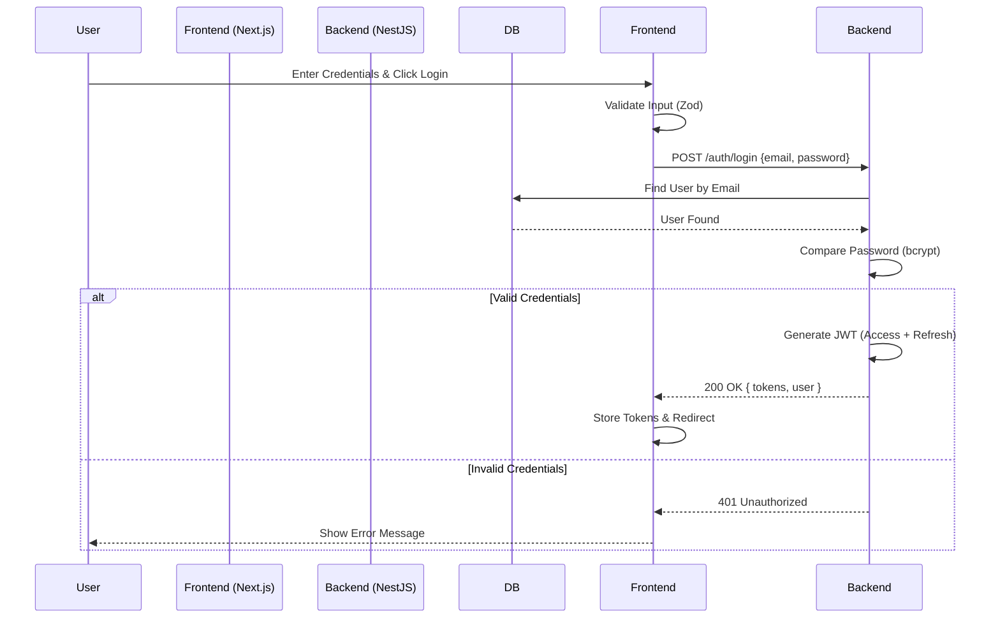

# Technical Design Document: Login Feature

## 1. Overview
This feature implements the authentication mechanism for the Booking Tour application. It allows users to log in using their email and password or via social providers (Google, Apple). Upon successful authentication, the system issues JWT tokens (Access & Refresh) for session management.

## 2. Requirements

### 2.1 Functional Requirements
*   **Email/Password Login:**
    *   Users can sign in with a valid email and password.
    *   Validate email format and password length (min 6 chars).
    *   Show appropriate error messages for invalid credentials, validation errors, or server errors.
    *   Redirect to home page or previous page upon success.
*   **Social Login:**
    *   Support Google and Apple Sign In.
    *   Create a new user account if one doesn't exist (JIT provisioning).
*   **UI/UX:**
    *   Responsive design (Single column on mobile, Two columns with Hero image on desktop).
    *   Loading states for buttons.
    *   Password visibility toggle.
    *   "Forgot Password" and "Sign Up" links.

### 2.2 Non-Functional Requirements
*   **Performance:** Login response time < 500ms.
*   **Security:**
    *   Passwords must not be stored in plain text (use bcrypt).
    *   Implement Rate Limiting to prevent brute-force attacks (e.g., 5 attempts/minute).
    *   Tokens (JWT) must be stored securely (HttpOnly cookies preferred or secure local storage).
*   **Availability:** Publicly accessible page (`/login`).

## 3. Technical Design

### 3.1. Database Schema Changes (Prisma)
No major schema changes are required as the `User` model already exists. However, we need to ensure the `provider` field supports social logins if not already present.

*Note: Assuming `User` model exists as per `apps/server/prisma/schema.prisma`.*

```prisma
// No changes to schema.prisma required for basic login.
// Existing User model:
// model User {
//   id        Int      @id @default(autoincrement())
//   email     String   @unique
//   password  String
//   role      Role     @default(USER)
//   ...
// }
```

### 3.2. Backend Implementation (NestJS)

*   **Module:** `AuthModule` (imports `UsersModule`, `JwtModule`, `PassportModule`).
*   **Controller:** `AuthController` (`apps/server/src/modules/auth/auth.controller.ts`).
    *   `POST /auth/login`: Handles email/password login.
    *   `POST /auth/google`: Handles Google login.
    *   `POST /auth/apple`: Handles Apple login.
*   **Service:** `AuthService` (`apps/server/src/modules/auth/auth.service.ts`).
    *   `validateUser(email, password)`: Verifies credentials.
    *   `login(user)`: Generates JWT tokens.
    *   `validateOAuthLogin(profile)`: Handles social login logic.
*   **DTOs:**
    *   `LoginDto`: `{ email, password }` with class-validator.
    *   `SocialLoginDto`: `{ idToken, provider }`.
*   **Guards:** `LocalAuthGuard` (for login endpoint), `JwtAuthGuard` (for protected routes).

### 3.3. Frontend Implementation (Next.js)

*   **Route:** `apps/web/app/(auth)/login/page.tsx`
*   **Components:**
    *   `LoginForm`: Client component with React Hook Form + Zod validation.
    *   `AuthLayout`: Shared layout for Login/Register pages.
    *   `SocialButtons`: Reusable component for Google/Apple buttons.
*   **State Management:**
    *   Use `useAuth` hook (context/store) to manage user session and tokens.
    *   Store tokens in `cookies` via Server Actions or client-side cookie library.
*   **Integration:**
    *   Call `POST /auth/login` using `fetch` or `axios`.
    *   Handle 400/401 errors and map to form fields.

### 3.4. Logic Flow

#### Email/Password Login


### 3.5. Security & Performance
*   **Rate Limiting:** Use `@nestjs/throttler` on `AuthController` to limit login attempts.
*   **Input Validation:** Strict validation using `LoginDto` and `class-validator`.
*   **CORS:** Ensure only allowed domains can access the auth endpoints.

## 4. Testing Plan

*   **Unit Tests:**
    *   `AuthService`: Test `validateUser` with correct/incorrect passwords.
    *   `AuthService`: Test `login` returns valid JWT structure.
*   **E2E Tests:**
    *   Test successful login flow.
    *   Test login with invalid email/password.
    *   Test validation errors (empty fields).
*   **Frontend Tests:**
    *   Verify form validation works.
    *   Verify error messages are displayed.
    *   Verify redirection after success.

## 5. Alternatives Considered
*   **NextAuth.js:** Considered using NextAuth.js on the frontend. *Decision:* Rejected for now to maintain centralized auth logic in the NestJS backend and support mobile apps in the future. We will use a custom auth flow communicating with our NestJS API.
