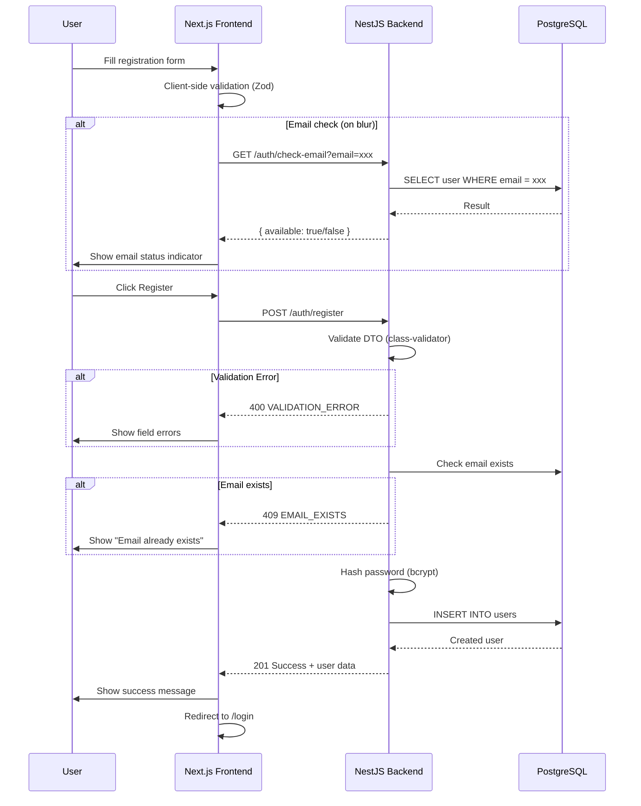
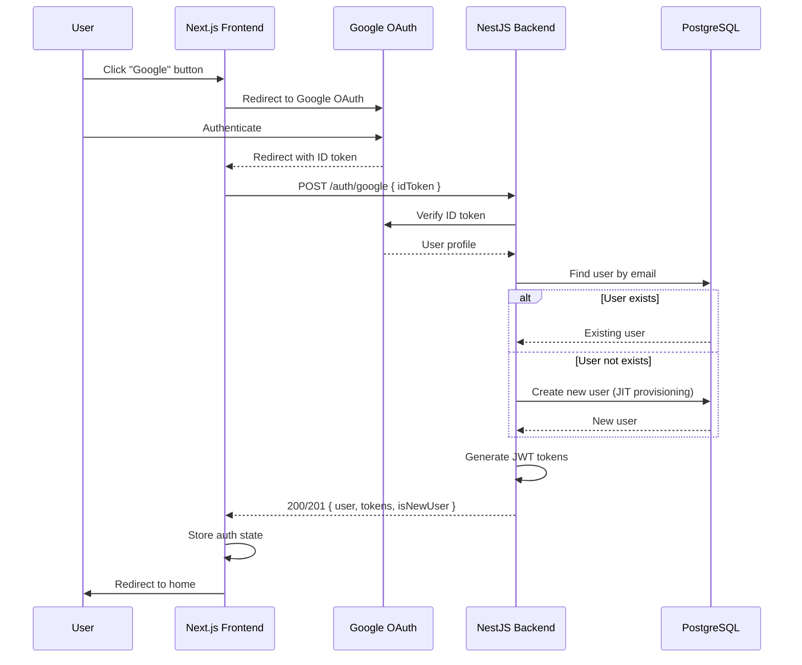

# Technical Design Document: User Registration

## 1. Overview

Tài liệu này mô tả thiết kế kỹ thuật cho chức năng **User Registration** của hệ thống Booking Tour. Chức năng cho phép người dùng mới tạo tài khoản bằng email/password hoặc thông qua social providers (Google, Facebook).

### 1.1 Purpose
- Cho phép người dùng mới đăng ký tài khoản để sử dụng các tính năng booking
- Hỗ trợ đăng ký qua email/password và social login
- Thu thập thông tin cơ bản: tên, email, phone, country

### 1.2 Scope
**Bao gồm:**
- Form đăng ký với validation
- Password strength indicator
- Country/phone selection với dial code
- Terms of Service agreement
- Social registration (Google, Facebook)
- Email availability check

**Không bao gồm:**
- Email verification flow
- Admin user creation
- Multi-factor authentication

## 2. Requirements

### 2.1 Functional Requirements

| ID | Requirement | Priority |
|----|-------------|----------|
| FR-001 | User có thể đăng ký bằng email/password | Must |
| FR-002 | User phải nhập: Full Name, Email, Password, Confirm Password | Must |
| FR-003 | User có thể nhập optional: Phone, Country | Should |
| FR-004 | System hiển thị password strength indicator | Must |
| FR-005 | User phải đồng ý Terms of Use để đăng ký | Must |
| FR-006 | System kiểm tra email availability real-time | Should |
| FR-007 | User có thể đăng ký qua Google/Facebook | Should |
| FR-008 | System redirect user đã authenticated về homepage | Must |

### 2.2 User Stories

| Story | Description |
|-------|-------------|
| US-001 | As a visitor, I want to create an account so that I can book tours |
| US-002 | As a visitor, I want to see password strength so that I create a secure password |
| US-003 | As a visitor, I want to register with Google so that I don't need to remember another password |
| US-004 | As a visitor, I want to see if my email is taken so that I know to use another email |

### 2.3 Non-Functional Requirements

| Category | Requirement |
|----------|-------------|
| **Performance** | Registration API response < 500ms |
| **Performance** | Email check API response < 200ms |
| **Security** | Password hashed với bcrypt (salt rounds: 10) |
| **Security** | Rate limiting: 5 requests/minute cho register endpoint |
| **Security** | Input validation server-side |
| **Availability** | Page load time < 2s |
| **Accessibility** | WCAG 2.1 AA compliance |

## 3. Technical Design

### 3.1 Database Schema

Sử dụng model `User` hiện có trong `schema.prisma`. Không cần thay đổi schema.

```prisma
model User {
  id        Int       @id @default(autoincrement())
  email     String    @unique
  password  String
  fullName  String?   @map("full_name")
  phone     String?
  role      Role      @default(USER)
  createdAt DateTime  @default(now()) @map("created_at")
  updatedAt DateTime  @updatedAt @map("updated_at")

  bookings  Booking[]
  reviews   Review[]
  payments  Payment[]

  @@map("users")
}
```

**Consideration cho tương lai:**
- Thêm field `country` vào User model
- Thêm field `emailVerified` cho email verification
- Thêm field `provider` để track social login

```prisma
// Future enhancement - không implement trong phase này
model User {
  // ... existing fields
  country       String?
  emailVerified Boolean   @default(false) @map("email_verified")
  provider      String?   @default("local") // 'local', 'google', 'facebook'
}
```

### 3.2 Backend Implementation (NestJS)

#### 3.2.1 API Endpoints

| Method | Endpoint | Description | Auth |
|--------|----------|-------------|------|
| POST | `/auth/register` | Register new user | Public |
| GET | `/auth/check-email` | Check email availability | Public |
| POST | `/auth/google` | Google OAuth login/register | Public |
| GET | `/api/countries` | Get countries list | Public |

#### 3.2.2 DTOs

**File: `apps/server/src/modules/auth/dto/register.dto.ts`**

```typescript
import { IsEmail, IsNotEmpty, IsOptional, IsString, MinLength, Matches } from 'class-validator';

export class RegisterDto {
  @IsNotEmpty({ message: 'Full name is required' })
  @IsString()
  @MinLength(2, { message: 'Name must be at least 2 characters' })
  fullName: string;

  @IsNotEmpty({ message: 'Email is required' })
  @IsEmail({}, { message: 'Please enter a valid email' })
  email: string;

  @IsNotEmpty({ message: 'Password is required' })
  @IsString()
  @MinLength(8, { message: 'Password must be at least 8 characters' })
  @Matches(/^(?=.*[a-z])(?=.*[A-Z])(?=.*\d)/, {
    message: 'Password must contain uppercase, lowercase, and number',
  })
  password: string;

  @IsOptional()
  @IsString()
  phone?: string;

  @IsOptional()
  @IsString()
  country?: string;
}
```

**File: `apps/server/src/modules/auth/dto/register-response.dto.ts`**

```typescript
export class RegisterResponseDto {
  user: {
    id: number;
    email: string;
    fullName: string;
    phone?: string;
    role: string;
    createdAt: Date;
  };
  message: string;
  // Optional: for auto-login
  accessToken?: string;
  refreshToken?: string;
}
```

**File: `apps/server/src/modules/auth/dto/check-email.dto.ts`**

```typescript
import { IsEmail, IsNotEmpty } from 'class-validator';

export class CheckEmailDto {
  @IsNotEmpty()
  @IsEmail()
  email: string;
}

export class CheckEmailResponseDto {
  available: boolean;
  message?: string;
}
```

#### 3.2.3 Service Methods

**File: `apps/server/src/modules/auth/auth.service.ts`**

```typescript
// Thêm vào AuthService hiện có

import { ConflictException, BadRequestException } from '@nestjs/common';
import { RegisterDto } from './dto/register.dto';
import { RegisterResponseDto } from './dto/register-response.dto';
import { CheckEmailResponseDto } from './dto/check-email.dto';

@Injectable()
export class AuthService {
  // ... existing code ...

  /**
   * Registers a new user account.
   * @param registerDto - Registration data
   * @returns RegisterResponseDto with user info and optional tokens
   * @throws ConflictException if email already exists
   */
  async register(registerDto: RegisterDto): Promise<RegisterResponseDto> {
    const { email, password, fullName, phone, country } = registerDto;

    // Check if email already exists
    const existingUser = await this.prisma.user.findUnique({
      where: { email: email.toLowerCase() },
    });

    if (existingUser) {
      throw new ConflictException('An account with this email already exists');
    }

    // Hash password
    const saltRounds = 10;
    const hashedPassword = await bcrypt.hash(password, saltRounds);

    // Create user
    const user = await this.prisma.user.create({
      data: {
        email: email.toLowerCase().trim(),
        password: hashedPassword,
        fullName: fullName.trim(),
        phone: phone?.trim(),
        // country: country, // Future: add to schema
        role: 'USER',
      },
      select: {
        id: true,
        email: true,
        fullName: true,
        phone: true,
        role: true,
        createdAt: true,
      },
    });

    return {
      user,
      message: 'Account created successfully. Please log in.',
    };
  }

  /**
   * Checks if an email address is available for registration.
   * @param email - Email to check
   * @returns CheckEmailResponseDto with availability status
   */
  async checkEmailAvailability(email: string): Promise<CheckEmailResponseDto> {
    const existingUser = await this.prisma.user.findUnique({
      where: { email: email.toLowerCase() },
      select: { id: true },
    });

    if (existingUser) {
      return {
        available: false,
        message: 'This email is already registered',
      };
    }

    return { available: true };
  }
}
```

#### 3.2.4 Controller Methods

**File: `apps/server/src/modules/auth/auth.controller.ts`**

```typescript
// Thêm vào AuthController hiện có

import { Query, Get } from '@nestjs/common';
import { RegisterDto } from './dto/register.dto';
import { CheckEmailDto } from './dto/check-email.dto';

@Controller('auth')
export class AuthController {
  // ... existing code ...

  @Post('register')
  @HttpCode(HttpStatus.CREATED)
  @Throttle({ default: { limit: 5, ttl: 60 } })
  async register(@Body() registerDto: RegisterDto) {
    return this.authService.register(registerDto);
  }

  @Get('check-email')
  @HttpCode(HttpStatus.OK)
  @Throttle({ default: { limit: 10, ttl: 60 } })
  async checkEmail(@Query() checkEmailDto: CheckEmailDto) {
    return this.authService.checkEmailAvailability(checkEmailDto.email);
  }
}
```

#### 3.2.5 Countries Module (Optional)

**File: `apps/server/src/modules/countries/countries.controller.ts`**

```typescript
import { Controller, Get } from '@nestjs/common';

@Controller('api/countries')
export class CountriesController {
  @Get()
  getCountries() {
    // Return static list hoặc từ database/external API
    return {
      success: true,
      data: [
        { code: 'US', name: 'United States', dialCode: '+1', flag: '🇺🇸' },
        { code: 'VN', name: 'Vietnam', dialCode: '+84', flag: '🇻🇳' },
        { code: 'JP', name: 'Japan', dialCode: '+81', flag: '🇯🇵' },
        { code: 'KR', name: 'South Korea', dialCode: '+82', flag: '🇰🇷' },
        { code: 'TH', name: 'Thailand', dialCode: '+66', flag: '🇹🇭' },
        // ... more countries
      ],
    };
  }
}
```

### 3.3 Frontend Implementation (Next.js)

#### 3.3.1 Routes & Pages

| Route | Page | Description |
|-------|------|-------------|
| `/register` | `app/(auth)/register/page.tsx` | Registration page |

#### 3.3.2 Components Structure

```
apps/web/
├── app/
│   └── (auth)/
│       └── register/
│           └── page.tsx
├── components/
│   └── auth/
│       ├── register-form.tsx          # Main form component
│       ├── password-strength.tsx      # Password strength indicator
│       ├── country-select.tsx         # Country dropdown with dial code
│       └── social-buttons.tsx         # Existing - reuse
├── lib/
│   ├── api/
│   │   └── auth.ts                    # Add register API calls
│   └── validations/
│       └── auth.ts                    # Add registerSchema
```

#### 3.3.3 Page Component

**File: `apps/web/app/(auth)/register/page.tsx`**

```tsx
import { Metadata } from 'next';
import { RegisterForm } from '@/components/auth/register-form';

export const metadata: Metadata = {
  title: 'Register | TourBooker',
  description: 'Create your account to book tours',
};

export default function RegisterPage() {
  return (
    <div className="flex flex-col gap-4">
      {/* Header */}
      <div className="text-center">
        <h1 className="text-[#111518] dark:text-white text-2xl font-bold leading-tight tracking-[-0.015em]">
          Create your account
        </h1>
        <p className="text-[#617989] dark:text-gray-400 text-base font-normal leading-normal mt-2">
          Join us to discover and book exclusive tours around the world.
        </p>
      </div>

      {/* Form */}
      <RegisterForm />
    </div>
  );
}
```

#### 3.3.4 Register Form Component

**File: `apps/web/components/auth/register-form.tsx`**

```tsx
'use client';

import { useState, Suspense, useEffect, useCallback } from 'react';
import { useRouter } from 'next/navigation';
import { useForm } from 'react-hook-form';
import { zodResolver } from '@hookform/resolvers/zod';
import Link from 'next/link';
import { registerSchema, type RegisterFormData } from '@/lib/validations/auth';
import { register as registerUser, checkEmail } from '@/lib/api/auth';
import { Button } from '@/components/ui/button';
import { Input } from '@/components/ui/input';
import { Checkbox } from '@/components/ui/checkbox';
import { SocialButtons } from './social-buttons';
import { PasswordStrength } from './password-strength';
import { CountrySelect } from './country-select';
import { useDebouncedCallback } from 'use-debounce';

function RegisterFormContent() {
  const router = useRouter();
  const [isLoading, setIsLoading] = useState(false);
  const [showPassword, setShowPassword] = useState(false);
  const [showConfirmPassword, setShowConfirmPassword] = useState(false);
  const [apiError, setApiError] = useState<string | null>(null);
  const [emailStatus, setEmailStatus] = useState<'idle' | 'checking' | 'available' | 'taken'>('idle');
  const [selectedCountry, setSelectedCountry] = useState<{ code: string; dialCode: string } | null>(null);

  const {
    register,
    handleSubmit,
    watch,
    setValue,
    formState: { errors, isValid },
  } = useForm<RegisterFormData>({
    resolver: zodResolver(registerSchema),
    mode: 'onChange',
  });

  const password = watch('password');
  const email = watch('email');

  // Debounced email check
  const checkEmailAvailability = useDebouncedCallback(async (emailValue: string) => {
    if (!emailValue || errors.email) {
      setEmailStatus('idle');
      return;
    }
    
    setEmailStatus('checking');
    try {
      const result = await checkEmail(emailValue);
      setEmailStatus(result.available ? 'available' : 'taken');
    } catch {
      setEmailStatus('idle');
    }
  }, 500);

  useEffect(() => {
    if (email) {
      checkEmailAvailability(email);
    }
  }, [email, checkEmailAvailability]);

  // Handle country change
  const handleCountryChange = useCallback((country: { code: string; dialCode: string }) => {
    setSelectedCountry(country);
    setValue('country', country.code);
  }, [setValue]);

  const onSubmit = async (data: RegisterFormData) => {
    if (emailStatus === 'taken') {
      setApiError('This email is already registered');
      return;
    }

    setIsLoading(true);
    setApiError(null);

    try {
      // Format phone with country code
      const phone = data.phone && selectedCountry 
        ? `${selectedCountry.dialCode}${data.phone}` 
        : data.phone;

      await registerUser({
        fullName: data.fullName.trim(),
        email: data.email.toLowerCase().trim(),
        password: data.password,
        phone,
        country: data.country,
      });

      // Success - redirect to login with success message
      router.push('/login?registered=true');
    } catch (error: unknown) {
      if (error instanceof Error) {
        setApiError(error.message);
      } else {
        setApiError('An unexpected error occurred. Please try again.');
      }
    } finally {
      setIsLoading(false);
    }
  };

  return (
    <div className="space-y-6">
      {/* Social Login Buttons */}
      <SocialButtons />

      {/* Divider */}
      <div className="flex items-center gap-4">
        <div className="h-px bg-[#dbe1e6] dark:bg-[#22303c] flex-1"></div>
        <span className="text-[#617989] dark:text-gray-500 text-sm font-medium">
          OR CONTINUE WITH
        </span>
        <div className="h-px bg-[#dbe1e6] dark:bg-[#22303c] flex-1"></div>
      </div>

      {/* Form */}
      <form onSubmit={handleSubmit(onSubmit)} className="flex flex-col gap-5">
        {/* Full Name */}
        <label className="flex flex-col min-w-40 flex-1">
          <p className="text-[#111518] dark:text-white text-base font-medium leading-normal pb-2">
            Full Name <span className="text-red-500">*</span>
          </p>
          <Input
            type="text"
            placeholder="e.g. Jane Doe"
            {...register('fullName')}
            className="h-12"
          />
          {errors.fullName && (
            <p className="mt-1 text-sm text-red-600">{errors.fullName.message}</p>
          )}
        </label>

        {/* Email */}
        <label className="flex flex-col min-w-40 flex-1">
          <p className="text-[#111518] dark:text-white text-base font-medium leading-normal pb-2">
            Email Address <span className="text-red-500">*</span>
          </p>
          <div className="relative">
            <Input
              type="email"
              placeholder="e.g. jane@example.com"
              {...register('email')}
              className="h-12 pr-10"
            />
            {emailStatus === 'checking' && (
              <span className="absolute right-3 top-1/2 -translate-y-1/2">
                <span className="animate-spin">⏳</span>
              </span>
            )}
            {emailStatus === 'available' && (
              <span className="absolute right-3 top-1/2 -translate-y-1/2 text-green-500">✓</span>
            )}
            {emailStatus === 'taken' && (
              <span className="absolute right-3 top-1/2 -translate-y-1/2 text-red-500">✗</span>
            )}
          </div>
          {errors.email && (
            <p className="mt-1 text-sm text-red-600">{errors.email.message}</p>
          )}
          {emailStatus === 'taken' && (
            <p className="mt-1 text-sm text-red-600">
              This email is already registered.{' '}
              <Link href="/login" className="text-[#1392ec] hover:underline">
                Log in instead
              </Link>
            </p>
          )}
        </label>

        {/* Phone & Country Row */}
        <div className="grid grid-cols-1 md:grid-cols-2 gap-4">
          {/* Country */}
          <label className="flex flex-col">
            <p className="text-[#111518] dark:text-white text-base font-medium leading-normal pb-2">
              Country
            </p>
            <CountrySelect
              value={selectedCountry?.code}
              onChange={handleCountryChange}
            />
          </label>

          {/* Phone */}
          <label className="flex flex-col">
            <p className="text-[#111518] dark:text-white text-base font-medium leading-normal pb-2">
              Phone Number
            </p>
            <div className="flex">
              <span className="flex items-center px-3 bg-gray-100 dark:bg-[#22303c] border border-r-0 border-[#dbe1e6] dark:border-[#22303c] rounded-l-lg text-sm">
                {selectedCountry?.dialCode || '+1'}
              </span>
              <Input
                type="tel"
                placeholder="(555) 000-0000"
                {...register('phone')}
                className="h-12 rounded-l-none"
              />
            </div>
            {errors.phone && (
              <p className="mt-1 text-sm text-red-600">{errors.phone.message}</p>
            )}
          </label>
        </div>

        {/* Password */}
        <label className="flex flex-col min-w-40 flex-1">
          <p className="text-[#111518] dark:text-white text-base font-medium leading-normal pb-2">
            Password <span className="text-red-500">*</span>
          </p>
          <div className="relative">
            <Input
              type={showPassword ? 'text' : 'password'}
              placeholder="••••••••"
              {...register('password')}
              className="h-12 pr-12"
            />
            <button
              type="button"
              onClick={() => setShowPassword(!showPassword)}
              className="absolute right-3 top-1/2 -translate-y-1/2 text-[#617989] hover:text-[#111518] dark:hover:text-white"
            >
              <span className="material-symbols-outlined text-xl">
                {showPassword ? 'visibility_off' : 'visibility'}
              </span>
            </button>
          </div>
          {errors.password && (
            <p className="mt-1 text-sm text-red-600">{errors.password.message}</p>
          )}
          {password && <PasswordStrength password={password} />}
        </label>

        {/* Confirm Password */}
        <label className="flex flex-col min-w-40 flex-1">
          <p className="text-[#111518] dark:text-white text-base font-medium leading-normal pb-2">
            Confirm Password <span className="text-red-500">*</span>
          </p>
          <div className="relative">
            <Input
              type={showConfirmPassword ? 'text' : 'password'}
              placeholder="••••••••"
              {...register('confirmPassword')}
              className="h-12 pr-12"
            />
            <button
              type="button"
              onClick={() => setShowConfirmPassword(!showConfirmPassword)}
              className="absolute right-3 top-1/2 -translate-y-1/2 text-[#617989] hover:text-[#111518] dark:hover:text-white"
            >
              <span className="material-symbols-outlined text-xl">
                {showConfirmPassword ? 'visibility_off' : 'visibility'}
              </span>
            </button>
          </div>
          {errors.confirmPassword && (
            <p className="mt-1 text-sm text-red-600">{errors.confirmPassword.message}</p>
          )}
        </label>

        {/* Terms Checkbox */}
        <div className="flex items-start gap-3">
          <Checkbox
            id="agreeTerms"
            {...register('agreeTerms')}
            className="mt-1"
          />
          <label htmlFor="agreeTerms" className="text-sm text-[#617989] dark:text-gray-400">
            By creating an account, I agree to the{' '}
            <Link href="/terms" target="_blank" className="text-[#1392ec] hover:underline">
              Terms of Use
            </Link>{' '}
            and{' '}
            <Link href="/privacy" target="_blank" className="text-[#1392ec] hover:underline">
              Privacy Policy
            </Link>
            .
          </label>
        </div>
        {errors.agreeTerms && (
          <p className="text-sm text-red-600">{errors.agreeTerms.message}</p>
        )}

        {/* API Error */}
        {apiError && (
          <div className="rounded-md bg-red-50 dark:bg-red-900/20 p-4">
            <p className="text-sm text-red-800 dark:text-red-200">{apiError}</p>
          </div>
        )}

        {/* Submit Button */}
        <Button
          type="submit"
          className="w-full h-12 bg-[#1392ec] hover:bg-blue-600 text-white text-base font-bold mt-2"
          disabled={isLoading || !isValid || emailStatus === 'taken'}
        >
          {isLoading ? 'Creating account...' : 'Register Account'}
        </Button>
      </form>

      {/* Login Link */}
      <div className="text-center">
        <p className="text-[#617989] dark:text-gray-400 text-sm">
          Already have an account?{' '}
          <Link href="/login" className="text-[#1392ec] font-bold hover:underline">
            Log in
          </Link>
        </p>
      </div>
    </div>
  );
}

export function RegisterForm() {
  return (
    <Suspense fallback={<div>Loading...</div>}>
      <RegisterFormContent />
    </Suspense>
  );
}
```

#### 3.3.5 Password Strength Component

**File: `apps/web/components/auth/password-strength.tsx`**

```tsx
'use client';

import { useMemo } from 'react';
import { cn } from '@/lib/utils';

interface PasswordStrengthProps {
  password: string;
}

type StrengthLevel = 'weak' | 'medium' | 'strong';

interface StrengthResult {
  score: number;
  level: StrengthLevel;
  color: string;
  label: string;
  percentage: number;
}

function calculatePasswordStrength(password: string): StrengthResult {
  let score = 0;

  if (password.length >= 8) score++;
  if (password.length >= 12) score++;
  if (/[a-z]/.test(password)) score++;
  if (/[A-Z]/.test(password)) score++;
  if (/[0-9]/.test(password)) score++;
  if (/[^a-zA-Z0-9]/.test(password)) score++;

  if (score <= 2) {
    return { score, level: 'weak', color: 'bg-red-500', label: 'Weak', percentage: 33 };
  } else if (score <= 4) {
    return { score, level: 'medium', color: 'bg-yellow-500', label: 'Medium Strength', percentage: 66 };
  } else {
    return { score, level: 'strong', color: 'bg-green-500', label: 'Strong', percentage: 100 };
  }
}

export function PasswordStrength({ password }: PasswordStrengthProps) {
  const strength = useMemo(() => calculatePasswordStrength(password), [password]);

  return (
    <div className="mt-2 space-y-2">
      {/* Progress Bar */}
      <div className="h-2 bg-gray-200 dark:bg-gray-700 rounded-full overflow-hidden">
        <div
          className={cn('h-full transition-all duration-300', strength.color)}
          style={{ width: `${strength.percentage}%` }}
        />
      </div>

      {/* Label */}
      <p className={cn(
        'text-sm font-medium',
        strength.level === 'weak' && 'text-red-500',
        strength.level === 'medium' && 'text-yellow-600',
        strength.level === 'strong' && 'text-green-500',
      )}>
        Password Strength: {strength.label}
      </p>

      {/* Requirements */}
      <ul className="text-xs text-[#617989] space-y-1">
        <li className={cn(password.length >= 8 && 'text-green-500')}>
          {password.length >= 8 ? '✓' : '○'} At least 8 characters
        </li>
        <li className={cn(/[A-Z]/.test(password) && 'text-green-500')}>
          {/[A-Z]/.test(password) ? '✓' : '○'} One uppercase letter
        </li>
        <li className={cn(/[a-z]/.test(password) && 'text-green-500')}>
          {/[a-z]/.test(password) ? '✓' : '○'} One lowercase letter
        </li>
        <li className={cn(/[0-9]/.test(password) && 'text-green-500')}>
          {/[0-9]/.test(password) ? '✓' : '○'} One number
        </li>
      </ul>
    </div>
  );
}
```

#### 3.3.6 Country Select Component

**File: `apps/web/components/auth/country-select.tsx`**

```tsx
'use client';

import { useState, useEffect } from 'react';
import { getCountries, type Country } from '@/lib/api/countries';

interface CountrySelectProps {
  value?: string;
  onChange: (country: { code: string; dialCode: string }) => void;
}

export function CountrySelect({ value, onChange }: CountrySelectProps) {
  const [countries, setCountries] = useState<Country[]>([]);
  const [isLoading, setIsLoading] = useState(true);

  useEffect(() => {
    const fetchCountries = async () => {
      try {
        const data = await getCountries();
        setCountries(data);
      } catch (error) {
        console.error('Failed to fetch countries:', error);
      } finally {
        setIsLoading(false);
      }
    };

    fetchCountries();
  }, []);

  const handleChange = (e: React.ChangeEvent<HTMLSelectElement>) => {
    const selected = countries.find(c => c.code === e.target.value);
    if (selected) {
      onChange({ code: selected.code, dialCode: selected.dialCode });
    }
  };

  if (isLoading) {
    return (
      <select disabled className="h-12 w-full rounded-lg border border-[#dbe1e6] bg-gray-100">
        <option>Loading...</option>
      </select>
    );
  }

  return (
    <select
      value={value || ''}
      onChange={handleChange}
      className="h-12 w-full rounded-lg border border-[#dbe1e6] dark:border-[#22303c] bg-white dark:bg-[#1a2630] text-[#111518] dark:text-white px-3 focus:outline-none focus:ring-2 focus:ring-[#1392ec]/50"
    >
      <option value="">Select a country</option>
      {countries.map((country) => (
        <option key={country.code} value={country.code}>
          {country.flag} {country.name}
        </option>
      ))}
    </select>
  );
}
```

#### 3.3.7 Validation Schema

**File: `apps/web/lib/validations/auth.ts`**

```typescript
// Thêm vào file hiện có

export const registerSchema = z.object({
  fullName: z
    .string()
    .min(1, 'Full name is required')
    .min(2, 'Name must be at least 2 characters'),

  email: z
    .string()
    .min(1, 'Email is required')
    .email('Please enter a valid email'),

  phone: z
    .string()
    .optional()
    .refine(
      (val) => !val || /^[0-9]{7,15}$/.test(val),
      'Please enter a valid phone number'
    ),

  country: z.string().optional(),

  password: z
    .string()
    .min(1, 'Password is required')
    .min(8, 'Password must be at least 8 characters')
    .regex(
      /^(?=.*[a-z])(?=.*[A-Z])(?=.*\d)/,
      'Password must contain uppercase, lowercase, and number'
    ),

  confirmPassword: z
    .string()
    .min(1, 'Please confirm your password'),

  agreeTerms: z
    .boolean()
    .refine((val) => val === true, 'You must agree to the terms'),
}).refine((data) => data.password === data.confirmPassword, {
  message: 'Passwords do not match',
  path: ['confirmPassword'],
});

export type RegisterFormData = z.infer<typeof registerSchema>;
```

#### 3.3.8 API Functions

**File: `apps/web/lib/api/auth.ts`**

```typescript
// Thêm vào file hiện có

export interface RegisterRequest {
  fullName: string;
  email: string;
  password: string;
  phone?: string;
  country?: string;
}

export interface RegisterResponse {
  user: {
    id: number;
    email: string;
    fullName: string;
    role: string;
    createdAt: string;
  };
  message: string;
}

export interface CheckEmailResponse {
  available: boolean;
  message?: string;
}

export async function register(data: RegisterRequest): Promise<RegisterResponse> {
  const response = await fetch(`${API_URL}/auth/register`, {
    method: 'POST',
    headers: { 'Content-Type': 'application/json' },
    body: JSON.stringify(data),
  });

  if (!response.ok) {
    const error = await response.json();
    throw new Error(error.error?.message || 'Registration failed');
  }

  const result = await response.json();
  return result.data;
}

export async function checkEmail(email: string): Promise<CheckEmailResponse> {
  const response = await fetch(
    `${API_URL}/auth/check-email?email=${encodeURIComponent(email)}`
  );

  if (!response.ok) {
    throw new Error('Failed to check email');
  }

  const result = await response.json();
  return result.data;
}
```

**File: `apps/web/lib/api/countries.ts`**

```typescript
const API_URL = process.env.NEXT_PUBLIC_API_URL || 'http://localhost:3001';

export interface Country {
  code: string;
  name: string;
  dialCode: string;
  flag: string;
}

export async function getCountries(): Promise<Country[]> {
  const response = await fetch(`${API_URL}/api/countries`);
  
  if (!response.ok) {
    throw new Error('Failed to fetch countries');
  }

  const result = await response.json();
  return result.data;
}
```

### 3.4 Logic Flow

#### 3.4.1 Registration Flow



#### 3.4.2 Social Registration Flow



### 3.5 Security & Performance

#### 3.5.1 Security Measures

| Measure | Implementation |
|---------|----------------|
| **Password Hashing** | bcrypt với salt rounds = 10 |
| **Rate Limiting** | 5 requests/minute cho register endpoint |
| **Input Validation** | Server-side validation với class-validator |
| **SQL Injection** | Prisma parameterized queries |
| **XSS Prevention** | React auto-escaping, sanitize input |
| **CSRF** | SameSite cookies (khi dùng cookies) |

#### 3.5.2 Performance Optimizations

| Optimization | Implementation |
|--------------|----------------|
| **Debounced Email Check** | 500ms debounce trước khi call API |
| **Client-side Validation** | Zod validation trước khi submit |
| **Lazy Loading** | Countries list loaded on component mount |
| **Optimistic UI** | Show loading states immediately |

### 3.6 Error Handling

| Error Code | HTTP Status | User Message | Action |
|------------|-------------|--------------|--------|
| `VALIDATION_ERROR` | 400 | Field-specific errors | Highlight fields |
| `EMAIL_EXISTS` | 409 | "Email already registered" | Show login link |
| `WEAK_PASSWORD` | 400 | "Password too weak" | Show requirements |
| `RATE_LIMITED` | 429 | "Too many attempts" | Show retry timer |
| `SERVER_ERROR` | 500 | "Something went wrong" | Show retry button |

## 4. Testing Plan

### 4.1 Unit Tests (Backend)

**File: `apps/server/src/modules/auth/auth.service.spec.ts`**

```typescript
describe('AuthService - Register', () => {
  describe('register', () => {
    it('should create a new user successfully', async () => {
      // Arrange
      const registerDto = {
        fullName: 'Jane Doe',
        email: 'jane@example.com',
        password: 'Password123!',
      };

      // Act
      const result = await authService.register(registerDto);

      // Assert
      expect(result.user.email).toBe('jane@example.com');
      expect(result.message).toBe('Account created successfully. Please log in.');
    });

    it('should throw ConflictException if email exists', async () => {
      // Arrange
      const existingEmail = 'existing@example.com';
      
      // Act & Assert
      await expect(authService.register({ ...registerDto, email: existingEmail }))
        .rejects.toThrow(ConflictException);
    });

    it('should hash password with bcrypt', async () => {
      // Verify password is hashed, not stored as plain text
    });

    it('should normalize email to lowercase', async () => {
      // Verify Jane@Example.COM becomes jane@example.com
    });
  });

  describe('checkEmailAvailability', () => {
    it('should return available: true for new email', async () => {});
    it('should return available: false for existing email', async () => {});
  });
});
```

### 4.2 E2E Tests (Backend)

**File: `apps/server/test/auth-register.e2e-spec.ts`**

```typescript
describe('Auth Register (e2e)', () => {
  describe('POST /auth/register', () => {
    it('should register a new user', () => {
      return request(app.getHttpServer())
        .post('/auth/register')
        .send({
          fullName: 'Test User',
          email: 'test@example.com',
          password: 'Password123!',
        })
        .expect(201)
        .expect((res) => {
          expect(res.body.data.user.email).toBe('test@example.com');
        });
    });

    it('should return 409 for duplicate email', () => {
      return request(app.getHttpServer())
        .post('/auth/register')
        .send({ email: 'existing@example.com', ... })
        .expect(409);
    });

    it('should return 400 for invalid data', () => {
      return request(app.getHttpServer())
        .post('/auth/register')
        .send({ email: 'invalid-email' })
        .expect(400);
    });

    it('should rate limit after 5 requests', () => {
      // Make 6 requests, expect 429 on 6th
    });
  });

  describe('GET /auth/check-email', () => {
    it('should return available: true for new email', () => {});
    it('should return available: false for existing email', () => {});
  });
});
```

### 4.3 Component Tests (Frontend)

**File: `apps/web/components/auth/__tests__/register-form.test.tsx`**

```typescript
describe('RegisterForm', () => {
  it('renders all form fields', () => {});
  it('shows validation errors for empty required fields', () => {});
  it('shows password strength indicator when typing', () => {});
  it('shows error when passwords do not match', () => {});
  it('disables submit when terms not checked', () => {});
  it('calls register API on valid submit', () => {});
  it('shows API error message on failure', () => {});
  it('redirects to login on success', () => {});
});

describe('PasswordStrength', () => {
  it('shows Weak for short passwords', () => {});
  it('shows Medium for decent passwords', () => {});
  it('shows Strong for complex passwords', () => {});
});
```

### 4.4 Integration Tests

```typescript
describe('Registration Flow Integration', () => {
  it('should complete full registration flow', async () => {
    // 1. Load register page
    // 2. Fill form
    // 3. Submit
    // 4. Verify user created in DB
    // 5. Verify redirect to login
  });
});
```

## 5. Alternatives Considered

### 5.1 Auto-login after Registration

**Option A (Chosen):** Redirect to login page
- Pros: Simpler flow, user confirms credentials work
- Cons: Extra step for user

**Option B:** Auto-login with tokens
- Pros: Better UX, fewer steps
- Cons: More complex, security considerations

**Decision:** Start with Option A for simplicity. Can add auto-login as enhancement.

### 5.2 Email Verification

**Option A (Chosen):** No email verification (Phase 1)
- Pros: Faster onboarding, simpler implementation
- Cons: Risk of fake emails

**Option B:** Required email verification
- Pros: Verified users, less spam
- Cons: More friction, complex flow

**Decision:** Implement in Phase 2 với separate feature.

### 5.3 Password Requirements

**Option A (Chosen):** Min 8 chars + uppercase + lowercase + number
- Pros: Good security, not too restrictive
- Cons: Some users may find it annoying

**Option B:** More strict (special chars required)
- Pros: Stronger passwords
- Cons: Higher friction

**Decision:** Current requirements balance security and UX.

## 6. Implementation Checklist

### Backend
- [ ] Create `RegisterDto` và `RegisterResponseDto`
- [ ] Create `CheckEmailDto` và `CheckEmailResponseDto`
- [ ] Implement `AuthService.register()`
- [ ] Implement `AuthService.checkEmailAvailability()`
- [ ] Add controller endpoints
- [ ] Add rate limiting
- [ ] Write unit tests
- [ ] Write E2E tests

### Frontend
- [ ] Create `/register` page
- [ ] Create `RegisterForm` component
- [ ] Create `PasswordStrength` component
- [ ] Create `CountrySelect` component
- [ ] Add `registerSchema` validation
- [ ] Add `register` và `checkEmail` API functions
- [ ] Handle auth redirect (already logged in users)
- [ ] Write component tests

### Integration
- [ ] Test full registration flow
- [ ] Test error scenarios
- [ ] Test responsive design
- [ ] Test accessibility

## 7. Dependencies

### NPM Packages (Existing)
- `bcrypt` - Password hashing
- `class-validator` - DTO validation
- `@nestjs/throttler` - Rate limiting
- `zod` - Frontend validation
- `react-hook-form` - Form handling
- `use-debounce` - Debounced callbacks

### New Package (Frontend)
```bash
cd apps/web
pnpm add use-debounce
```

## 8. Deployment Notes

- Ensure `bcrypt` native bindings are compiled for production environment
- Configure rate limiting in production (consider Redis for distributed)
- Set up monitoring for registration failures
- Add logging for security events (failed registrations, rate limit hits)
