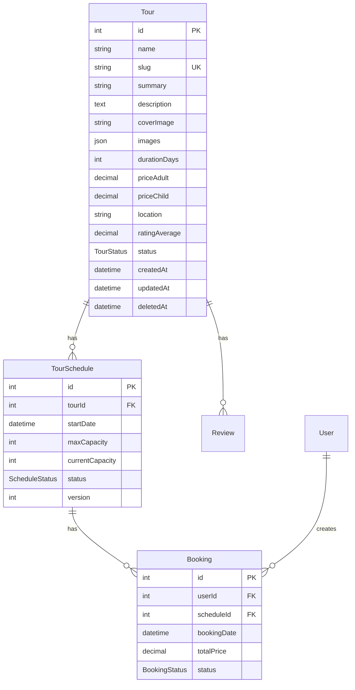
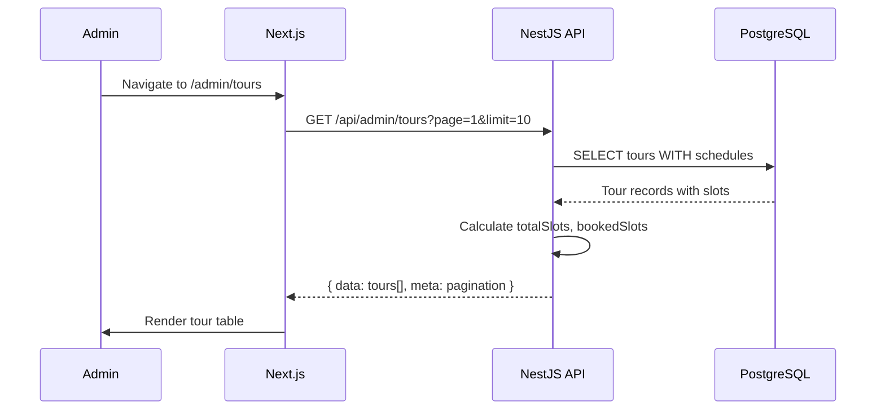
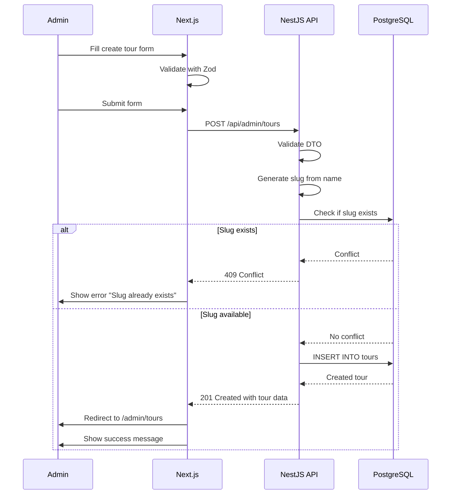
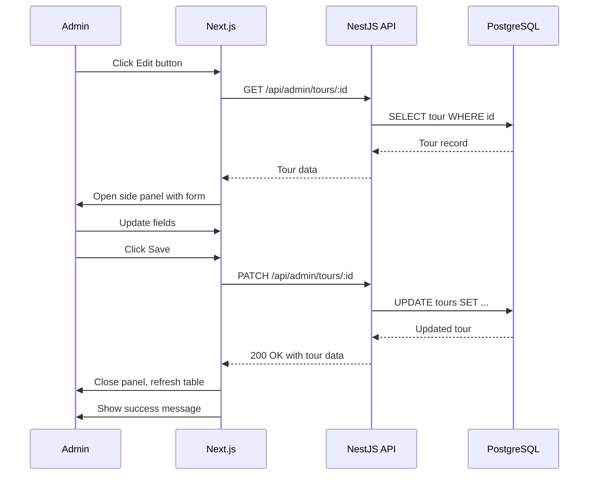
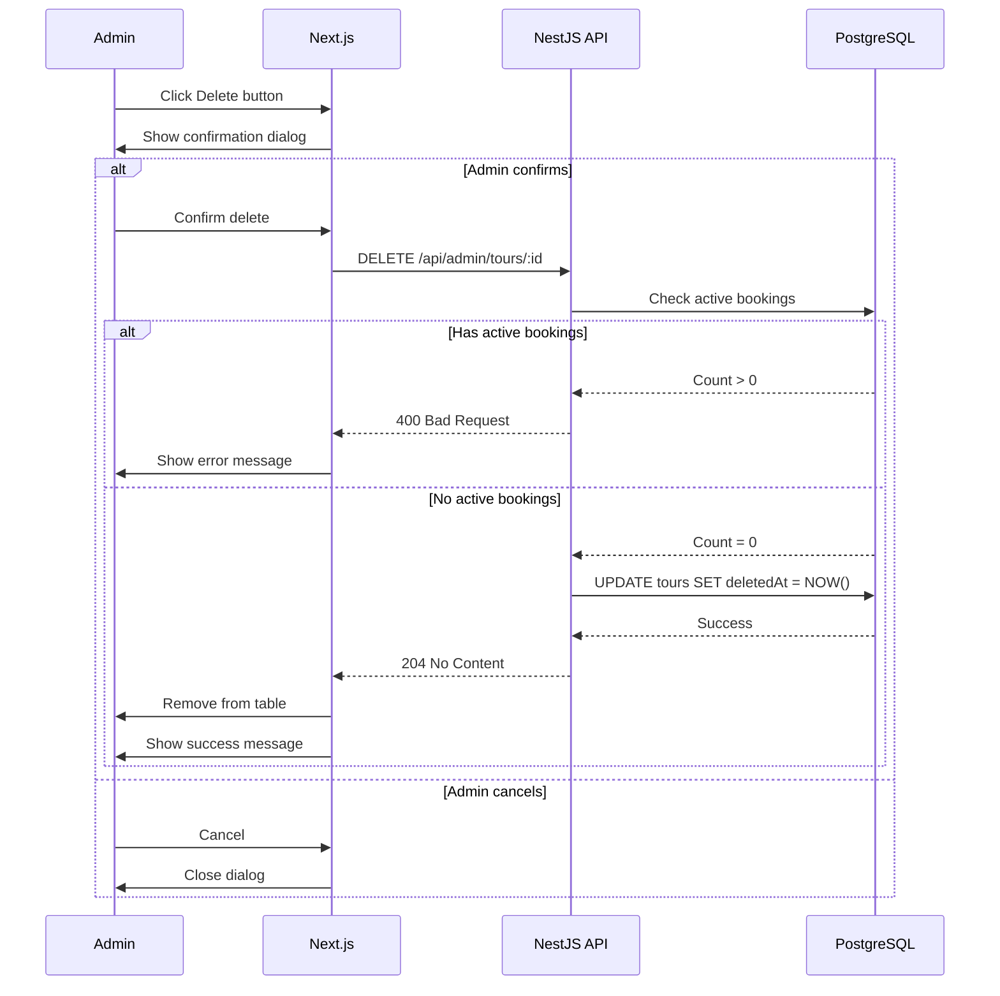

# Technical Design Document: Admin Tour Management

## 1. Overview

### 1.1 Purpose
This document describes the technical design for the **Admin Tour Management** feature of the Booking Tour system. The feature allows administrators to manage tour catalog including creating, reading, updating, and deleting tours with real-time inventory tracking across multiple schedules.

### 1.2 Scope

**Included:**
- Admin dashboard with tour statistics (Total, Active, Drafts, Fully Booked)
- Tour CRUD operations (Create, Read, Update, Delete)
- Search and filter functionality (by status, name, location)
- Inventory tracking (slots booked/available per tour)
- Soft delete for tours with bookings
- Bulk actions (publish/unpublish, delete drafts)
- Side panel/modal for quick editing
- Image upload for tour cover and gallery

**Excluded:**
- Public-facing tour listing/detail pages (separate feature)
- Payment processing (separate feature)
- Review moderation (separate feature)
- Advanced analytics/reporting

### 1.3 Related Features
- **User Authentication** (SCR-001, SCR-002): Admin must be authenticated with `ADMIN` role
- **Tour Schedules** (future): Managing specific departure dates and inventory per schedule
- **Booking Management** (SCR-012): Tours with active bookings cannot be hard-deleted

---

## 2. Requirements

### 2.1 Functional Requirements

| ID | Requirement | Priority |
|----|-------------|----------|
| FR-001 | Admin can view all tours in a paginated table | Must |
| FR-002 | Admin can search tours by name or location | Must |
| FR-003 | Admin can filter tours by status (Published, Draft, Archived) | Must |
| FR-004 | Admin can view tour statistics (Total, Active, Drafts, Fully Booked) | Must |
| FR-005 | Admin can create a new tour with all fields | Must |
| FR-006 | Admin can edit tour details via side panel | Must |
| FR-007 | Admin can delete tours (soft delete if bookings exist) | Must |
| FR-008 | Admin can see booked/total slots for each tour | Should |
| FR-009 | Admin can bulk publish/unpublish tours | Should |
| FR-010 | Admin can upload tour cover image and gallery images | Should |
| FR-011 | System prevents hard delete of tours with active bookings | Must |

### 2.2 User Stories

| Story | Description |
|-------|-------------|
| US-001 | As an admin, I want to see all tours in a table so that I can manage them efficiently |
| US-002 | As an admin, I want to search tours by name so that I can quickly find specific tours |
| US-003 | As an admin, I want to filter tours by status so that I can focus on drafts or published tours |
| US-004 | As an admin, I want to see tour statistics so that I can understand the inventory status at a glance |
| US-005 | As an admin, I want to edit tour details via a quick side panel so that I don't lose context |
| US-006 | As an admin, I want to be warned before deleting tours with bookings so that I avoid data loss |

### 2.3 Non-Functional Requirements

| Category | Requirement |
|----------|-------------|
| **Performance** | Tour list API response < 300ms for 100 tours |
| **Performance** | Search results return < 200ms |
| **Performance** | Statistics calculation < 500ms |
| **Security** | Only users with `ADMIN` role can access tour management |
| **Security** | Input validation on all tour fields (server-side) |
| **Security** | File upload validation (image type, size < 5MB) |
| **Consistency** | Slot counts must be accurate (derived from schedules) |
| **Availability** | Page load time < 2s |
| **Usability** | Responsive design for tablet and desktop (mobile optional) |

---

## 3. Technical Design

### 3.1 Database Schema

#### 3.1.1 Current Schema Analysis

The existing `Tour` model supports the basic tour catalog:

```prisma
model Tour {
  id            Int      @id @default(autoincrement())
  name          String
  slug          String   @unique // SEO URL
  summary       String?
  description   String?  @db.Text
  coverImage    String?  @map("cover_image")
  images        Json?    // Array of image URLs
  durationDays  Int      @map("duration_days")
  priceAdult    Decimal  @map("price_adult") @db.Decimal(10, 2)
  priceChild    Decimal  @map("price_child") @db.Decimal(10, 2)
  location      String?
  ratingAverage Decimal  @default(0) @map("rating_average") @db.Decimal(2, 1)
  
  schedules     TourSchedule[]
  reviews       Review[]

  @@map("tours")
}
```

**Missing fields needed for Admin Management:**
- `status` (Published, Draft, Archived)
- `createdAt`, `updatedAt` timestamps
- `deletedAt` for soft delete

#### 3.1.2 Proposed Schema Changes

Add the following fields to `Tour` model:

```prisma
model Tour {
  id            Int        @id @default(autoincrement())
  name          String
  slug          String     @unique
  summary       String?
  description   String?    @db.Text
  coverImage    String?    @map("cover_image")
  images        Json?      // Array of image URLs
  durationDays  Int        @map("duration_days")
  priceAdult    Decimal    @map("price_adult") @db.Decimal(10, 2)
  priceChild    Decimal    @map("price_child") @db.Decimal(10, 2)
  location      String?
  ratingAverage Decimal    @default(0) @map("rating_average") @db.Decimal(2, 1)
  
  // NEW FIELDS
  status        TourStatus @default(DRAFT)
  createdAt     DateTime   @default(now()) @map("created_at")
  updatedAt     DateTime   @updatedAt @map("updated_at")
  deletedAt     DateTime?  @map("deleted_at") // Soft delete
  
  schedules     TourSchedule[]
  reviews       Review[]

  @@map("tours")
}

enum TourStatus {
  DRAFT       // Not visible to public
  PUBLISHED   // Visible to public
  ARCHIVED    // Hidden but not deleted
}
```

**Migration Command:**
```bash
cd apps/server
pnpm prisma migrate dev --name add_tour_status_and_timestamps
```

#### 3.1.3 Entity Relationship Diagram



---

### 3.2 Backend Implementation (NestJS)

#### 3.2.1 Module Structure

Create a new `tours` module:

```
apps/server/src/modules/tours/
├── tours.module.ts
├── tours.controller.ts
├── tours.service.ts
├── tours.service.spec.ts
├── dto/
│   ├── create-tour.dto.ts
│   ├── update-tour.dto.ts
│   ├── tour-query.dto.ts
│   └── tour-response.dto.ts
└── entities/
    └── tour.entity.ts
```

#### 3.2.2 API Endpoints

| Method | Endpoint | Description | Auth |
|--------|----------|-------------|------|
| GET | `/api/admin/tours` | List tours with pagination & filters | ADMIN |
| GET | `/api/admin/tours/statistics` | Get tour statistics | ADMIN |
| GET | `/api/admin/tours/:id` | Get tour detail | ADMIN |
| POST | `/api/admin/tours` | Create new tour | ADMIN |
| PATCH | `/api/admin/tours/:id` | Update tour | ADMIN |
| DELETE | `/api/admin/tours/:id` | Delete tour (soft delete) | ADMIN |
| POST | `/api/admin/tours/bulk-publish` | Bulk publish tours | ADMIN |
| POST | `/api/admin/tours/bulk-delete` | Bulk delete tours | ADMIN |

#### 3.2.3 DTOs

**File: `apps/server/src/modules/tours/dto/tour-query.dto.ts`**

```typescript
import { IsOptional, IsString, IsEnum, IsInt, Min } from 'class-validator';
import { Type } from 'class-transformer';

export class TourQueryDto {
  @IsOptional()
  @IsString()
  search?: string; // Search by name or location

  @IsOptional()
  @IsEnum(['DRAFT', 'PUBLISHED', 'ARCHIVED'])
  status?: 'DRAFT' | 'PUBLISHED' | 'ARCHIVED';

  @IsOptional()
  @Type(() => Number)
  @IsInt()
  @Min(1)
  page?: number = 1;

  @IsOptional()
  @Type(() => Number)
  @IsInt()
  @Min(1)
  limit?: number = 10;

  @IsOptional()
  @IsString()
  sort?: string; // e.g., "name:asc", "createdAt:desc"
}
```

**File: `apps/server/src/modules/tours/dto/create-tour.dto.ts`**

```typescript
import { IsNotEmpty, IsString, IsInt, IsDecimal, IsOptional, IsEnum, Min, IsArray, IsUrl } from 'class-validator';
import { Type } from 'class-transformer';

export class CreateTourDto {
  @IsNotEmpty()
  @IsString()
  name: string;

  @IsOptional()
  @IsString()
  summary?: string;

  @IsOptional()
  @IsString()
  description?: string;

  @IsOptional()
  @IsUrl()
  coverImage?: string;

  @IsOptional()
  @IsArray()
  @IsUrl({}, { each: true })
  images?: string[];

  @IsNotEmpty()
  @Type(() => Number)
  @IsInt()
  @Min(1)
  durationDays: number;

  @IsNotEmpty()
  @Type(() => Number)
  @IsDecimal()
  priceAdult: number;

  @IsNotEmpty()
  @Type(() => Number)
  @IsDecimal()
  priceChild: number;

  @IsOptional()
  @IsString()
  location?: string;

  @IsOptional()
  @IsEnum(['DRAFT', 'PUBLISHED', 'ARCHIVED'])
  status?: 'DRAFT' | 'PUBLISHED' | 'ARCHIVED';
}
```

**File: `apps/server/src/modules/tours/dto/update-tour.dto.ts`**

```typescript
import { PartialType } from '@nestjs/mapped-types';
import { CreateTourDto } from './create-tour.dto';

export class UpdateTourDto extends PartialType(CreateTourDto) {}
```

**File: `apps/server/src/modules/tours/dto/tour-response.dto.ts`**

```typescript
export class TourResponseDto {
  id: number;
  name: string;
  slug: string;
  summary?: string;
  description?: string;
  coverImage?: string;
  images?: string[];
  durationDays: number;
  priceAdult: number;
  priceChild: number;
  location?: string;
  status: string;
  ratingAverage: number;
  totalSlots: number;      // Sum of maxCapacity from all schedules
  bookedSlots: number;     // Sum of currentCapacity from all schedules
  availableSlots: number;  // totalSlots - bookedSlots
  createdAt: Date;
  updatedAt: Date;
}

export class TourListResponseDto {
  data: TourResponseDto[];
  meta: {
    total: number;
    page: number;
    limit: number;
    totalPages: number;
  };
}

export class TourStatisticsDto {
  total: number;
  active: number;       // Published tours
  drafts: number;
  fullyBooked: number;  // Tours where bookedSlots === totalSlots
}
```

#### 3.2.4 Service Methods

**File: `apps/server/src/modules/tours/tours.service.ts`**

```typescript
import { Injectable, NotFoundException, ConflictException, BadRequestException } from '@nestjs/common';
import { PrismaService } from '@/prisma/prisma.service';
import { CreateTourDto } from './dto/create-tour.dto';
import { UpdateTourDto } from './dto/update-tour.dto';
import { TourQueryDto } from './dto/tour-query.dto';
import { TourResponseDto, TourListResponseDto, TourStatisticsDto } from './dto/tour-response.dto';

@Injectable()
export class ToursService {
  constructor(private prisma: PrismaService) {}

  /**
   * Get paginated list of tours with filters.
   */
  async findAll(query: TourQueryDto): Promise<TourListResponseDto> {
    const { search, status, page = 1, limit = 10, sort = 'createdAt:desc' } = query;

    // Build where clause
    const where: any = {
      deletedAt: null, // Exclude soft-deleted tours
    };

    if (search) {
      where.OR = [
        { name: { contains: search, mode: 'insensitive' } },
        { location: { contains: search, mode: 'insensitive' } },
      ];
    }

    if (status) {
      where.status = status;
    }

    // Parse sort
    const [sortField, sortOrder] = sort.split(':');
    const orderBy = { [sortField]: sortOrder || 'desc' };

    // Pagination
    const skip = (page - 1) * limit;

    // Execute queries
    const [tours, total] = await Promise.all([
      this.prisma.tour.findMany({
        where,
        include: {
          schedules: {
            select: {
              maxCapacity: true,
              currentCapacity: true,
            },
          },
        },
        orderBy,
        skip,
        take: limit,
      }),
      this.prisma.tour.count({ where }),
    ]);

    // Calculate slots for each tour
    const data: TourResponseDto[] = tours.map((tour) => {
      const totalSlots = tour.schedules.reduce((sum, s) => sum + s.maxCapacity, 0);
      const bookedSlots = tour.schedules.reduce((sum, s) => sum + s.currentCapacity, 0);

      return {
        id: tour.id,
        name: tour.name,
        slug: tour.slug,
        summary: tour.summary,
        description: tour.description,
        coverImage: tour.coverImage,
        images: Array.isArray(tour.images) ? tour.images as string[] : [],
        durationDays: tour.durationDays,
        priceAdult: Number(tour.priceAdult),
        priceChild: Number(tour.priceChild),
        location: tour.location,
        status: tour.status,
        ratingAverage: Number(tour.ratingAverage),
        totalSlots,
        bookedSlots,
        availableSlots: totalSlots - bookedSlots,
        createdAt: tour.createdAt,
        updatedAt: tour.updatedAt,
      };
    });

    return {
      data,
      meta: {
        total,
        page,
        limit,
        totalPages: Math.ceil(total / limit),
      },
    };
  }

  /**
   * Get tour statistics for dashboard.
   */
  async getStatistics(): Promise<TourStatisticsDto> {
    const [total, active, drafts, toursWithSchedules] = await Promise.all([
      this.prisma.tour.count({ where: { deletedAt: null } }),
      this.prisma.tour.count({ where: { status: 'PUBLISHED', deletedAt: null } }),
      this.prisma.tour.count({ where: { status: 'DRAFT', deletedAt: null } }),
      this.prisma.tour.findMany({
        where: { deletedAt: null },
        include: {
          schedules: {
            select: {
              maxCapacity: true,
              currentCapacity: true,
            },
          },
        },
      }),
    ]);

    // Calculate fully booked tours
    const fullyBooked = toursWithSchedules.filter((tour) => {
      const totalSlots = tour.schedules.reduce((sum, s) => sum + s.maxCapacity, 0);
      const bookedSlots = tour.schedules.reduce((sum, s) => sum + s.currentCapacity, 0);
      return totalSlots > 0 && bookedSlots >= totalSlots;
    }).length;

    return { total, active, drafts, fullyBooked };
  }

  /**
   * Find tour by ID.
   */
  async findOne(id: number): Promise<TourResponseDto> {
    const tour = await this.prisma.tour.findUnique({
      where: { id },
      include: {
        schedules: {
          select: {
            maxCapacity: true,
            currentCapacity: true,
          },
        },
      },
    });

    if (!tour || tour.deletedAt) {
      throw new NotFoundException(`Tour with ID ${id} not found`);
    }

    const totalSlots = tour.schedules.reduce((sum, s) => sum + s.maxCapacity, 0);
    const bookedSlots = tour.schedules.reduce((sum, s) => sum + s.currentCapacity, 0);

    return {
      id: tour.id,
      name: tour.name,
      slug: tour.slug,
      summary: tour.summary,
      description: tour.description,
      coverImage: tour.coverImage,
      images: Array.isArray(tour.images) ? tour.images as string[] : [],
      durationDays: tour.durationDays,
      priceAdult: Number(tour.priceAdult),
      priceChild: Number(tour.priceChild),
      location: tour.location,
      status: tour.status,
      ratingAverage: Number(tour.ratingAverage),
      totalSlots,
      bookedSlots,
      availableSlots: totalSlots - bookedSlots,
      createdAt: tour.createdAt,
      updatedAt: tour.updatedAt,
    };
  }

  /**
   * Create new tour.
   */
  async create(createTourDto: CreateTourDto): Promise<TourResponseDto> {
    // Generate slug from name
    const slug = this.generateSlug(createTourDto.name);

    // Check if slug exists
    const existingTour = await this.prisma.tour.findUnique({
      where: { slug },
    });

    if (existingTour) {
      throw new ConflictException(`Tour with slug "${slug}" already exists`);
    }

    const tour = await this.prisma.tour.create({
      data: {
        name: createTourDto.name,
        slug,
        summary: createTourDto.summary,
        description: createTourDto.description,
        coverImage: createTourDto.coverImage,
        images: createTourDto.images || [],
        durationDays: createTourDto.durationDays,
        priceAdult: createTourDto.priceAdult,
        priceChild: createTourDto.priceChild,
        location: createTourDto.location,
        status: createTourDto.status || 'DRAFT',
      },
    });

    return this.findOne(tour.id);
  }

  /**
   * Update tour.
   */
  async update(id: number, updateTourDto: UpdateTourDto): Promise<TourResponseDto> {
    // Check if tour exists
    await this.findOne(id);

    // If name is updated, regenerate slug
    let slug: string | undefined;
    if (updateTourDto.name) {
      slug = this.generateSlug(updateTourDto.name);

      // Check if new slug conflicts with another tour
      const existingTour = await this.prisma.tour.findUnique({
        where: { slug },
      });

      if (existingTour && existingTour.id !== id) {
        throw new ConflictException(`Tour with slug "${slug}" already exists`);
      }
    }

    await this.prisma.tour.update({
      where: { id },
      data: {
        ...updateTourDto,
        slug,
      },
    });

    return this.findOne(id);
  }

  /**
   * Delete tour (soft delete).
   */
  async remove(id: number): Promise<void> {
    // Check if tour exists
    await this.findOne(id);

    // Check for active bookings
    const activeBookingsCount = await this.prisma.booking.count({
      where: {
        schedule: {
          tourId: id,
        },
        status: {
          in: ['PENDING', 'PAID'],
        },
      },
    });

    if (activeBookingsCount > 0) {
      throw new BadRequestException(
        `Cannot delete tour with ${activeBookingsCount} active booking(s). Please cancel bookings first or archive the tour.`
      );
    }

    // Soft delete
    await this.prisma.tour.update({
      where: { id },
      data: { deletedAt: new Date() },
    });
  }

  /**
   * Generate URL-friendly slug from tour name.
   */
  private generateSlug(name: string): string {
    return name
      .toLowerCase()
      .trim()
      .replace(/[^\w\s-]/g, '') // Remove special characters
      .replace(/\s+/g, '-')      // Replace spaces with hyphens
      .replace(/-+/g, '-')       // Replace multiple hyphens with single
      .substring(0, 100);         // Limit length
  }
}
```

#### 3.2.5 Controller

**File: `apps/server/src/modules/tours/tours.controller.ts`**

```typescript
import {
  Controller,
  Get,
  Post,
  Patch,
  Delete,
  Body,
  Param,
  Query,
  UseGuards,
  HttpCode,
  HttpStatus,
  ParseIntPipe,
} from '@nestjs/common';
import { ApiTags, ApiOperation, ApiBearerAuth, ApiResponse } from '@nestjs/swagger';
import { ToursService } from './tours.service';
import { CreateTourDto } from './dto/create-tour.dto';
import { UpdateTourDto } from './dto/update-tour.dto';
import { TourQueryDto } from './dto/tour-query.dto';
import { JwtAuthGuard } from '@/modules/auth/guards/jwt-auth.guard';
import { Roles } from '@/modules/auth/auth.decorators';

@ApiTags('admin/tours')
@ApiBearerAuth('access-token')
@Controller('api/admin/tours')
@UseGuards(JwtAuthGuard)
@Roles('ADMIN')
export class ToursController {
  constructor(private readonly toursService: ToursService) {}

  @Get('statistics')
  @ApiOperation({ summary: 'Get tour statistics' })
  @HttpCode(HttpStatus.OK)
  async getStatistics() {
    return this.toursService.getStatistics();
  }

  @Get()
  @ApiOperation({ summary: 'List tours with pagination and filters' })
  @HttpCode(HttpStatus.OK)
  async findAll(@Query() query: TourQueryDto) {
    return this.toursService.findAll(query);
  }

  @Get(':id')
  @ApiOperation({ summary: 'Get tour by ID' })
  @HttpCode(HttpStatus.OK)
  async findOne(@Param('id', ParseIntPipe) id: number) {
    return this.toursService.findOne(id);
  }

  @Post()
  @ApiOperation({ summary: 'Create new tour' })
  @HttpCode(HttpStatus.CREATED)
  async create(@Body() createTourDto: CreateTourDto) {
    return this.toursService.create(createTourDto);
  }

  @Patch(':id')
  @ApiOperation({ summary: 'Update tour' })
  @HttpCode(HttpStatus.OK)
  async update(
    @Param('id', ParseIntPipe) id: number,
    @Body() updateTourDto: UpdateTourDto,
  ) {
    return this.toursService.update(id, updateTourDto);
  }

  @Delete(':id')
  @ApiOperation({ summary: 'Delete tour (soft delete)' })
  @HttpCode(HttpStatus.NO_CONTENT)
  async remove(@Param('id', ParseIntPipe) id: number) {
    return this.toursService.remove(id);
  }
}
```

#### 3.2.6 Module Registration

**File: `apps/server/src/modules/tours/tours.module.ts`**

```typescript
import { Module } from '@nestjs/common';
import { ToursController } from './tours.controller';
import { ToursService } from './tours.service';
import { PrismaModule } from '@/prisma/prisma.module';

@Module({
  imports: [PrismaModule],
  controllers: [ToursController],
  providers: [ToursService],
  exports: [ToursService],
})
export class ToursModule {}
```

Register in `app.module.ts`:

```typescript
import { ToursModule } from './modules/tours/tours.module';

@Module({
  imports: [
    // ... other modules
    ToursModule,
  ],
})
export class AppModule {}
```

---

### 3.3 Frontend Implementation (Next.js)

#### 3.3.1 Routes & Pages

| Route | Page | Description |
|-------|------|-------------|
| `/admin/tours` | `app/admin/tours/page.tsx` | Tour list with filters |
| `/admin/tours/new` | `app/admin/tours/new/page.tsx` | Create new tour form |
| `/admin/tours/[id]` | `app/admin/tours/[id]/page.tsx` | Edit tour (optional full page) |

#### 3.3.2 Components Structure

```
apps/web/
├── app/
│   └── admin/
│       ├── layout.tsx                   # Admin layout with sidebar
│       └── tours/
│           ├── page.tsx                 # Tour list page
│           ├── new/
│           │   └── page.tsx             # Create tour page
│           └── [id]/
│               └── page.tsx             # Edit tour page (optional)
├── components/
│   └── admin/
│       └── tours/
│           ├── tour-statistics.tsx      # Statistics cards
│           ├── tour-filters.tsx         # Search & tabs
│           ├── tour-table.tsx           # Main table with actions
│           ├── tour-edit-panel.tsx      # Side panel for quick edit
│           ├── tour-form.tsx            # Shared form component
│           ├── tour-delete-dialog.tsx   # Delete confirmation
│           └── tour-bulk-actions.tsx    # Bulk action toolbar
├── lib/
│   ├── api/
│   │   └── admin/
│   │       └── tours.ts                 # API functions
│   └── validations/
│       └── tour.ts                      # Zod schemas
```

#### 3.3.3 API Functions

**File: `apps/web/lib/api/admin/tours.ts`**

```typescript
const API_BASE_URL = process.env.NEXT_PUBLIC_API_URL || 'http://localhost:4000';

export interface Tour {
  id: number;
  name: string;
  slug: string;
  summary?: string;
  description?: string;
  coverImage?: string;
  images?: string[];
  durationDays: number;
  priceAdult: number;
  priceChild: number;
  location?: string;
  status: 'DRAFT' | 'PUBLISHED' | 'ARCHIVED';
  ratingAverage: number;
  totalSlots: number;
  bookedSlots: number;
  availableSlots: number;
  createdAt: string;
  updatedAt: string;
}

export interface TourListResponse {
  data: Tour[];
  meta: {
    total: number;
    page: number;
    limit: number;
    totalPages: number;
  };
}

export interface TourStatistics {
  total: number;
  active: number;
  drafts: number;
  fullyBooked: number;
}

export interface TourQueryParams {
  search?: string;
  status?: string;
  page?: number;
  limit?: number;
  sort?: string;
}

/**
 * Fetch paginated list of tours with filters.
 */
export async function getTours(
  params: TourQueryParams,
  token: string
): Promise<TourListResponse> {
  const queryString = new URLSearchParams(
    Object.entries(params).filter(([_, v]) => v != null) as [string, string][]
  ).toString();

  const response = await fetch(
    `${API_BASE_URL}/api/admin/tours?${queryString}`,
    {
      headers: {
        Authorization: `Bearer ${token}`,
      },
    }
  );

  if (!response.ok) {
    throw new Error('Failed to fetch tours');
  }

  return response.json();
}

/**
 * Fetch tour statistics.
 */
export async function getTourStatistics(token: string): Promise<TourStatistics> {
  const response = await fetch(`${API_BASE_URL}/api/admin/tours/statistics`, {
    headers: {
      Authorization: `Bearer ${token}`,
    },
  });

  if (!response.ok) {
    throw new Error('Failed to fetch statistics');
  }

  return response.json();
}

/**
 * Fetch single tour by ID.
 */
export async function getTourById(id: number, token: string): Promise<Tour> {
  const response = await fetch(`${API_BASE_URL}/api/admin/tours/${id}`, {
    headers: {
      Authorization: `Bearer ${token}`,
    },
  });

  if (!response.ok) {
    throw new Error('Failed to fetch tour');
  }

  return response.json();
}

/**
 * Create new tour.
 */
export async function createTour(data: Partial<Tour>, token: string): Promise<Tour> {
  const response = await fetch(`${API_BASE_URL}/api/admin/tours`, {
    method: 'POST',
    headers: {
      'Content-Type': 'application/json',
      Authorization: `Bearer ${token}`,
    },
    body: JSON.stringify(data),
  });

  if (!response.ok) {
    const error = await response.json();
    throw new Error(error.message || 'Failed to create tour');
  }

  return response.json();
}

/**
 * Update tour.
 */
export async function updateTour(
  id: number,
  data: Partial<Tour>,
  token: string
): Promise<Tour> {
  const response = await fetch(`${API_BASE_URL}/api/admin/tours/${id}`, {
    method: 'PATCH',
    headers: {
      'Content-Type': 'application/json',
      Authorization: `Bearer ${token}`,
    },
    body: JSON.stringify(data),
  });

  if (!response.ok) {
    const error = await response.json();
    throw new Error(error.message || 'Failed to update tour');
  }

  return response.json();
}

/**
 * Delete tour.
 */
export async function deleteTour(id: number, token: string): Promise<void> {
  const response = await fetch(`${API_BASE_URL}/api/admin/tours/${id}`, {
    method: 'DELETE',
    headers: {
      Authorization: `Bearer ${token}`,
    },
  });

  if (!response.ok) {
    const error = await response.json();
    throw new Error(error.message || 'Failed to delete tour');
  }
}
```

#### 3.3.4 Validation Schema

**File: `apps/web/lib/validations/tour.ts`**

```typescript
import { z } from 'zod';

export const tourSchema = z.object({
  name: z.string().min(1, 'Tour name is required').max(200),
  summary: z.string().max(500).optional(),
  description: z.string().optional(),
  coverImage: z.string().url('Must be a valid URL').optional(),
  images: z.array(z.string().url()).optional(),
  durationDays: z.number().int().min(1, 'Duration must be at least 1 day'),
  priceAdult: z.number().min(0, 'Price must be non-negative'),
  priceChild: z.number().min(0, 'Price must be non-negative'),
  location: z.string().optional(),
  status: z.enum(['DRAFT', 'PUBLISHED', 'ARCHIVED']).optional(),
});

export type TourFormData = z.infer<typeof tourSchema>;
```

#### 3.3.5 Main Page Component

**File: `apps/web/app/admin/tours/page.tsx`**

```tsx
import { Metadata } from 'next';
import { TourStatistics } from '@/components/admin/tours/tour-statistics';
import { TourFilters } from '@/components/admin/tours/tour-filters';
import { TourTable } from '@/components/admin/tours/tour-table';

export const metadata: Metadata = {
  title: 'Tour Management | Admin',
  description: 'Manage tours, inventory, and pricing',
};

export default function AdminToursPage() {
  return (
    <div className="space-y-6 p-6">
      {/* Header */}
      <div className="flex items-center justify-between">
        <div>
          <h1 className="text-2xl font-bold">Tour Management</h1>
          <p className="text-gray-600 mt-1">
            Manage listings, inventory, and pricing details.
          </p>
        </div>
        <a
          href="/admin/tours/new"
          className="px-4 py-2 bg-blue-600 text-white rounded-lg hover:bg-blue-700"
        >
          Add New Tour
        </a>
      </div>

      {/* Statistics */}
      <TourStatistics />

      {/* Filters */}
      <TourFilters />

      {/* Table */}
      <TourTable />
    </div>
  );
}
```

---

### 3.4 Logic Flow

#### 3.4.1 List Tours Flow



#### 3.4.2 Create Tour Flow



#### 3.4.3 Edit Tour Flow



#### 3.4.4 Delete Tour Flow



---

### 3.5 Security & Performance

#### 3.5.1 Security Measures

| Measure | Implementation |
|---------|----------------|
| **Authentication** | JWT with `@UseGuards(JwtAuthGuard)` |
| **Authorization** | `@Roles('ADMIN')` decorator to restrict access |
| **Input Validation** | DTOs with `class-validator` on backend, Zod on frontend |
| **SQL Injection** | Prisma parameterized queries (automatic) |
| **XSS Prevention** | React auto-escaping, Content-Security-Policy headers |
| **File Upload** | Validate file type (image/jpeg, image/png), size < 5MB |
| **Soft Delete** | Prevent data loss, maintain referential integrity |

#### 3.5.2 Performance Optimizations

| Optimization | Implementation |
|--------------|----------------|
| **Database Indexes** | Index on `slug` (unique), `status`, `deletedAt` |
| **Pagination** | Offset-based pagination (limit 10-50 per page) |
| **Selective Loading** | Use Prisma `select` to fetch only needed fields |
| **Parallel Queries** | `Promise.all()` for statistics and list queries |
| **Caching** | Consider Redis cache for statistics (TTL 5 min) |
| **Frontend Debouncing** | Debounce search input (300ms) |
| **Optimistic UI** | Show immediate feedback before API confirms |

#### 3.5.3 Database Indexes

Add to migration:

```sql
-- Index for filtering by status
CREATE INDEX idx_tours_status ON tours(status) WHERE deleted_at IS NULL;

-- Index for soft delete checks
CREATE INDEX idx_tours_deleted_at ON tours(deleted_at);

-- Index for search (PostgreSQL full-text search, optional)
CREATE INDEX idx_tours_name_trgm ON tours USING gin(name gin_trgm_ops);
CREATE INDEX idx_tours_location_trgm ON tours USING gin(location gin_trgm_ops);
```

---

## 4. Testing Plan

### 4.1 Backend Unit Tests

**File: `apps/server/src/modules/tours/tours.service.spec.ts`**

```typescript
describe('ToursService', () => {
  describe('findAll', () => {
    it('should return paginated tours', async () => {});
    it('should filter by status', async () => {});
    it('should search by name', async () => {});
    it('should exclude soft-deleted tours', async () => {});
  });

  describe('create', () => {
    it('should create a new tour with generated slug', async () => {});
    it('should throw ConflictException if slug exists', async () => {});
    it('should default status to DRAFT', async () => {});
  });

  describe('update', () => {
    it('should update tour fields', async () => {});
    it('should regenerate slug if name changes', async () => {});
    it('should throw NotFoundException if tour not found', async () => {});
  });

  describe('remove', () => {
    it('should soft delete tour without bookings', async () => {});
    it('should throw BadRequestException if active bookings exist', async () => {});
  });

  describe('getStatistics', () => {
    it('should calculate correct statistics', async () => {});
    it('should identify fully booked tours', async () => {});
  });
});
```

### 4.2 Backend E2E Tests

**File: `apps/server/test/admin-tours.e2e-spec.ts`**

```typescript
describe('Admin Tours (e2e)', () => {
  describe('GET /api/admin/tours', () => {
    it('should return 401 without auth token', () => {});
    it('should return 403 for non-admin users', () => {});
    it('should return paginated tours for admin', () => {});
  });

  describe('POST /api/admin/tours', () => {
    it('should create tour with valid data', () => {});
    it('should return 400 for invalid data', () => {});
    it('should return 409 for duplicate slug', () => {});
  });

  describe('DELETE /api/admin/tours/:id', () => {
    it('should soft delete tour', () => {});
    it('should prevent delete if active bookings exist', () => {});
  });
});
```

### 4.3 Frontend Component Tests

**File: `apps/web/components/admin/tours/__tests__/tour-table.test.tsx`**

```typescript
describe('TourTable', () => {
  it('renders tour list', () => {});
  it('displays slots as progress bar', () => {});
  it('handles edit action', () => {});
  it('shows delete confirmation dialog', () => {});
  it('handles pagination', () => {});
});
```

---

## 5. Alternatives Considered

### 5.1 Slug Generation Strategy

**Option A (Chosen):** Auto-generate slug from tour name on create/update
- **Pros:** Consistent, SEO-friendly, automatic
- **Cons:** May need conflict resolution (e.g., append number)

**Option B:** Let admin manually enter slug
- **Pros:** Full control
- **Cons:** Extra field, potential errors

**Decision:** Auto-generate with conflict detection. Admin can override via API if needed.

### 5.2 Delete Strategy

**Option A (Chosen):** Soft delete (add `deletedAt` timestamp)
- **Pros:** Data recovery, audit trail, referential integrity
- **Cons:** Slightly more complex queries (filter `deletedAt IS NULL`)

**Option B:** Hard delete (remove from database)
- **Pros:** Simpler queries
- **Cons:** Data loss, broken foreign keys

**Decision:** Soft delete for safety. Prevents accidental data loss and maintains history.

### 5.3 Statistics Calculation

**Option A (Chosen):** Calculate on-demand from database
- **Pros:** Always accurate
- **Cons:** Slower if many tours

**Option B:** Pre-calculate and cache in Redis
- **Pros:** Fast response
- **Cons:** Cache invalidation complexity

**Decision:** Start with on-demand. Add caching if performance becomes issue (> 1000 tours).

### 5.4 Edit UI

**Option A (Chosen):** Side panel for quick edits
- **Pros:** Context preserved, fast workflow
- **Cons:** Limited space for complex forms

**Option B:** Full-page edit form
- **Pros:** More space
- **Cons:** Lose list context

**Decision:** Side panel for quick edits. Full page available at `/admin/tours/[id]` for detailed editing.

---

## 6. Implementation Checklist

### 6.1 Database

- [ ] Add `status`, `createdAt`, `updatedAt`, `deletedAt` to `Tour` model
- [ ] Create migration: `pnpm prisma migrate dev --name add_tour_status_and_timestamps`
- [ ] Add indexes for `status`, `deletedAt`
- [ ] Verify migration in development database

### 6.2 Backend (NestJS)

- [ ] Create `tours` module, service, controller
- [ ] Implement DTOs: `CreateTourDto`, `UpdateTourDto`, `TourQueryDto`, `TourResponseDto`
- [ ] Implement service methods: `findAll`, `findOne`, `create`, `update`, `remove`, `getStatistics`
- [ ] Add authentication guard (`JwtAuthGuard`)
- [ ] Add role guard (`@Roles('ADMIN')`)
- [ ] Add Swagger documentation
- [ ] Write unit tests for service
- [ ] Write E2E tests for controller

### 6.3 Frontend (Next.js)

- [ ] Create `/admin/tours` page
- [ ] Create `TourStatistics` component
- [ ] Create `TourFilters` component (search, tabs)
- [ ] Create `TourTable` component with pagination
- [ ] Create `TourEditPanel` side panel component
- [ ] Create `TourForm` shared form component
- [ ] Create `TourDeleteDialog` confirmation component
- [ ] Add API functions in `lib/api/admin/tours.ts`
- [ ] Add Zod validation schema
- [ ] Implement error handling and loading states
- [ ] Write component tests

### 6.4 Integration & QA

- [ ] Test admin authentication flow
- [ ] Test CRUD operations end-to-end
- [ ] Test soft delete with/without active bookings
- [ ] Test search and filter functionality
- [ ] Test pagination
- [ ] Test responsive design (desktop, tablet)
- [ ] Test error scenarios (401, 403, 404, 409)
- [ ] Performance test with 100+ tours

---

## 7. Dependencies

### 7.1 Backend Dependencies (Existing)
- `@nestjs/common`, `@nestjs/core` - Framework
- `@prisma/client` - Database ORM
- `class-validator`, `class-transformer` - Validation
- `@nestjs/swagger` - API documentation

### 7.2 Frontend Dependencies (Existing)
- `next` - Framework
- `react`, `react-dom` - UI library
- `zod` - Validation
- `react-hook-form` - Form handling
- `@hookform/resolvers` - Zod + React Hook Form integration

### 7.3 New Dependencies

**Backend:**
None required - all dependencies already in place.

**Frontend:**
Consider adding for enhanced UX:
```bash
cd apps/web
pnpm add @tanstack/react-table  # For advanced table features
pnpm add @radix-ui/react-dialog  # For modal/side panel
```

---

## 8. Deployment Notes

- **Database Migration:** Run `pnpm prisma migrate deploy` in production
- **Environment Variables:** Ensure `DATABASE_URL`, `JWT_SECRET`, `NEXT_PUBLIC_API_URL` are set
- **Admin Access:** Manually set `role = 'ADMIN'` for admin users in database
- **File Upload:** If using image upload, configure storage (S3, Cloudinary, etc.)
- **Performance:** Monitor query performance; add indexes if needed
- **Caching:** Consider Redis caching for statistics endpoint if > 1000 tours

---

**End of Technical Design Document**
