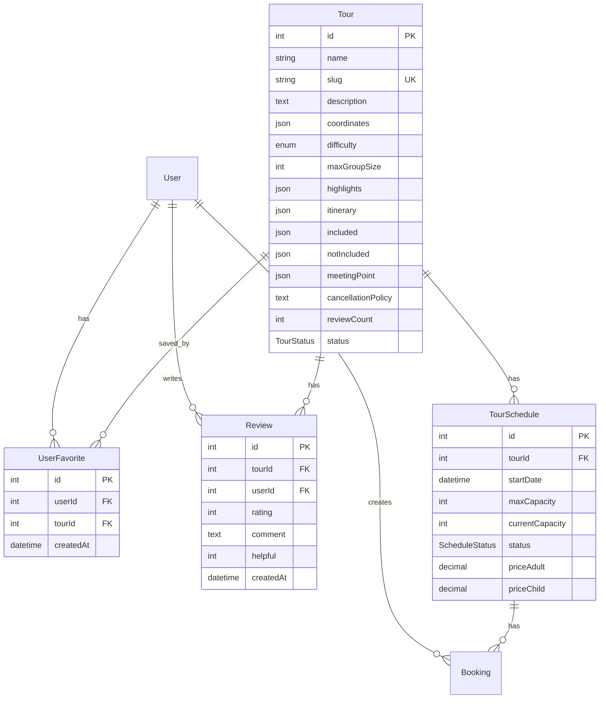
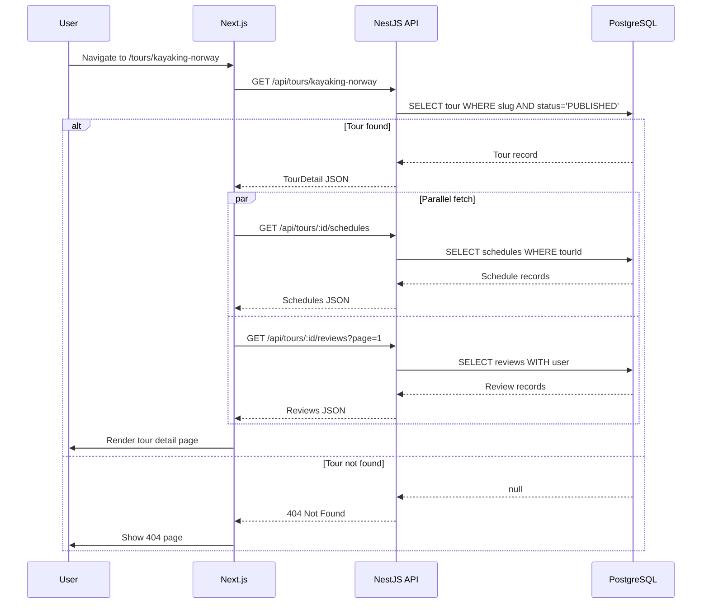
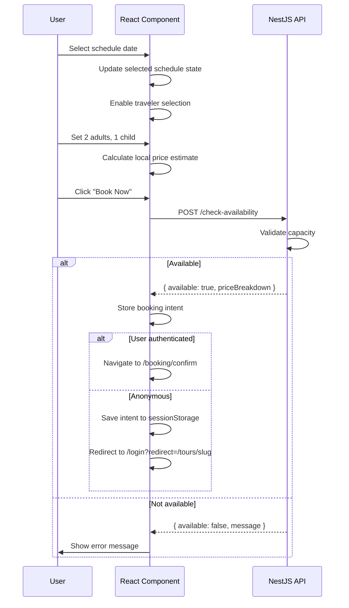
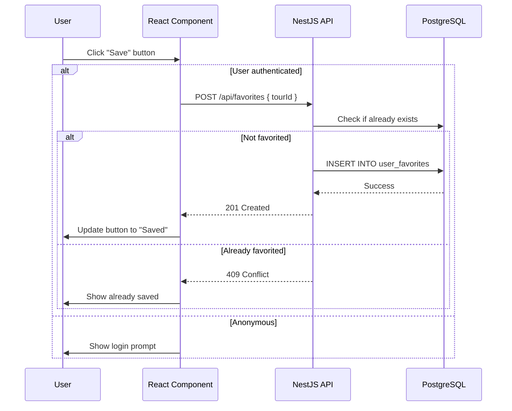

# Technical Design Document: Tour Detail Screen

## 1. Overview

### 1.1 Purpose

This document describes the technical design for the **Tour Detail Screen** (SCR-004) of the Booking Tour system. The feature provides a public-facing detailed view of a tour including gallery, highlights, itinerary, schedules, booking functionality, reviews, and meeting point map.

### 1.2 Scope

**Included:**

- Public tour detail page with SEO optimization
- Image gallery with lightbox
- Experience highlights section
- Expandable tour description
- Accordion itinerary
- What's included/not included
- Schedule picker with availability status
- Traveler count selection with price calculation
- Booking card (sticky sidebar on desktop, fixed bar on mobile)
- Reviews section with pagination and sorting
- Meeting point with static map image
- Share tour functionality
- Save to favorites (authenticated users)
- Booking intent storage for anonymous users

**Excluded:**

- Admin tour management (covered in TDD-admin-tours)
- Payment processing (separate feature)
- Review submission (separate feature)
- Interactive Google Maps (using static image)

### 1.3 Related Features

- **User Authentication** (SCR-001, SCR-002): Required for favorites and booking
- **Admin Tour Management** (TDD-admin-tours): Tour CRUD operations
- **Booking Confirmation** (SCR-005): Next step after clicking "Book Now"
- **Tour Listing** (SCR-003): Entry point to tour detail

---

## 2. Requirements

### 2.1 Functional Requirements

| ID     | Requirement                                                 | Priority |
| ------ | ----------------------------------------------------------- | -------- |
| FR-001 | User can view tour details by slug (public)                 | Must     |
| FR-002 | User can browse image gallery with lightbox                 | Must     |
| FR-003 | User can read expandable tour description                   | Must     |
| FR-004 | User can view itinerary in accordion format                 | Must     |
| FR-005 | User can see what's included/not included                   | Must     |
| FR-006 | User can select available schedule date                     | Must     |
| FR-007 | User can adjust traveler count (adults/children)            | Must     |
| FR-008 | User can see real-time price calculation                    | Must     |
| FR-009 | User can check availability before booking                  | Must     |
| FR-010 | Authenticated user can proceed to booking                   | Must     |
| FR-011 | Anonymous user is redirected to login with intent preserved | Must     |
| FR-012 | User can view reviews with pagination                       | Should   |
| FR-013 | User can sort reviews (recent, highest, lowest)             | Should   |
| FR-014 | User can see meeting point on static map                    | Should   |
| FR-015 | User can share tour (copy link, social media)               | Should   |
| FR-016 | Authenticated user can save/unsave tour to favorites        | Should   |
| FR-017 | Page has proper SEO meta tags and structured data           | Should   |

### 2.2 User Stories

| Story  | Description                                                                                   |
| ------ | --------------------------------------------------------------------------------------------- |
| US-001 | As a visitor, I want to view detailed tour information so that I can decide if I want to book |
| US-002 | As a visitor, I want to see available dates so that I can plan my trip                        |
| US-003 | As a visitor, I want to see price breakdown so that I understand the total cost               |
| US-004 | As a visitor, I want to read reviews so that I can trust the tour quality                     |
| US-005 | As a user, I want to save tours to favorites so that I can book later                         |
| US-006 | As a visitor, I want to share tours with friends so they can join                             |
| US-007 | As an anonymous user, I want my booking selections preserved after login                      |

### 2.3 Non-Functional Requirements

| Category           | Requirement                                                    |
| ------------------ | -------------------------------------------------------------- |
| **Performance**    | Tour detail API response < 200ms                               |
| **Performance**    | Page LCP (Largest Contentful Paint) < 2.5s                     |
| **Performance**    | Reviews pagination response < 150ms                            |
| **SEO**            | Proper meta tags, Open Graph, structured data (Product schema) |
| **Security**       | Favorites endpoints require authentication                     |
| **Security**       | Check-availability validates traveler count server-side        |
| **Accessibility**  | WCAG 2.1 AA compliance for gallery and forms                   |
| **Responsiveness** | Desktop (2-column), Tablet/Mobile (1-column with bottom bar)   |

---

## 3. Technical Design

### 3.1 Database Schema

#### 3.1.1 Extended Tour Model

Add new fields to support tour detail page:

```prisma
model Tour {
  id              Int        @id @default(autoincrement())
  name            String
  slug            String     @unique
  summary         String?
  description     String?    @db.Text
  coverImage      String?    @map("cover_image")
  images          Json?      // Array of image URLs
  durationDays    Int        @map("duration_days")
  priceAdult      Decimal    @map("price_adult") @db.Decimal(10, 2)
  priceChild      Decimal    @map("price_child") @db.Decimal(10, 2)
  location        String?
  ratingAverage   Decimal    @default(0) @map("rating_average") @db.Decimal(2, 1)

  // From TDD-admin-tours
  status          TourStatus @default(DRAFT)
  createdAt       DateTime   @default(now()) @map("created_at")
  updatedAt       DateTime   @updatedAt @map("updated_at")
  deletedAt       DateTime?  @map("deleted_at")

  // NEW FIELDS for Tour Detail
  coordinates     Json?      // { lat: number, lng: number }
  difficulty      Difficulty @default(MODERATE)
  maxGroupSize    Int        @default(12) @map("max_group_size")
  highlights      Json?      // [{ icon: string, label: string }]
  itinerary       Json?      // [{ day: number, title: string, description: string }]
  included        Json?      // string[]
  notIncluded     Json?      @map("not_included") // string[]
  meetingPoint    Json?      @map("meeting_point") // { name, address, coordinates, instructions }
  cancellationPolicy String? @map("cancellation_policy") @db.Text
  reviewCount     Int        @default(0) @map("review_count")

  schedules       TourSchedule[]
  reviews         Review[]
  favorites       UserFavorite[]

  @@map("tours")
}

enum Difficulty {
  EASY
  MODERATE
  CHALLENGING
}

enum TourStatus {
  DRAFT
  PUBLISHED
  ARCHIVED
}
```

#### 3.1.2 Extended Review Model

```prisma
model Review {
  id        Int      @id @default(autoincrement())
  tourId    Int      @map("tour_id")
  userId    Int      @map("user_id")
  rating    Int      // 1-5
  comment   String?  @db.Text
  helpful   Int      @default(0) // NEW: helpful count
  createdAt DateTime @default(now()) @map("created_at")

  tour Tour @relation(fields: [tourId], references: [id])
  user User @relation(fields: [userId], references: [id])

  @@map("reviews")
}
```

#### 3.1.3 New UserFavorite Model

```prisma
model UserFavorite {
  id        Int      @id @default(autoincrement())
  userId    Int      @map("user_id")
  tourId    Int      @map("tour_id")
  createdAt DateTime @default(now()) @map("created_at")

  user User @relation(fields: [userId], references: [id])
  tour Tour @relation(fields: [tourId], references: [id])

  @@unique([userId, tourId]) // Prevent duplicates
  @@map("user_favorites")
}
```

Update User model to include favorites:

```prisma
model User {
  // ... existing fields
  favorites UserFavorite[]
}
```

#### 3.1.4 Entity Relationship Diagram



#### 3.1.5 Migration

```bash
cd apps/server
pnpm prisma migrate dev --name add_tour_detail_and_favorites
```

---

### 3.2 Backend Implementation (NestJS)

#### 3.2.1 Module Structure

Extend existing `tours` module and create `favorites` module:

```
apps/server/src/modules/
├── tours/
│   ├── tours.module.ts
│   ├── tours.controller.ts          # Admin endpoints (existing)
│   ├── tours-public.controller.ts   # NEW: Public endpoints
│   ├── tours.service.ts
│   ├── dto/
│   │   ├── tour-detail-response.dto.ts
│   │   ├── schedule-response.dto.ts
│   │   ├── review-query.dto.ts
│   │   ├── review-response.dto.ts
│   │   └── check-availability.dto.ts
│   └── entities/
├── favorites/                        # NEW MODULE
│   ├── favorites.module.ts
│   ├── favorites.controller.ts
│   ├── favorites.service.ts
│   └── dto/
│       ├── create-favorite.dto.ts
│       └── favorite-response.dto.ts
```

#### 3.2.2 API Endpoints

**Public Tour Endpoints:**

| Method | Endpoint                                               | Description                 | Auth   |
| ------ | ------------------------------------------------------ | --------------------------- | ------ |
| GET    | `/api/tours/{slug}`                                    | Get tour detail by slug     | Public |
| GET    | `/api/tours/{tourId}/schedules`                        | Get tour schedules          | Public |
| GET    | `/api/tours/{tourId}/reviews`                          | Get reviews with pagination | Public |
| POST   | `/api/tours/schedules/{scheduleId}/check-availability` | Check availability          | Public |

**Favorites Endpoints:**

| Method | Endpoint                         | Description                | Auth |
| ------ | -------------------------------- | -------------------------- | ---- |
| GET    | `/api/favorites`                 | Get user's favorites       | USER |
| POST   | `/api/favorites`                 | Add tour to favorites      | USER |
| DELETE | `/api/favorites/{tourId}`        | Remove from favorites      | USER |
| GET    | `/api/favorites/{tourId}/status` | Check if tour is favorited | USER |

#### 3.2.3 DTOs

**File: `dto/tour-detail-response.dto.ts`**

```typescript
export interface Coordinates {
  lat: number;
  lng: number;
}

export interface Highlight {
  icon: string;
  label: string;
}

export interface ItineraryDay {
  day: number;
  title: string;
  description: string;
}

export interface MeetingPoint {
  name: string;
  address: string;
  coordinates: Coordinates;
  instructions: string;
}

export class TourDetailResponseDto {
  id: number;
  name: string;
  slug: string;
  summary?: string;
  description?: string;
  coverImage?: string;
  images: string[];
  durationDays: number;
  priceAdult: number;
  priceChild: number;
  location?: string;
  coordinates?: Coordinates;
  ratingAverage: number;
  reviewCount: number;
  difficulty: "EASY" | "MODERATE" | "CHALLENGING";
  maxGroupSize: number;
  highlights: Highlight[];
  itinerary: ItineraryDay[];
  included: string[];
  notIncluded: string[];
  meetingPoint?: MeetingPoint;
  cancellationPolicy?: string;
  createdAt: Date;
  updatedAt: Date;
}
```

**File: `dto/schedule-response.dto.ts`**

```typescript
export class ScheduleResponseDto {
  id: number;
  tourId: number;
  startDate: string;
  maxCapacity: number;
  currentCapacity: number;
  availableSpots: number;
  status: "OPEN" | "SOLD_OUT" | "CLOSED" | "COMPLETED";
  priceAdult: number;
  priceChild: number;
}

export class ScheduleListResponseDto {
  schedules: ScheduleResponseDto[];
}
```

**File: `dto/review-query.dto.ts`**

```typescript
import { IsOptional, IsInt, Min, IsEnum } from "class-validator";
import { Type } from "class-transformer";

export class ReviewQueryDto {
  @IsOptional()
  @Type(() => Number)
  @IsInt()
  @Min(1)
  page?: number = 1;

  @IsOptional()
  @Type(() => Number)
  @IsInt()
  @Min(1)
  limit?: number = 5;

  @IsOptional()
  @IsEnum(["recent", "rating_desc", "rating_asc"])
  sort?: "recent" | "rating_desc" | "rating_asc" = "recent";
}
```

**File: `dto/review-response.dto.ts`**

```typescript
export class ReviewUserDto {
  id: number;
  fullName: string;
  avatar?: string;
}

export class ReviewDto {
  id: number;
  user: ReviewUserDto;
  rating: number;
  comment?: string;
  createdAt: string;
  helpful: number;
}

export class ReviewSummaryDto {
  averageRating: number;
  totalReviews: number;
  distribution: Record<string, number>; // { "5": 35, "4": 8, ... }
}

export class ReviewListResponseDto {
  summary: ReviewSummaryDto;
  reviews: ReviewDto[];
  pagination: {
    page: number;
    limit: number;
    total: number;
    totalPages: number;
    hasNext: boolean;
  };
}
```

**File: `dto/check-availability.dto.ts`**

```typescript
import { IsInt, Min, Max } from "class-validator";

export class CheckAvailabilityDto {
  @IsInt()
  @Min(1)
  @Max(20)
  adults: number;

  @IsInt()
  @Min(0)
  @Max(20)
  children: number;
}

export class AvailabilityResponseDto {
  available: boolean;
  scheduleId: number;
  requestedSpots: number;
  availableSpots: number;
  message?: string;
  priceBreakdown?: {
    adults: { count: number; unitPrice: number; total: number };
    children: { count: number; unitPrice: number; total: number };
    subtotal: number;
    taxes: number;
    total: number;
  };
}
```

#### 3.2.4 Service Methods

**File: `tours.service.ts` - Add public methods**

```typescript
// Add to existing ToursService

/**
 * Get tour by slug (public)
 */
async findBySlug(slug: string): Promise<TourDetailResponseDto> {
  const tour = await this.prisma.tour.findUnique({
    where: {
      slug,
      status: 'PUBLISHED',
      deletedAt: null,
    },
  });

  if (!tour) {
    throw new NotFoundException('Tour not found');
  }

  return this.mapToDetailResponse(tour);
}

/**
 * Get schedules for a tour (public)
 */
async getSchedules(
  tourId: number,
  from?: string,
  to?: string
): Promise<ScheduleListResponseDto> {
  const now = new Date();
  const threeMonthsLater = new Date();
  threeMonthsLater.setMonth(threeMonthsLater.getMonth() + 3);

  const schedules = await this.prisma.tourSchedule.findMany({
    where: {
      tourId,
      startDate: {
        gte: from ? new Date(from) : now,
        lte: to ? new Date(to) : threeMonthsLater,
      },
      status: { in: ['OPEN', 'SOLD_OUT'] },
    },
    orderBy: { startDate: 'asc' },
  });

  return {
    schedules: schedules.map((s) => ({
      id: s.id,
      tourId: s.tourId,
      startDate: s.startDate.toISOString(),
      maxCapacity: s.maxCapacity,
      currentCapacity: s.currentCapacity,
      availableSpots: s.maxCapacity - s.currentCapacity,
      status: s.status,
      priceAdult: Number(s.priceAdult || tour.priceAdult),
      priceChild: Number(s.priceChild || tour.priceChild),
    })),
  };
}

/**
 * Get reviews for a tour with pagination
 */
async getReviews(
  tourId: number,
  query: ReviewQueryDto
): Promise<ReviewListResponseDto> {
  const { page = 1, limit = 5, sort = 'recent' } = query;

  // Build orderBy
  let orderBy: any = { createdAt: 'desc' };
  if (sort === 'rating_desc') orderBy = { rating: 'desc' };
  if (sort === 'rating_asc') orderBy = { rating: 'asc' };

  // Get reviews with user info
  const [reviews, total, ratingCounts] = await Promise.all([
    this.prisma.review.findMany({
      where: { tourId },
      include: {
        user: {
          select: { id: true, fullName: true },
        },
      },
      orderBy,
      skip: (page - 1) * limit,
      take: limit,
    }),
    this.prisma.review.count({ where: { tourId } }),
    this.prisma.review.groupBy({
      by: ['rating'],
      where: { tourId },
      _count: true,
    }),
  ]);

  // Calculate distribution
  const distribution: Record<string, number> = { '5': 0, '4': 0, '3': 0, '2': 0, '1': 0 };
  ratingCounts.forEach((r) => {
    distribution[String(r.rating)] = r._count;
  });

  // Calculate average
  const avgResult = await this.prisma.review.aggregate({
    where: { tourId },
    _avg: { rating: true },
  });

  return {
    summary: {
      averageRating: avgResult._avg.rating || 0,
      totalReviews: total,
      distribution,
    },
    reviews: reviews.map((r) => ({
      id: r.id,
      user: {
        id: r.user.id,
        fullName: r.user.fullName || 'Anonymous',
        avatar: undefined, // Add avatar field to User model if needed
      },
      rating: r.rating,
      comment: r.comment,
      createdAt: r.createdAt.toISOString(),
      helpful: r.helpful,
    })),
    pagination: {
      page,
      limit,
      total,
      totalPages: Math.ceil(total / limit),
      hasNext: page * limit < total,
    },
  };
}

/**
 * Check availability for a schedule
 */
async checkAvailability(
  scheduleId: number,
  dto: CheckAvailabilityDto
): Promise<AvailabilityResponseDto> {
  const schedule = await this.prisma.tourSchedule.findUnique({
    where: { id: scheduleId },
    include: { tour: true },
  });

  if (!schedule) {
    throw new NotFoundException('Schedule not found');
  }

  const requestedSpots = dto.adults + dto.children;
  const availableSpots = schedule.maxCapacity - schedule.currentCapacity;
  const available = availableSpots >= requestedSpots && schedule.status === 'OPEN';

  if (!available) {
    return {
      available: false,
      scheduleId,
      requestedSpots,
      availableSpots,
      message: availableSpots === 0
        ? 'This date is sold out'
        : `Only ${availableSpots} spots available for this date`,
    };
  }

  // Calculate price
  const priceAdult = Number(schedule.tour.priceAdult);
  const priceChild = Number(schedule.tour.priceChild);
  const adultsTotal = dto.adults * priceAdult;
  const childrenTotal = dto.children * priceChild;
  const subtotal = adultsTotal + childrenTotal;
  const taxRate = 0.10;
  const taxes = subtotal * taxRate;
  const total = subtotal + taxes;

  return {
    available: true,
    scheduleId,
    requestedSpots,
    availableSpots,
    priceBreakdown: {
      adults: { count: dto.adults, unitPrice: priceAdult, total: adultsTotal },
      children: { count: dto.children, unitPrice: priceChild, total: childrenTotal },
      subtotal,
      taxes,
      total,
    },
  };
}
```

**File: `favorites.service.ts`**

```typescript
import {
  Injectable,
  ConflictException,
  NotFoundException,
} from "@nestjs/common";
import { PrismaService } from "@/prisma/prisma.service";

@Injectable()
export class FavoritesService {
  constructor(private prisma: PrismaService) {}

  async getUserFavorites(userId: number) {
    const favorites = await this.prisma.userFavorite.findMany({
      where: { userId },
      include: {
        tour: {
          select: {
            id: true,
            name: true,
            slug: true,
            coverImage: true,
            priceAdult: true,
            location: true,
            ratingAverage: true,
            durationDays: true,
          },
        },
      },
      orderBy: { createdAt: "desc" },
    });

    return favorites.map((f) => ({
      id: f.id,
      tourId: f.tourId,
      createdAt: f.createdAt,
      tour: {
        ...f.tour,
        priceAdult: Number(f.tour.priceAdult),
        ratingAverage: Number(f.tour.ratingAverage),
      },
    }));
  }

  async addFavorite(userId: number, tourId: number) {
    // Check if tour exists
    const tour = await this.prisma.tour.findUnique({
      where: { id: tourId, deletedAt: null },
    });

    if (!tour) {
      throw new NotFoundException("Tour not found");
    }

    // Check if already favorited
    const existing = await this.prisma.userFavorite.findUnique({
      where: { userId_tourId: { userId, tourId } },
    });

    if (existing) {
      throw new ConflictException("Tour already in favorites");
    }

    return this.prisma.userFavorite.create({
      data: { userId, tourId },
    });
  }

  async removeFavorite(userId: number, tourId: number) {
    const favorite = await this.prisma.userFavorite.findUnique({
      where: { userId_tourId: { userId, tourId } },
    });

    if (!favorite) {
      throw new NotFoundException("Favorite not found");
    }

    return this.prisma.userFavorite.delete({
      where: { id: favorite.id },
    });
  }

  async isFavorited(userId: number, tourId: number): Promise<boolean> {
    const favorite = await this.prisma.userFavorite.findUnique({
      where: { userId_tourId: { userId, tourId } },
    });
    return !!favorite;
  }
}
```

#### 3.2.5 Controllers

**File: `tours-public.controller.ts`**

```typescript
import {
  Controller,
  Get,
  Post,
  Body,
  Param,
  Query,
  HttpCode,
  HttpStatus,
  ParseIntPipe,
} from "@nestjs/common";
import { ApiTags, ApiOperation } from "@nestjs/swagger";
import { ToursService } from "./tours.service";
import { ReviewQueryDto } from "./dto/review-query.dto";
import { CheckAvailabilityDto } from "./dto/check-availability.dto";

@ApiTags("tours")
@Controller("api/tours")
export class ToursPublicController {
  constructor(private readonly toursService: ToursService) {}

  @Get(":slug")
  @ApiOperation({ summary: "Get tour by slug" })
  @HttpCode(HttpStatus.OK)
  async findBySlug(@Param("slug") slug: string) {
    return this.toursService.findBySlug(slug);
  }

  @Get(":tourId/schedules")
  @ApiOperation({ summary: "Get tour schedules" })
  @HttpCode(HttpStatus.OK)
  async getSchedules(
    @Param("tourId", ParseIntPipe) tourId: number,
    @Query("from") from?: string,
    @Query("to") to?: string,
  ) {
    return this.toursService.getSchedules(tourId, from, to);
  }

  @Get(":tourId/reviews")
  @ApiOperation({ summary: "Get tour reviews" })
  @HttpCode(HttpStatus.OK)
  async getReviews(
    @Param("tourId", ParseIntPipe) tourId: number,
    @Query() query: ReviewQueryDto,
  ) {
    return this.toursService.getReviews(tourId, query);
  }

  @Post("schedules/:scheduleId/check-availability")
  @ApiOperation({ summary: "Check schedule availability" })
  @HttpCode(HttpStatus.OK)
  async checkAvailability(
    @Param("scheduleId", ParseIntPipe) scheduleId: number,
    @Body() dto: CheckAvailabilityDto,
  ) {
    return this.toursService.checkAvailability(scheduleId, dto);
  }
}
```

**File: `favorites.controller.ts`**

```typescript
import {
  Controller,
  Get,
  Post,
  Delete,
  Body,
  Param,
  UseGuards,
  HttpCode,
  HttpStatus,
  ParseIntPipe,
  Req,
} from "@nestjs/common";
import { ApiTags, ApiOperation, ApiBearerAuth } from "@nestjs/swagger";
import { FavoritesService } from "./favorites.service";
import { JwtAuthGuard } from "@/modules/auth/guards/jwt-auth.guard";

@ApiTags("favorites")
@ApiBearerAuth("access-token")
@Controller("api/favorites")
@UseGuards(JwtAuthGuard)
export class FavoritesController {
  constructor(private readonly favoritesService: FavoritesService) {}

  @Get()
  @ApiOperation({ summary: "Get user favorites" })
  async getUserFavorites(@Req() req: any) {
    return this.favoritesService.getUserFavorites(req.user.id);
  }

  @Post()
  @ApiOperation({ summary: "Add tour to favorites" })
  @HttpCode(HttpStatus.CREATED)
  async addFavorite(@Req() req: any, @Body("tourId") tourId: number) {
    return this.favoritesService.addFavorite(req.user.id, tourId);
  }

  @Delete(":tourId")
  @ApiOperation({ summary: "Remove from favorites" })
  @HttpCode(HttpStatus.NO_CONTENT)
  async removeFavorite(
    @Req() req: any,
    @Param("tourId", ParseIntPipe) tourId: number,
  ) {
    return this.favoritesService.removeFavorite(req.user.id, tourId);
  }

  @Get(":tourId/status")
  @ApiOperation({ summary: "Check if tour is favorited" })
  async isFavorited(
    @Req() req: any,
    @Param("tourId", ParseIntPipe) tourId: number,
  ) {
    const isFavorited = await this.favoritesService.isFavorited(
      req.user.id,
      tourId,
    );
    return { isFavorited };
  }
}
```

---

### 3.3 Frontend Implementation (Next.js)

#### 3.3.1 Routes & Pages

| Route           | Page                        | Description      |
| --------------- | --------------------------- | ---------------- |
| `/tours/[slug]` | `app/tours/[slug]/page.tsx` | Tour detail page |

#### 3.3.2 Components Structure

```
apps/web/
├── app/
│   └── tours/
│       └── [slug]/
│           ├── page.tsx              # Main page (Server Component)
│           └── loading.tsx           # Loading skeleton
├── components/
│   └── tours/
│       ├── tour-detail/
│       │   ├── tour-header.tsx       # Breadcrumb, title, actions
│       │   ├── tour-gallery.tsx      # Image gallery with lightbox
│       │   ├── tour-highlights.tsx   # Experience highlights
│       │   ├── tour-description.tsx  # Expandable description
│       │   ├── tour-itinerary.tsx    # Accordion itinerary
│       │   ├── tour-included.tsx     # What's included/not included
│       │   ├── tour-meeting-point.tsx # Static map + address
│       │   ├── tour-reviews.tsx      # Reviews section
│       │   ├── booking-card.tsx      # Booking card (sidebar/bottom)
│       │   ├── schedule-picker.tsx   # Calendar date picker
│       │   ├── traveler-selector.tsx # Adult/child counter
│       │   ├── price-breakdown.tsx   # Price details
│       │   └── share-modal.tsx       # Share options
│       └── favorites/
│           └── favorite-button.tsx   # Save/unsave button
├── lib/
│   ├── api/
│   │   ├── tours.ts                  # Public tour API
│   │   └── favorites.ts              # Favorites API
│   ├── hooks/
│   │   ├── use-tour.ts               # Tour data hook
│   │   ├── use-tour-schedules.ts     # Schedules hook
│   │   ├── use-tour-reviews.ts       # Reviews hook
│   │   ├── use-booking-selection.ts  # Booking state hook
│   │   └── use-favorites.ts          # Favorites hook
│   └── types/
│       └── tour.ts                   # TypeScript types
```

#### 3.3.3 Types

**File: `lib/types/tour.ts`**

```typescript
export interface Coordinates {
  lat: number;
  lng: number;
}

export interface Highlight {
  icon: string;
  label: string;
}

export interface ItineraryDay {
  day: number;
  title: string;
  description: string;
}

export interface MeetingPoint {
  name: string;
  address: string;
  coordinates: Coordinates;
  instructions: string;
}

export interface TourDetail {
  id: number;
  name: string;
  slug: string;
  summary?: string;
  description?: string;
  coverImage?: string;
  images: string[];
  durationDays: number;
  priceAdult: number;
  priceChild: number;
  location?: string;
  coordinates?: Coordinates;
  ratingAverage: number;
  reviewCount: number;
  difficulty: "EASY" | "MODERATE" | "CHALLENGING";
  maxGroupSize: number;
  highlights: Highlight[];
  itinerary: ItineraryDay[];
  included: string[];
  notIncluded: string[];
  meetingPoint?: MeetingPoint;
  cancellationPolicy?: string;
}

export interface TourSchedule {
  id: number;
  tourId: number;
  startDate: string;
  maxCapacity: number;
  currentCapacity: number;
  availableSpots: number;
  status: "OPEN" | "SOLD_OUT" | "CLOSED" | "COMPLETED";
  priceAdult: number;
  priceChild: number;
}

export interface BookingSelection {
  scheduleId: number | null;
  schedule: TourSchedule | null;
  adults: number;
  children: number;
  totalPrice: number;
}

export interface ReviewUser {
  id: number;
  fullName: string;
  avatar?: string;
}

export interface Review {
  id: number;
  user: ReviewUser;
  rating: number;
  comment?: string;
  createdAt: string;
  helpful: number;
}

export interface ReviewSummary {
  averageRating: number;
  totalReviews: number;
  distribution: Record<string, number>;
}
```

#### 3.3.4 API Functions

**File: `lib/api/tours.ts`**

```typescript
const API_URL = process.env.NEXT_PUBLIC_API_URL || "http://localhost:4000";

export async function getTourBySlug(slug: string): Promise<TourDetail> {
  const response = await fetch(`${API_URL}/api/tours/${slug}`, {
    next: { revalidate: 60 }, // ISR: revalidate every 60 seconds
  });

  if (!response.ok) {
    if (response.status === 404) {
      throw new Error("TOUR_NOT_FOUND");
    }
    throw new Error("Failed to fetch tour");
  }

  return response.json();
}

export async function getTourSchedules(
  tourId: number,
  from?: string,
  to?: string,
): Promise<{ schedules: TourSchedule[] }> {
  const params = new URLSearchParams();
  if (from) params.set("from", from);
  if (to) params.set("to", to);

  const response = await fetch(
    `${API_URL}/api/tours/${tourId}/schedules?${params.toString()}`,
  );

  if (!response.ok) {
    throw new Error("Failed to fetch schedules");
  }

  return response.json();
}

export async function getTourReviews(
  tourId: number,
  page = 1,
  limit = 5,
  sort: "recent" | "rating_desc" | "rating_asc" = "recent",
): Promise<ReviewListResponse> {
  const params = new URLSearchParams({
    page: String(page),
    limit: String(limit),
    sort,
  });

  const response = await fetch(
    `${API_URL}/api/tours/${tourId}/reviews?${params.toString()}`,
  );

  if (!response.ok) {
    throw new Error("Failed to fetch reviews");
  }

  return response.json();
}

export async function checkAvailability(
  scheduleId: number,
  adults: number,
  children: number,
): Promise<AvailabilityResponse> {
  const response = await fetch(
    `${API_URL}/api/tours/schedules/${scheduleId}/check-availability`,
    {
      method: "POST",
      headers: { "Content-Type": "application/json" },
      body: JSON.stringify({ adults, children }),
    },
  );

  if (!response.ok) {
    throw new Error("Failed to check availability");
  }

  return response.json();
}
```

**File: `lib/api/favorites.ts`**

```typescript
const API_URL = process.env.NEXT_PUBLIC_API_URL || "http://localhost:4000";

export async function addToFavorites(tourId: number, token: string) {
  const response = await fetch(`${API_URL}/api/favorites`, {
    method: "POST",
    headers: {
      "Content-Type": "application/json",
      Authorization: `Bearer ${token}`,
    },
    body: JSON.stringify({ tourId }),
  });

  if (!response.ok) {
    const error = await response.json();
    throw new Error(error.message || "Failed to add to favorites");
  }

  return response.json();
}

export async function removeFromFavorites(tourId: number, token: string) {
  const response = await fetch(`${API_URL}/api/favorites/${tourId}`, {
    method: "DELETE",
    headers: {
      Authorization: `Bearer ${token}`,
    },
  });

  if (!response.ok) {
    throw new Error("Failed to remove from favorites");
  }
}

export async function checkIsFavorited(
  tourId: number,
  token: string,
): Promise<boolean> {
  const response = await fetch(`${API_URL}/api/favorites/${tourId}/status`, {
    headers: {
      Authorization: `Bearer ${token}`,
    },
  });

  if (!response.ok) {
    return false;
  }

  const data = await response.json();
  return data.isFavorited;
}
```

#### 3.3.5 Main Page Component

**File: `app/tours/[slug]/page.tsx`**

```tsx
import { Metadata } from "next";
import { notFound } from "next/navigation";
import {
  getTourBySlug,
  getTourSchedules,
  getTourReviews,
} from "@/lib/api/tours";

import { TourHeader } from "@/components/tours/tour-detail/tour-header";
import { TourGallery } from "@/components/tours/tour-detail/tour-gallery";
import { TourHighlights } from "@/components/tours/tour-detail/tour-highlights";
import { TourDescription } from "@/components/tours/tour-detail/tour-description";
import { TourItinerary } from "@/components/tours/tour-detail/tour-itinerary";
import { TourIncluded } from "@/components/tours/tour-detail/tour-included";
import { TourMeetingPoint } from "@/components/tours/tour-detail/tour-meeting-point";
import { TourReviews } from "@/components/tours/tour-detail/tour-reviews";
import { BookingCard } from "@/components/tours/tour-detail/booking-card";

interface Props {
  params: Promise<{ slug: string }>;
}

export async function generateMetadata({ params }: Props): Promise<Metadata> {
  const { slug } = await params;

  try {
    const tour = await getTourBySlug(slug);
    return {
      title: `${tour.name} | TravelCo`,
      description: tour.summary || tour.description?.substring(0, 160),
      openGraph: {
        title: tour.name,
        description: tour.summary,
        images: tour.coverImage ? [tour.coverImage] : [],
        type: "website",
      },
    };
  } catch {
    return {
      title: "Tour Not Found | TravelCo",
    };
  }
}

export default async function TourDetailPage({ params }: Props) {
  const { slug } = await params;

  let tour;
  try {
    tour = await getTourBySlug(slug);
  } catch (error) {
    if (error instanceof Error && error.message === "TOUR_NOT_FOUND") {
      notFound();
    }
    throw error;
  }

  // Prefetch schedules and reviews
  const [schedulesData, reviewsData] = await Promise.all([
    getTourSchedules(tour.id),
    getTourReviews(tour.id),
  ]);

  return (
    <div className="min-h-screen bg-gray-50">
      {/* Header */}
      <TourHeader tour={tour} />

      <div className="max-w-7xl mx-auto px-4 py-8">
        <div className="grid grid-cols-1 lg:grid-cols-3 gap-8">
          {/* Main Content */}
          <div className="lg:col-span-2 space-y-8">
            <TourGallery coverImage={tour.coverImage} images={tour.images} />

            <TourHighlights highlights={tour.highlights} />

            <TourDescription description={tour.description} />

            <TourItinerary itinerary={tour.itinerary} />

            <TourIncluded
              included={tour.included}
              notIncluded={tour.notIncluded}
            />

            <TourMeetingPoint meetingPoint={tour.meetingPoint} />

            <TourReviews tourId={tour.id} initialData={reviewsData} />
          </div>

          {/* Booking Sidebar */}
          <div className="lg:col-span-1">
            <BookingCard
              tour={tour}
              initialSchedules={schedulesData.schedules}
            />
          </div>
        </div>
      </div>
    </div>
  );
}
```

---

### 3.4 Logic Flow

#### 3.4.1 View Tour Detail Flow



#### 3.4.2 Booking Selection Flow



#### 3.4.3 Favorites Flow



---

### 3.5 Security & Performance

#### 3.5.1 Security Measures

| Measure                 | Implementation                                                |
| ----------------------- | ------------------------------------------------------------- |
| **Public Endpoints**    | Tour detail, schedules, reviews are public (no auth required) |
| **Protected Endpoints** | Favorites require JWT authentication                          |
| **Input Validation**    | DTOs with class-validator on backend                          |
| **SQL Injection**       | Prisma parameterized queries                                  |
| **XSS Prevention**      | React auto-escaping, sanitize HTML in description             |
| **Rate Limiting**       | Consider rate limiting on check-availability endpoint         |

#### 3.5.2 Performance Optimizations

| Optimization               | Implementation                               |
| -------------------------- | -------------------------------------------- |
| **ISR**                    | Revalidate tour detail every 60 seconds      |
| **Parallel Data Fetching** | Fetch schedules + reviews in parallel        |
| **Image Optimization**     | Next.js Image component with lazy loading    |
| **Pagination**             | Reviews loaded in batches of 5               |
| **Database Indexes**       | Index on slug, tourId in reviews/schedules   |
| **Caching**                | Consider Redis for frequently accessed tours |
| **Static Map**             | Use static image instead of interactive map  |

#### 3.5.3 Database Indexes

```sql
-- Index for slug lookup (frequently used)
CREATE UNIQUE INDEX idx_tours_slug ON tours(slug) WHERE deleted_at IS NULL;

-- Index for reviews by tour
CREATE INDEX idx_reviews_tour_id ON reviews(tour_id);
CREATE INDEX idx_reviews_created_at ON reviews(created_at DESC);

-- Index for schedules by tour
CREATE INDEX idx_schedules_tour_id ON tour_schedules(tour_id);
CREATE INDEX idx_schedules_start_date ON tour_schedules(start_date);

-- Index for favorites
CREATE UNIQUE INDEX idx_favorites_user_tour ON user_favorites(user_id, tour_id);
```

---

## 4. Testing Plan

### 4.1 Backend Unit Tests

```typescript
describe("ToursService - Public", () => {
  describe("findBySlug", () => {
    it("should return tour detail for valid published slug", async () => {});
    it("should throw 404 for non-existent slug", async () => {});
    it("should throw 404 for draft/archived tours", async () => {});
  });

  describe("getSchedules", () => {
    it("should return schedules within date range", async () => {});
    it("should filter out CLOSED/COMPLETED schedules", async () => {});
    it("should calculate availableSpots correctly", async () => {});
  });

  describe("getReviews", () => {
    it("should return paginated reviews", async () => {});
    it("should sort by rating when requested", async () => {});
    it("should calculate rating distribution correctly", async () => {});
  });

  describe("checkAvailability", () => {
    it("should return available true when capacity exists", async () => {});
    it("should return available false when sold out", async () => {});
    it("should calculate price breakdown correctly", async () => {});
  });
});

describe("FavoritesService", () => {
  describe("addFavorite", () => {
    it("should add tour to favorites", async () => {});
    it("should throw 409 if already favorited", async () => {});
    it("should throw 404 if tour not found", async () => {});
  });

  describe("removeFavorite", () => {
    it("should remove tour from favorites", async () => {});
    it("should throw 404 if not favorited", async () => {});
  });
});
```

### 4.2 Backend E2E Tests

```typescript
describe("Public Tours (e2e)", () => {
  describe("GET /api/tours/:slug", () => {
    it("should return tour detail for valid slug", () => {});
    it("should return 404 for invalid slug", () => {});
  });

  describe("POST /api/tours/schedules/:id/check-availability", () => {
    it("should check availability correctly", () => {});
    it("should validate traveler counts", () => {});
  });
});

describe("Favorites (e2e)", () => {
  describe("POST /api/favorites", () => {
    it("should return 401 without auth", () => {});
    it("should add to favorites with valid auth", () => {});
  });
});
```

### 4.3 Frontend Tests

```typescript
describe("TourDetailPage", () => {
  it("renders tour information correctly", () => {});
  it("shows 404 page for invalid slug", () => {});
  it("has correct SEO meta tags", () => {});
});

describe("BookingCard", () => {
  it("enables Book Now when schedule selected", () => {});
  it("updates price when travelers change", () => {});
  it("shows error for insufficient availability", () => {});
  it("redirects to login for anonymous users", () => {});
});

describe("TourReviews", () => {
  it("loads more reviews on button click", () => {});
  it("sorts reviews correctly", () => {});
});
```

---

## 5. Alternatives Considered

### 5.1 Map Implementation

**Option A (Chosen):** Static map image placeholder

- **Pros:** No API costs, fast loading, simple implementation
- **Cons:** Not interactive

**Option B:** Google Maps Embed

- **Pros:** Interactive
- **Cons:** API costs, slower loading

**Option C:** Leaflet/Mapbox

- **Pros:** Free, interactive
- **Cons:** More complex setup

**Decision:** Start with static image. Can upgrade to Leaflet later if needed.

### 5.2 Reviews Loading

**Option A (Chosen):** Pagination with "Load More"

- **Pros:** Simple UX, reduces initial load
- **Cons:** User must click to see more

**Option B:** Infinite scroll

- **Pros:** Seamless experience
- **Cons:** More complex, harder to share specific review

**Decision:** Load More button for simpler implementation.

### 5.3 Booking Intent Storage

**Option A (Chosen):** sessionStorage

- **Pros:** Simple, no backend changes
- **Cons:** Lost if user closes browser

**Option B:** Server-side storage with token

- **Pros:** Persistent
- **Cons:** More complex, requires API changes

**Decision:** sessionStorage for MVP. Can enhance later.

---

## 6. Implementation Checklist

### 6.1 Database

- [ ] Add new fields to Tour model (coordinates, difficulty, highlights, etc.)
- [ ] Add helpful field to Review model
- [ ] Create UserFavorite model
- [ ] Create migration: `pnpm prisma migrate dev --name add_tour_detail_and_favorites`
- [ ] Add database indexes
- [ ] Seed sample data for testing

### 6.2 Backend (NestJS)

- [ ] Create `tours-public.controller.ts` with public endpoints
- [ ] Add public service methods to ToursService
- [ ] Create FavoritesModule, Service, Controller
- [ ] Create all DTOs
- [ ] Add Swagger documentation
- [ ] Write unit tests
- [ ] Write E2E tests

### 6.3 Frontend (Next.js)

- [ ] Create `/tours/[slug]/page.tsx`
- [ ] Create `/tours/[slug]/loading.tsx`
- [ ] Create `/tours/[slug]/not-found.tsx`
- [ ] Create TourHeader component
- [ ] Create TourGallery component with lightbox
- [ ] Create TourHighlights component
- [ ] Create TourDescription component (expandable)
- [ ] Create TourItinerary component (accordion)
- [ ] Create TourIncluded component
- [ ] Create TourMeetingPoint component (static map)
- [ ] Create TourReviews component with pagination
- [ ] Create BookingCard component
- [ ] Create SchedulePicker component
- [ ] Create TravelerSelector component
- [ ] Create PriceBreakdown component
- [ ] Create ShareModal component
- [ ] Create FavoriteButton component
- [ ] Create API functions
- [ ] Create custom hooks
- [ ] Add SEO meta tags and structured data
- [ ] Implement responsive design
- [ ] Write component tests

### 6.4 Integration & QA

- [ ] Test all 20 acceptance criteria scenarios
- [ ] Test responsive design (desktop, tablet, mobile)
- [ ] Test anonymous user booking flow
- [ ] Test authenticated user booking flow
- [ ] Test favorites functionality
- [ ] Test error states (404, network errors)
- [ ] Performance testing (LCP < 2.5s)
- [ ] SEO validation (structured data)
- [ ] Accessibility testing

---

**End of Technical Design Document**
