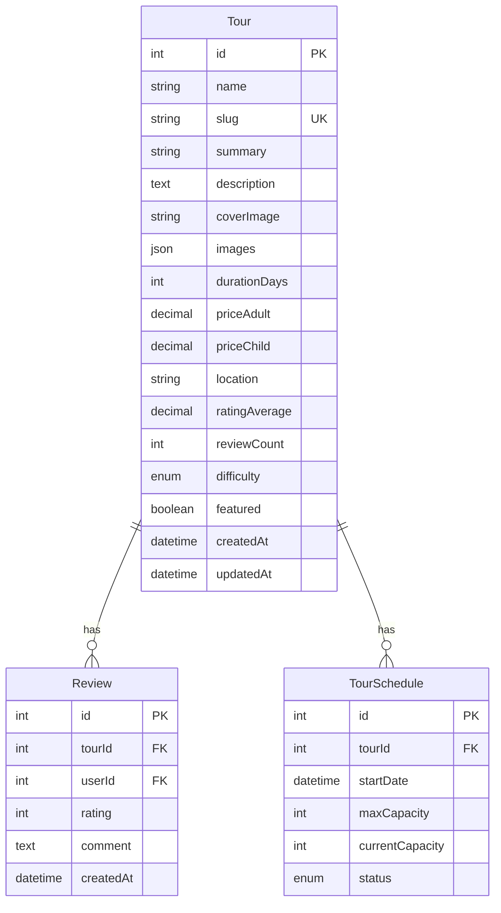
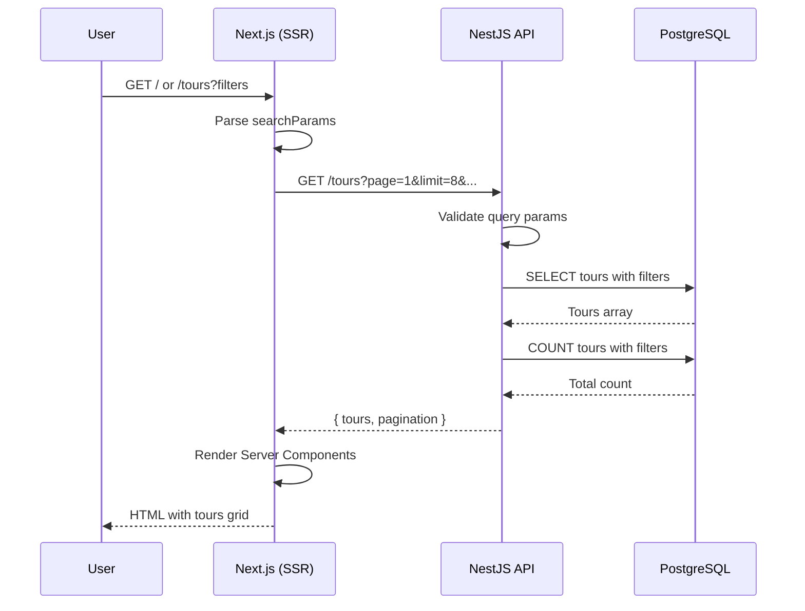
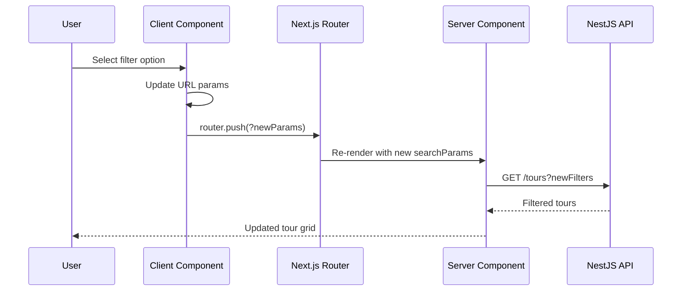
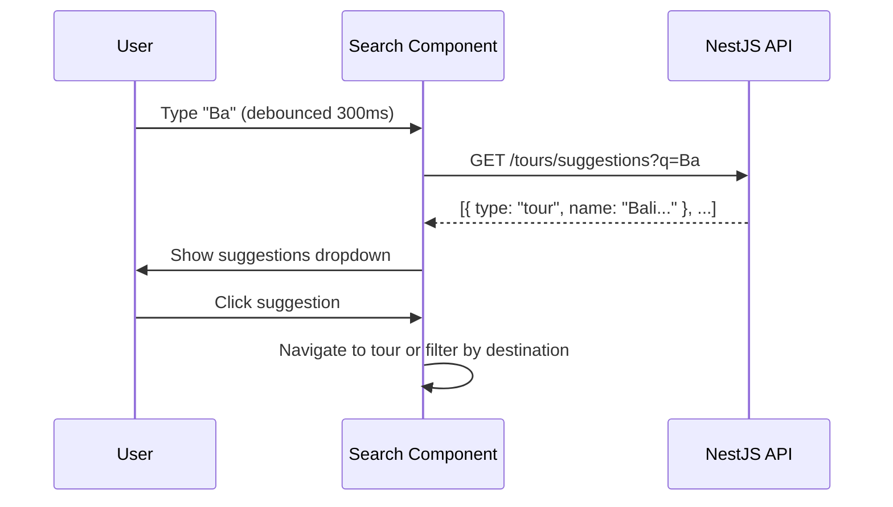

# Technical Design Document: Tours Overview (Home Page)

## 1. Overview

Tài liệu này mô tả thiết kế kỹ thuật cho **Tours Overview Screen** - trang chủ hiển thị danh sách tours với các tính năng search, filter, sort và pagination.

### 1.1 Purpose
- Hiển thị danh sách tours cho visitors và users
- Cung cấp khả năng search, filter, sort tours
- Hỗ trợ pagination và responsive design
- Tối ưu SEO cho landing page

### 1.2 Scope

**Bao gồm:**
- Hero section với search bar
- Tour cards grid với images, ratings, prices
- Filter bar (Popular/New, Price, Difficulty)
- Sort options
- Pagination (numbered + load more)
- Skeleton loading states
- Empty và Error states
- URL state persistence

**Không bao gồm:**
- Tour detail page (separate screen)
- Booking flow
- User reviews management
- Admin tour management

## 2. Requirements

### 2.1 Functional Requirements

| ID | Requirement | Priority |
|----|-------------|----------|
| FR-001 | Hiển thị danh sách tours với pagination (8 items/page) | Must |
| FR-002 | Search tours theo name, location | Must |
| FR-003 | Filter tours theo price range | Must |
| FR-004 | Filter tours theo difficulty level | Must |
| FR-005 | Sort tours (popular, newest, price, rating) | Must |
| FR-006 | Hiển thị tour card với image, title, rating, location, duration, price | Must |
| FR-007 | URL state persistence (filters, page, search) | Must |
| FR-008 | Responsive design (desktop, tablet, mobile) | Must |
| FR-009 | Search suggestions dropdown | Should |
| FR-010 | Load more option (alternative to pagination) | Should |
| FR-011 | Featured tours badge | Should |

### 2.2 User Stories

| Story | Description |
|-------|-------------|
| US-001 | As a visitor, I want to browse available tours so that I can find one to book |
| US-002 | As a visitor, I want to search for tours by destination so that I can find relevant options |
| US-003 | As a visitor, I want to filter tours by price so that I can find affordable options |
| US-004 | As a visitor, I want to see tour ratings so that I can choose quality tours |
| US-005 | As a visitor, I want to share filtered results URL so that others can see same results |

### 2.3 Non-Functional Requirements

| Category | Requirement |
|----------|-------------|
| **Performance** | API response time < 200ms |
| **Performance** | Page load time < 2s (LCP) |
| **Performance** | Image lazy loading for below-fold content |
| **SEO** | Server-side rendering for tour list |
| **SEO** | Proper meta tags and Open Graph |
| **Caching** | Tours list cached for 5 minutes |
| **Availability** | Skeleton loading during data fetch |

## 3. Technical Design

### 3.1 Database Schema

Sử dụng model `Tour` và `Review` hiện có. Cần thêm một số fields để support đầy đủ features.

**Current Schema:**
```prisma
model Tour {
  id            Int      @id @default(autoincrement())
  name          String
  slug          String   @unique
  summary       String?
  description   String?  @db.Text
  coverImage    String?  @map("cover_image")
  images        Json?
  durationDays  Int      @map("duration_days")
  priceAdult    Decimal  @map("price_adult") @db.Decimal(10, 2)
  priceChild    Decimal  @map("price_child") @db.Decimal(10, 2)
  location      String?
  ratingAverage Decimal  @default(0) @map("rating_average") @db.Decimal(2, 1)
  
  schedules     TourSchedule[]
  reviews       Review[]

  @@map("tours")
}
```

**Proposed Schema Changes:**
```prisma
model Tour {
  // ... existing fields ...
  
  // New fields for tours overview
  difficulty    Difficulty?  @default(EASY)
  featured      Boolean      @default(false)
  reviewCount   Int          @default(0) @map("review_count")
  createdAt     DateTime     @default(now()) @map("created_at")
  updatedAt     DateTime     @updatedAt @map("updated_at")

  // Indexes for performance
  @@index([location])
  @@index([priceAdult])
  @@index([ratingAverage])
  @@index([featured])
  @@index([createdAt])
  
  @@map("tours")
}

enum Difficulty {
  EASY
  MODERATE
  CHALLENGING
}
```

**ERD Diagram:**


### 3.2 Backend Implementation (NestJS)

#### 3.2.1 API Endpoints

| Method | Endpoint | Description | Auth |
|--------|----------|-------------|------|
| GET | `/tours` | Get paginated tours list | Public |
| GET | `/tours/featured` | Get featured tours | Public |
| GET | `/tours/suggestions` | Get search suggestions | Public |

#### 3.2.2 Module Structure

```
apps/server/src/modules/tours/
├── tours.module.ts
├── tours.controller.ts
├── tours.service.ts
├── dto/
│   ├── get-tours.dto.ts
│   ├── tour-response.dto.ts
│   └── tour-suggestion.dto.ts
└── interfaces/
    └── tour-filters.interface.ts
```

#### 3.2.3 DTOs

**File: `apps/server/src/modules/tours/dto/get-tours.dto.ts`**

```typescript
import { IsOptional, IsInt, IsString, IsEnum, Min, Max } from 'class-validator';
import { Type } from 'class-transformer';

export enum SortOption {
  POPULAR = 'popular',
  NEWEST = 'newest',
  PRICE_ASC = 'price_asc',
  PRICE_DESC = 'price_desc',
  RATING = 'rating',
}

export enum DifficultyFilter {
  EASY = 'easy',
  MODERATE = 'moderate',
  CHALLENGING = 'challenging',
}

export class GetToursDto {
  @IsOptional()
  @Type(() => Number)
  @IsInt()
  @Min(1)
  page?: number = 1;

  @IsOptional()
  @Type(() => Number)
  @IsInt()
  @Min(1)
  @Max(50)
  limit?: number = 8;

  @IsOptional()
  @IsString()
  search?: string;

  @IsOptional()
  @IsEnum(SortOption)
  sort?: SortOption = SortOption.POPULAR;

  @IsOptional()
  @Type(() => Number)
  @IsInt()
  @Min(0)
  priceMin?: number;

  @IsOptional()
  @Type(() => Number)
  @IsInt()
  priceMax?: number;

  @IsOptional()
  @IsEnum(DifficultyFilter)
  difficulty?: DifficultyFilter;

  @IsOptional()
  @IsString()
  location?: string;
}
```

**File: `apps/server/src/modules/tours/dto/tour-response.dto.ts`**

```typescript
export class TourItemDto {
  id: number;
  name: string;
  slug: string;
  summary?: string;
  coverImage?: string;
  durationDays: number;
  priceAdult: number;
  priceChild: number;
  location?: string;
  ratingAverage: number;
  reviewCount: number;
  difficulty?: string;
  featured: boolean;
  nextAvailableDate?: string;
}

export class PaginationDto {
  page: number;
  limit: number;
  total: number;
  totalPages: number;
  hasNext: boolean;
  hasPrev: boolean;
}

export class ToursResponseDto {
  tours: TourItemDto[];
  pagination: PaginationDto;
}
```

**File: `apps/server/src/modules/tours/dto/tour-suggestion.dto.ts`**

```typescript
import { IsString, MinLength, IsOptional, IsInt, Max } from 'class-validator';
import { Type } from 'class-transformer';

export class GetSuggestionsDto {
  @IsString()
  @MinLength(2)
  q: string;

  @IsOptional()
  @Type(() => Number)
  @IsInt()
  @Max(10)
  limit?: number = 5;
}

export class SuggestionItemDto {
  type: 'tour' | 'destination';
  id?: number;
  name: string;
  slug?: string;
}

export class SuggestionsResponseDto {
  suggestions: SuggestionItemDto[];
}
```

#### 3.2.4 Service Implementation

**File: `apps/server/src/modules/tours/tours.service.ts`**

```typescript
import { Injectable } from '@nestjs/common';
import { PrismaService } from '../../prisma/prisma.service';
import { GetToursDto, SortOption } from './dto/get-tours.dto';
import { ToursResponseDto, TourItemDto } from './dto/tour-response.dto';
import { GetSuggestionsDto, SuggestionsResponseDto } from './dto/tour-suggestion.dto';
import { Prisma } from '@prisma/client';

@Injectable()
export class ToursService {
  constructor(private readonly prisma: PrismaService) {}

  /**
   * Get paginated tours list with filters and sorting.
   * @param dto - Query parameters for filtering, sorting, pagination
   * @returns ToursResponseDto with tours array and pagination info
   */
  async getTours(dto: GetToursDto): Promise<ToursResponseDto> {
    const { page = 1, limit = 8, search, sort, priceMin, priceMax, difficulty, location } = dto;
    const skip = (page - 1) * limit;

    // Build where clause
    const where: Prisma.TourWhereInput = {};

    if (search) {
      where.OR = [
        { name: { contains: search, mode: 'insensitive' } },
        { location: { contains: search, mode: 'insensitive' } },
        { summary: { contains: search, mode: 'insensitive' } },
      ];
    }

    if (priceMin !== undefined || priceMax !== undefined) {
      where.priceAdult = {};
      if (priceMin !== undefined) where.priceAdult.gte = priceMin;
      if (priceMax !== undefined) where.priceAdult.lte = priceMax;
    }

    if (difficulty) {
      where.difficulty = difficulty.toUpperCase() as any;
    }

    if (location) {
      where.location = { contains: location, mode: 'insensitive' };
    }

    // Build order by
    const orderBy = this.buildOrderBy(sort);

    // Execute queries
    const [tours, total] = await Promise.all([
      this.prisma.tour.findMany({
        where,
        orderBy,
        skip,
        take: limit,
        select: {
          id: true,
          name: true,
          slug: true,
          summary: true,
          coverImage: true,
          durationDays: true,
          priceAdult: true,
          priceChild: true,
          location: true,
          ratingAverage: true,
          // reviewCount: true, // Add after schema migration
          // difficulty: true,
          // featured: true,
          schedules: {
            where: {
              status: 'OPEN',
              startDate: { gte: new Date() },
            },
            orderBy: { startDate: 'asc' },
            take: 1,
            select: { startDate: true },
          },
        },
      }),
      this.prisma.tour.count({ where }),
    ]);

    const totalPages = Math.ceil(total / limit);

    return {
      tours: tours.map((tour) => this.mapTourToDto(tour)),
      pagination: {
        page,
        limit,
        total,
        totalPages,
        hasNext: page < totalPages,
        hasPrev: page > 1,
      },
    };
  }

  /**
   * Get featured tours for homepage highlight.
   * @param limit - Number of featured tours to return
   * @returns Array of featured tour items
   */
  async getFeaturedTours(limit: number = 4): Promise<TourItemDto[]> {
    const tours = await this.prisma.tour.findMany({
      where: {
        // featured: true, // Add after schema migration
      },
      orderBy: { ratingAverage: 'desc' },
      take: limit,
      select: {
        id: true,
        name: true,
        slug: true,
        coverImage: true,
        priceAdult: true,
        location: true,
        ratingAverage: true,
      },
    });

    return tours.map((tour) => this.mapTourToDto(tour));
  }

  /**
   * Get search suggestions based on query.
   * @param dto - Search query parameters
   * @returns Array of tour and destination suggestions
   */
  async getSuggestions(dto: GetSuggestionsDto): Promise<SuggestionsResponseDto> {
    const { q, limit = 5 } = dto;

    // Get matching tours
    const tours = await this.prisma.tour.findMany({
      where: {
        OR: [
          { name: { contains: q, mode: 'insensitive' } },
          { location: { contains: q, mode: 'insensitive' } },
        ],
      },
      take: limit,
      select: {
        id: true,
        name: true,
        slug: true,
        location: true,
      },
    });

    // Get unique locations as destinations
    const locations = await this.prisma.tour.findMany({
      where: {
        location: { contains: q, mode: 'insensitive' },
      },
      distinct: ['location'],
      take: 3,
      select: { location: true },
    });

    const suggestions = [
      ...tours.map((tour) => ({
        type: 'tour' as const,
        id: tour.id,
        name: tour.name,
        slug: tour.slug,
      })),
      ...locations
        .filter((l) => l.location)
        .map((l) => ({
          type: 'destination' as const,
          name: l.location!,
        })),
    ];

    return { suggestions: suggestions.slice(0, limit) };
  }

  /**
   * Build Prisma orderBy based on sort option.
   */
  private buildOrderBy(sort?: SortOption): Prisma.TourOrderByWithRelationInput {
    switch (sort) {
      case SortOption.NEWEST:
        return { id: 'desc' }; // Use createdAt after migration
      case SortOption.PRICE_ASC:
        return { priceAdult: 'asc' };
      case SortOption.PRICE_DESC:
        return { priceAdult: 'desc' };
      case SortOption.RATING:
        return { ratingAverage: 'desc' };
      case SortOption.POPULAR:
      default:
        return { ratingAverage: 'desc' }; // Use reviewCount after migration
    }
  }

  /**
   * Map Prisma Tour to TourItemDto.
   */
  private mapTourToDto(tour: any): TourItemDto {
    return {
      id: tour.id,
      name: tour.name,
      slug: tour.slug,
      summary: tour.summary,
      coverImage: tour.coverImage,
      durationDays: tour.durationDays,
      priceAdult: Number(tour.priceAdult),
      priceChild: Number(tour.priceChild),
      location: tour.location,
      ratingAverage: Number(tour.ratingAverage),
      reviewCount: tour.reviewCount ?? 0,
      difficulty: tour.difficulty?.toLowerCase(),
      featured: tour.featured ?? false,
      nextAvailableDate: tour.schedules?.[0]?.startDate?.toISOString(),
    };
  }
}
```

#### 3.2.5 Controller Implementation

**File: `apps/server/src/modules/tours/tours.controller.ts`**

```typescript
import { Controller, Get, Query } from '@nestjs/common';
import { ToursService } from './tours.service';
import { GetToursDto } from './dto/get-tours.dto';
import { GetSuggestionsDto } from './dto/tour-suggestion.dto';

@Controller('tours')
export class ToursController {
  constructor(private readonly toursService: ToursService) {}

  /**
   * Get paginated tours list with filters.
   * GET /tours?page=1&limit=8&search=bali&sort=popular
   */
  @Get()
  async getTours(@Query() dto: GetToursDto) {
    return {
      success: true,
      data: await this.toursService.getTours(dto),
    };
  }

  /**
   * Get featured tours for homepage.
   * GET /tours/featured?limit=4
   */
  @Get('featured')
  async getFeaturedTours(@Query('limit') limit?: number) {
    return {
      success: true,
      data: {
        tours: await this.toursService.getFeaturedTours(limit),
      },
    };
  }

  /**
   * Get search suggestions.
   * GET /tours/suggestions?q=ba&limit=5
   */
  @Get('suggestions')
  async getSuggestions(@Query() dto: GetSuggestionsDto) {
    return {
      success: true,
      data: await this.toursService.getSuggestions(dto),
    };
  }
}
```

#### 3.2.6 Module Registration

**File: `apps/server/src/modules/tours/tours.module.ts`**

```typescript
import { Module } from '@nestjs/common';
import { ToursController } from './tours.controller';
import { ToursService } from './tours.service';
import { PrismaModule } from '../../prisma/prisma.module';

@Module({
  imports: [PrismaModule],
  controllers: [ToursController],
  providers: [ToursService],
  exports: [ToursService],
})
export class ToursModule {}
```

### 3.3 Frontend Implementation (Next.js)

#### 3.3.1 Routes & Pages

| Route | Page | Type | Description |
|-------|------|------|-------------|
| `/` | `app/page.tsx` | Server | Home page with tours |
| `/tours` | `app/tours/page.tsx` | Server | Tours listing (alias) |

#### 3.3.2 Components Structure

```
apps/web/
├── app/
│   ├── page.tsx                    # Home page (Server Component)
│   └── tours/
│       └── page.tsx                # Tours page (redirect or alias)
├── components/
│   └── tours/
│       ├── hero-section.tsx        # Hero with search
│       ├── tour-card.tsx           # Individual tour card
│       ├── tour-card-skeleton.tsx  # Loading skeleton
│       ├── tour-grid.tsx           # Grid of tour cards
│       ├── tour-filters.tsx        # Filter bar (Client)
│       ├── tour-search.tsx         # Search input (Client)
│       ├── tour-pagination.tsx     # Pagination (Client)
│       ├── empty-state.tsx         # No results state
│       └── error-state.tsx         # Error state with retry
├── lib/
│   ├── api/
│   │   └── tours.ts                # API functions
│   └── types/
│       └── tour.ts                 # Type definitions
└── hooks/
    └── use-tour-filters.ts         # URL state hook
```

#### 3.3.3 Type Definitions

**File: `apps/web/lib/types/tour.ts`**

```typescript
export interface Tour {
  id: number;
  name: string;
  slug: string;
  summary?: string;
  coverImage?: string;
  durationDays: number;
  priceAdult: number;
  priceChild: number;
  location?: string;
  ratingAverage: number;
  reviewCount?: number;
  difficulty?: 'easy' | 'moderate' | 'challenging';
  featured?: boolean;
  nextAvailableDate?: string;
}

export interface TourFilters {
  search?: string;
  page?: number;
  limit?: number;
  sort?: 'popular' | 'newest' | 'price_asc' | 'price_desc' | 'rating';
  priceMin?: number;
  priceMax?: number;
  difficulty?: 'easy' | 'moderate' | 'challenging';
  location?: string;
}

export interface Pagination {
  page: number;
  limit: number;
  total: number;
  totalPages: number;
  hasNext: boolean;
  hasPrev: boolean;
}

export interface ToursResponse {
  tours: Tour[];
  pagination: Pagination;
}

export interface TourCardProps {
  tour: Tour;
  priority?: boolean;
}
```

#### 3.3.4 API Functions

**File: `apps/web/lib/api/tours.ts`**

```typescript
import { Tour, TourFilters, ToursResponse } from '../types/tour';

const API_URL = process.env.NEXT_PUBLIC_API_URL || 'http://localhost:3001';

/**
 * Fetch paginated tours with filters.
 */
export async function getTours(filters: TourFilters = {}): Promise<ToursResponse> {
  const params = new URLSearchParams();
  
  Object.entries(filters).forEach(([key, value]) => {
    if (value !== undefined && value !== '') {
      params.set(key, String(value));
    }
  });

  const response = await fetch(`${API_URL}/tours?${params.toString()}`, {
    next: { revalidate: 300 }, // Cache for 5 minutes
  });

  if (!response.ok) {
    throw new Error('Failed to fetch tours');
  }

  const result = await response.json();
  return result.data;
}

/**
 * Fetch featured tours.
 */
export async function getFeaturedTours(limit: number = 4): Promise<Tour[]> {
  const response = await fetch(`${API_URL}/tours/featured?limit=${limit}`, {
    next: { revalidate: 300 },
  });

  if (!response.ok) {
    throw new Error('Failed to fetch featured tours');
  }

  const result = await response.json();
  return result.data.tours;
}

/**
 * Fetch search suggestions.
 */
export async function getSearchSuggestions(query: string, limit: number = 5) {
  const response = await fetch(
    `${API_URL}/tours/suggestions?q=${encodeURIComponent(query)}&limit=${limit}`
  );

  if (!response.ok) {
    throw new Error('Failed to fetch suggestions');
  }

  const result = await response.json();
  return result.data.suggestions;
}
```

#### 3.3.5 Page Component (Server Component)

**File: `apps/web/app/page.tsx`**

```tsx
import { Suspense } from 'react';
import { Metadata } from 'next';
import { getTours } from '@/lib/api/tours';
import { TourFilters } from '@/lib/types/tour';
import { HeroSection } from '@/components/tours/hero-section';
import { TourGrid } from '@/components/tours/tour-grid';
import { TourFiltersBar } from '@/components/tours/tour-filters';
import { TourPagination } from '@/components/tours/tour-pagination';
import { TourGridSkeleton } from '@/components/tours/tour-card-skeleton';
import { EmptyState } from '@/components/tours/empty-state';

export const metadata: Metadata = {
  title: 'Discover Amazing Tours | TravelCo',
  description: 'Explore the world\'s most beautiful destinations with our curated tours.',
  openGraph: {
    title: 'Discover Amazing Tours | TravelCo',
    description: 'Explore the world\'s most beautiful destinations.',
    images: ['/og-tours.jpg'],
  },
};

interface HomePageProps {
  searchParams: Promise<{
    search?: string;
    page?: string;
    sort?: string;
    priceMin?: string;
    priceMax?: string;
    difficulty?: string;
  }>;
}

export default async function HomePage({ searchParams }: HomePageProps) {
  const params = await searchParams;
  
  const filters: TourFilters = {
    search: params.search,
    page: params.page ? parseInt(params.page) : 1,
    sort: params.sort as TourFilters['sort'],
    priceMin: params.priceMin ? parseInt(params.priceMin) : undefined,
    priceMax: params.priceMax ? parseInt(params.priceMax) : undefined,
    difficulty: params.difficulty as TourFilters['difficulty'],
    limit: 8,
  };

  return (
    <main>
      {/* Hero Section */}
      <HeroSection />

      {/* Tours Section */}
      <section className="max-w-7xl mx-auto px-4 py-12">
        {/* Section Header */}
        <div className="mb-8">
          <h2 className="text-2xl font-bold text-gray-900 dark:text-white">
            Popular Tours This Season
          </h2>
          <p className="text-gray-600 dark:text-gray-400 mt-2">
            Search through our most loved destinations for your next adventure.
          </p>
        </div>

        {/* Filters */}
        <TourFiltersBar />

        {/* Tour Grid with Suspense */}
        <Suspense fallback={<TourGridSkeleton count={8} />}>
          <ToursContent filters={filters} />
        </Suspense>
      </section>
    </main>
  );
}

async function ToursContent({ filters }: { filters: TourFilters }) {
  const { tours, pagination } = await getTours(filters);

  if (tours.length === 0) {
    return <EmptyState />;
  }

  return (
    <>
      {/* Results Count */}
      <p className="text-sm text-gray-500 mb-4">
        Showing {tours.length} of {pagination.total} tours
      </p>

      {/* Tour Grid */}
      <TourGrid tours={tours} />

      {/* Pagination */}
      <TourPagination pagination={pagination} />
    </>
  );
}
```

#### 3.3.6 Tour Card Component

**File: `apps/web/components/tours/tour-card.tsx`**

```tsx
import Image from 'next/image';
import Link from 'next/link';
import { Star, MapPin, Clock } from 'lucide-react';
import { Tour } from '@/lib/types/tour';
import { formatCurrency } from '@/lib/utils';

interface TourCardProps {
  tour: Tour;
  priority?: boolean;
}

export function TourCard({ tour, priority = false }: TourCardProps) {
  return (
    <article className="group bg-white dark:bg-gray-800 rounded-xl shadow-sm hover:shadow-lg transition-shadow overflow-hidden">
      {/* Image */}
      <Link href={`/tours/${tour.slug}`} className="block relative aspect-[16/9]">
        <Image
          src={tour.coverImage || '/placeholder-tour.jpg'}
          alt={tour.name}
          fill
          className="object-cover group-hover:scale-105 transition-transform duration-300"
          priority={priority}
          sizes="(max-width: 768px) 100vw, (max-width: 1024px) 50vw, 25vw"
        />
        {tour.featured && (
          <span className="absolute top-3 left-3 bg-yellow-500 text-white text-xs font-semibold px-2 py-1 rounded">
            Featured
          </span>
        )}
      </Link>

      {/* Content */}
      <div className="p-4">
        {/* Title */}
        <Link href={`/tours/${tour.slug}`}>
          <h3 className="font-semibold text-gray-900 dark:text-white line-clamp-2 group-hover:text-blue-600 transition-colors">
            {tour.name}
          </h3>
        </Link>

        {/* Metadata */}
        <div className="mt-2 space-y-1">
          {/* Rating */}
          <div className="flex items-center gap-1 text-sm">
            <Star className="w-4 h-4 text-yellow-500 fill-yellow-500" />
            <span className="font-medium">{tour.ratingAverage.toFixed(1)}</span>
            {tour.reviewCount && (
              <span className="text-gray-500">({tour.reviewCount} reviews)</span>
            )}
          </div>

          {/* Location */}
          {tour.location && (
            <div className="flex items-center gap-1 text-sm text-gray-600 dark:text-gray-400">
              <MapPin className="w-4 h-4" />
              <span>{tour.location}</span>
            </div>
          )}

          {/* Duration */}
          <div className="flex items-center gap-1 text-sm text-gray-600 dark:text-gray-400">
            <Clock className="w-4 h-4" />
            <span>{tour.durationDays} Days</span>
          </div>
        </div>

        {/* Price & CTA */}
        <div className="mt-4 flex items-center justify-between">
          <div>
            <span className="text-xs text-gray-500">From</span>
            <p className="text-lg font-bold text-gray-900 dark:text-white">
              {formatCurrency(tour.priceAdult)}
              <span className="text-sm font-normal text-gray-500">/person</span>
            </p>
          </div>
          <Link
            href={`/tours/${tour.slug}`}
            className="px-4 py-2 bg-blue-600 hover:bg-blue-700 text-white text-sm font-medium rounded-lg transition-colors"
          >
            Book Now
          </Link>
        </div>
      </div>
    </article>
  );
}
```

#### 3.3.7 Tour Filters Component (Client)

**File: `apps/web/components/tours/tour-filters.tsx`**

```tsx
'use client';

import { useRouter, useSearchParams } from 'next/navigation';
import { useCallback } from 'react';

const priceOptions = [
  { label: 'All Prices', value: '' },
  { label: 'Under $500', value: '0-500' },
  { label: '$500 - $1,000', value: '500-1000' },
  { label: '$1,000 - $2,000', value: '1000-2000' },
  { label: 'Over $2,000', value: '2000-' },
];

const difficultyOptions = [
  { label: 'All Levels', value: '' },
  { label: 'Easy', value: 'easy' },
  { label: 'Moderate', value: 'moderate' },
  { label: 'Challenging', value: 'challenging' },
];

const sortOptions = [
  { label: 'Popular', value: 'popular' },
  { label: 'Newest', value: 'newest' },
  { label: 'Price: Low to High', value: 'price_asc' },
  { label: 'Price: High to Low', value: 'price_desc' },
  { label: 'Top Rated', value: 'rating' },
];

export function TourFiltersBar() {
  const router = useRouter();
  const searchParams = useSearchParams();

  const updateFilter = useCallback(
    (key: string, value: string) => {
      const params = new URLSearchParams(searchParams.toString());
      
      if (value) {
        params.set(key, value);
      } else {
        params.delete(key);
      }
      
      // Reset to page 1 when filter changes
      params.delete('page');
      
      router.push(`?${params.toString()}`);
    },
    [router, searchParams]
  );

  const handlePriceChange = (value: string) => {
    const params = new URLSearchParams(searchParams.toString());
    
    if (value) {
      const [min, max] = value.split('-');
      if (min) params.set('priceMin', min);
      else params.delete('priceMin');
      if (max) params.set('priceMax', max);
      else params.delete('priceMax');
    } else {
      params.delete('priceMin');
      params.delete('priceMax');
    }
    
    params.delete('page');
    router.push(`?${params.toString()}`);
  };

  const currentSort = searchParams.get('sort') || 'popular';
  const currentDifficulty = searchParams.get('difficulty') || '';
  const currentPriceMin = searchParams.get('priceMin');
  const currentPriceMax = searchParams.get('priceMax');
  const currentPrice = currentPriceMin || currentPriceMax
    ? `${currentPriceMin || ''}-${currentPriceMax || ''}`
    : '';

  return (
    <div className="flex flex-wrap gap-4 mb-6">
      {/* Sort */}
      <select
        value={currentSort}
        onChange={(e) => updateFilter('sort', e.target.value)}
        className="px-4 py-2 border border-gray-300 dark:border-gray-600 rounded-lg bg-white dark:bg-gray-800 text-sm"
      >
        {sortOptions.map((option) => (
          <option key={option.value} value={option.value}>
            {option.label}
          </option>
        ))}
      </select>

      {/* Price */}
      <select
        value={currentPrice}
        onChange={(e) => handlePriceChange(e.target.value)}
        className="px-4 py-2 border border-gray-300 dark:border-gray-600 rounded-lg bg-white dark:bg-gray-800 text-sm"
      >
        {priceOptions.map((option) => (
          <option key={option.value} value={option.value}>
            {option.label}
          </option>
        ))}
      </select>

      {/* Difficulty */}
      <select
        value={currentDifficulty}
        onChange={(e) => updateFilter('difficulty', e.target.value)}
        className="px-4 py-2 border border-gray-300 dark:border-gray-600 rounded-lg bg-white dark:bg-gray-800 text-sm"
      >
        {difficultyOptions.map((option) => (
          <option key={option.value} value={option.value}>
            {option.label}
          </option>
        ))}
      </select>
    </div>
  );
}
```

### 3.4 Logic Flow

#### 3.4.1 Tours List Flow



#### 3.4.2 Filter Change Flow



#### 3.4.3 Search Suggestions Flow



### 3.5 Security & Performance

#### 3.5.1 Security Measures

| Measure | Implementation |
|---------|----------------|
| **Input Validation** | class-validator on all query params |
| **SQL Injection** | Prisma parameterized queries |
| **Rate Limiting** | Consider for suggestions endpoint |
| **XSS Prevention** | React auto-escaping |

#### 3.5.2 Performance Optimizations

| Optimization | Implementation |
|--------------|----------------|
| **Server-Side Rendering** | Next.js SSR for SEO and initial load |
| **Data Caching** | `next: { revalidate: 300 }` (5 min) |
| **Image Optimization** | Next.js Image with lazy loading |
| **Database Indexes** | Index on location, priceAdult, ratingAverage |
| **Pagination** | Limit results to 8 per page |
| **Skeleton Loading** | Show placeholders during fetch |
| **URL State** | Persist filters in URL for shareability |

#### 3.5.3 SEO Considerations

| Item | Implementation |
|------|----------------|
| **Meta Tags** | Dynamic title, description based on filters |
| **Open Graph** | og:image, og:title for social sharing |
| **Structured Data** | JSON-LD for tour listings |
| **Semantic HTML** | Proper headings, article tags |

### 3.6 Error Handling

| Error | HTTP Status | User Message | Action |
|-------|-------------|--------------|--------|
| `INVALID_PARAMS` | 400 | "Invalid filter parameters" | Reset filters |
| `SERVER_ERROR` | 500 | "Something went wrong" | Show retry button |
| `NO_RESULTS` | 200 | "No tours found" | Show suggestions |

## 4. Testing Plan

### 4.1 Unit Tests (Backend)

**File: `apps/server/src/modules/tours/tours.service.spec.ts`**

```typescript
describe('ToursService', () => {
  describe('getTours', () => {
    it('should return paginated tours', async () => {});
    it('should filter by search query', async () => {});
    it('should filter by price range', async () => {});
    it('should filter by difficulty', async () => {});
    it('should sort by price ascending', async () => {});
    it('should sort by rating', async () => {});
    it('should return empty array when no results', async () => {});
  });

  describe('getFeaturedTours', () => {
    it('should return featured tours', async () => {});
    it('should limit results', async () => {});
  });

  describe('getSuggestions', () => {
    it('should return matching tours', async () => {});
    it('should return matching destinations', async () => {});
    it('should limit suggestions', async () => {});
  });
});
```

### 4.2 E2E Tests (Backend)

**File: `apps/server/test/tours.e2e-spec.ts`**

```typescript
describe('Tours (e2e)', () => {
  describe('GET /tours', () => {
    it('should return paginated tours', () => {});
    it('should filter by search', () => {});
    it('should filter by price', () => {});
    it('should handle invalid params', () => {});
  });

  describe('GET /tours/featured', () => {
    it('should return featured tours', () => {});
  });

  describe('GET /tours/suggestions', () => {
    it('should return suggestions', () => {});
    it('should require minimum query length', () => {});
  });
});
```

### 4.3 Component Tests (Frontend)

```typescript
describe('TourCard', () => {
  it('renders tour information', () => {});
  it('shows featured badge when featured', () => {});
  it('links to tour detail page', () => {});
});

describe('TourFiltersBar', () => {
  it('renders filter dropdowns', () => {});
  it('updates URL on filter change', () => {});
  it('resets page to 1 on filter change', () => {});
});

describe('TourPagination', () => {
  it('shows current page', () => {});
  it('disables prev on first page', () => {});
  it('disables next on last page', () => {});
});
```

## 5. Alternatives Considered

### 5.1 Client-Side vs Server-Side Rendering

**Option A (Chosen):** Server-Side Rendering with Client hydration
- Pros: Better SEO, faster initial load, URL shareability
- Cons: More complex, server load

**Option B:** Full Client-Side Rendering
- Pros: Simpler, real-time updates
- Cons: Poor SEO, slower initial load

**Decision:** SSR for SEO-critical landing page.

### 5.2 Pagination vs Infinite Scroll

**Option A (Chosen):** Traditional pagination with URL state
- Pros: SEO friendly, shareable URLs, predictable
- Cons: Extra clicks for user

**Option B:** Infinite scroll
- Pros: Better UX on mobile
- Cons: Poor SEO, no direct linking to page

**Decision:** Pagination for SEO, with "Load More" option for mobile.

### 5.3 Filter State Management

**Option A (Chosen):** URL search params
- Pros: Shareable, back/forward works, SSR compatible
- Cons: URL can get long

**Option B:** Client state (useState/Context)
- Pros: Cleaner URLs
- Cons: Not shareable, lost on refresh

**Decision:** URL params for shareability and persistence.

## 6. Implementation Checklist

### Database
- [ ] Add `difficulty`, `featured`, `reviewCount`, `createdAt` fields to Tour model
- [ ] Add database indexes for performance
- [ ] Run migration

### Backend
- [ ] Create ToursModule
- [ ] Create DTOs (GetToursDto, TourResponseDto, etc.)
- [ ] Implement ToursService methods
- [ ] Implement ToursController endpoints
- [ ] Register module in AppModule
- [ ] Write unit tests
- [ ] Write E2E tests

### Frontend
- [ ] Create type definitions
- [ ] Create API functions
- [ ] Create TourCard component
- [ ] Create TourCardSkeleton component
- [ ] Create TourGrid component
- [ ] Create TourFiltersBar component (Client)
- [ ] Create TourPagination component (Client)
- [ ] Create HeroSection component
- [ ] Create EmptyState component
- [ ] Create ErrorState component
- [ ] Update home page
- [ ] Write component tests

### Integration
- [ ] Test full flow with real API
- [ ] Test responsive design
- [ ] Test SEO meta tags
- [ ] Performance testing

## 7. Dependencies

### NPM Packages (Existing)
- `@nestjs/common` - NestJS core
- `class-validator` - DTO validation
- `class-transformer` - Type transformation
- `@prisma/client` - Database ORM
- `next` - React framework
- `lucide-react` - Icons

### New Packages (if needed)
```bash
# Frontend - for debounced search
cd apps/web
pnpm add use-debounce
```

## 8. Deployment Notes

- Add database indexes before deploying to production
- Configure CDN for tour images
- Set up Redis caching for tours list (future)
- Monitor API response times
- Set up error tracking for failed requests
