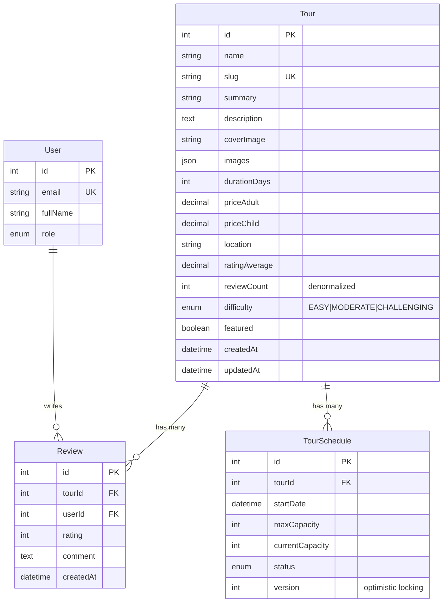
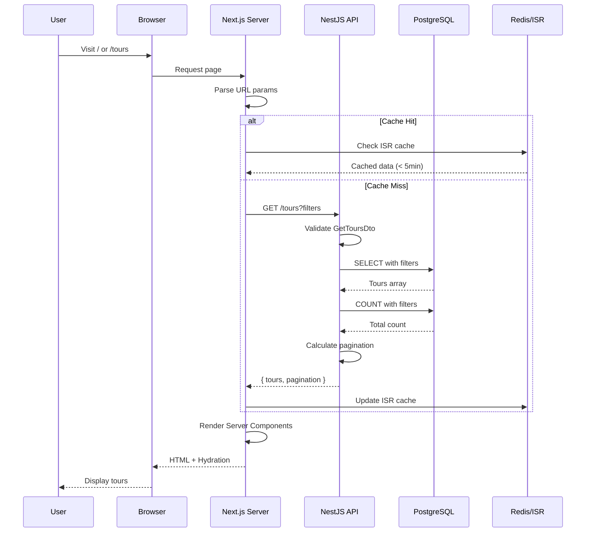
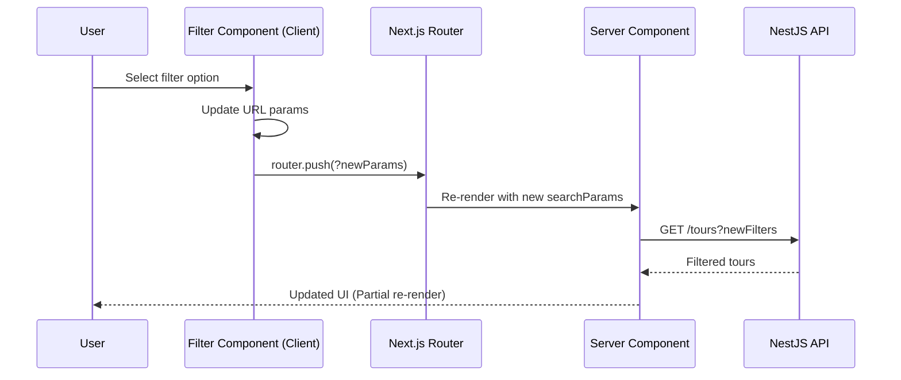
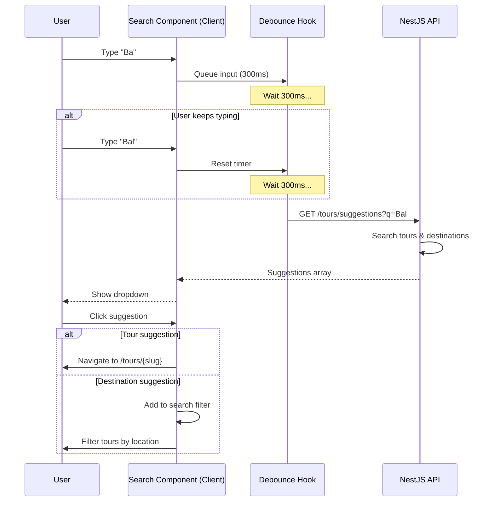
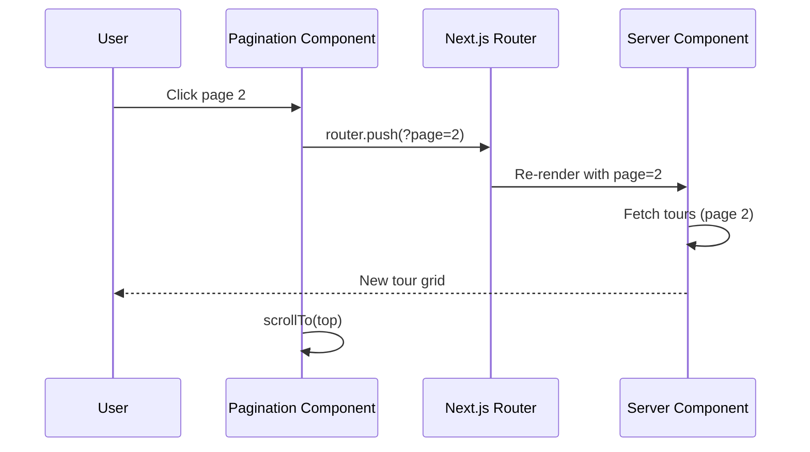
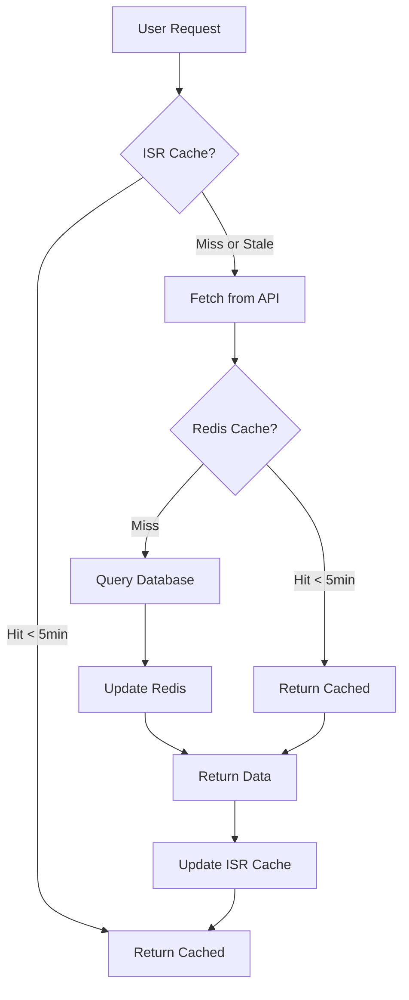

# Technical Design Document: Tours Overview (Home Page)

**Document Version**: 2.0  
**Last Updated**: 2026-01-31  
**Status**: Ready for Implementation

## 1. Overview

This document describes the technical design for the **Tours Overview Screen** - the main landing page displaying available tours with search, filtering, sorting, and pagination capabilities.

### 1.1 Purpose

- Display a paginated list of tours for visitors and authenticated users
- Provide robust search and filtering capabilities to help users find tours
- Support responsive design for mobile, tablet, and desktop
- Optimize for SEO and performance as the main entry point
- Enable URL-based state persistence for shareability

### 1.2 Scope

**Included:**
- Hero section with multi-field search bar (destination, dates, guests)
- Tour cards grid with images, ratings, prices, and metadata
- Advanced filter system (Price, Duration, Difficulty, Rating, Sort)
- Pagination (numbered + "Load More" option for mobile)
- Skeleton loading states for better UX
- Empty state and error state handling
- URL state persistence and shareability
- Responsive design (mobile-first approach)
- SEO optimization with meta tags and structured data

**Not Included:**
- Tour detail page (separate feature - SCR-004)
- Booking flow and payment processing
- User reviews and ratings management
- Admin tour management interface
- Real-time availability checking (handled in booking flow)

### 1.3 Related Documents

- **Screen Spec**: `01_screen_spec.md`
- **API Contract**: `02_api_contract.md`
- **Acceptance Criteria**: `03_acceptance_criteria.md`
- **Resource Mapper**: `04_resource_mapper.md`
- **Task Breakdown**: `tasks-tours-overview.md`
- **Design Reference**: `../../design/current_tours_overview/`

## 2. Requirements

### 2.1 Functional Requirements

| ID | Requirement | Priority | Status |
|----|-------------|----------|--------|
| FR-001 | Display paginated tours list (8 items per page, configurable) | Must Have | ✅ |
| FR-002 | Search tours by name, location, or description | Must Have | ✅ |
| FR-003 | Filter tours by price range (Under $500, $500-$1K, $1K-$2K, $2K+) | Must Have | ✅ |
| FR-004 | Filter tours by difficulty level (Easy, Moderate, Challenging) | Must Have | ✅ |
| FR-005 | Sort tours (Popular, Newest, Price Asc/Desc, Rating) | Must Have | ✅ |
| FR-006 | Display tour cards with image, title, rating, location, duration, price | Must Have | ✅ |
| FR-007 | URL state persistence for filters, pagination, and search | Must Have | ✅ |
| FR-008 | Responsive design (mobile, tablet, desktop, 4K) | Must Have | ✅ |
| FR-009 | Hero section with multi-field search (destination, dates, guests) | Must Have | ✅ |
| FR-010 | Search suggestions dropdown with debouncing | Should Have | ✅ |
| FR-011 | "Load More" option as alternative to pagination | Should Have | ✅ |
| FR-012 | Featured tours badge display | Should Have | ✅ |
| FR-013 | Favorite/Wishlist toggle on cards | Could Have | 🔜 |
| FR-014 | Filter by duration range (1-3 days, 4-7 days, 8+ days) | Could Have | 🔜 |

### 2.2 User Stories

| ID | Story |
|----|-------|
| US-001 | As a **visitor**, I want to browse available tours so that I can find one to book |
| US-002 | As a **visitor**, I want to search for tours by destination so that I can find relevant options |
| US-003 | As a **visitor**, I want to filter tours by price so that I can find affordable options within my budget |
| US-004 | As a **visitor**, I want to filter tours by difficulty so that I can find tours matching my fitness level |
| US-005 | As a **visitor**, I want to see tour ratings and reviews so that I can choose quality tours |
| US-006 | As a **visitor**, I want to share filtered results URL so that others can see the same results |
| US-007 | As a **mobile user**, I want a responsive design so that I can browse tours on my phone |
| US-008 | As a **returning visitor**, I want URL state persistence so that my filters remain when I refresh |

### 2.3 Non-Functional Requirements

| Category | Requirement | Target | Measurement |
|----------|-------------|--------|-------------|
| **Performance** | API response time | < 200ms | P95 |
| **Performance** | Page load time (LCP) | < 2s | Lighthouse |
| **Performance** | Time to Interactive (TTI) | < 3s | Lighthouse |
| **Performance** | First Contentful Paint (FCP) | < 1.5s | Lighthouse |
| **SEO** | Lighthouse SEO score | > 95 | Lighthouse |
| **SEO** | Server-side rendering | 100% | Code Review |
| **Caching** | Tours list cache TTL | 5 minutes | Redis/ISR |
| **Caching** | Static assets cache | 1 year | CDN Headers |
| **Availability** | API uptime | 99.9% | Monitoring |
| **Scalability** | Concurrent users | 10,000+ | Load Testing |
| **Accessibility** | WCAG 2.1 Level AA | 100% compliance | Axe DevTools |

## 3. Technical Design

### 3.1 Database Schema

#### 3.1.1 Current Schema Analysis

The existing `Tour` model needs enhancements to support all features:

```prisma
// Current schema (apps/server/prisma/schema.prisma)
model Tour {
  id            Int      @id @default(autoincrement())
  name          String
  slug          String   @unique
  summary       String?
  description   String?  @db.Text
  coverImage    String?  @map("cover_image")
  images        Json?
  durationDays  Int      @map("duration_days")
  priceAdult    Decimal  @map("price_adult") @db.Decimal(10, 2)
  priceChild    Decimal  @map("price_child") @db.Decimal(10, 2)
  location      String?
  ratingAverage Decimal  @default(0) @map("rating_average") @db.Decimal(2, 1)
  
  schedules     TourSchedule[]
  reviews       Review[]

  @@map("tours")
}
```

#### 3.1.2 Proposed Schema Changes

**New fields to add:**

```prisma
model Tour {
  // ... existing fields ...
  
  // New fields for tours overview
  difficulty    Difficulty?  @default(EASY)
  featured      Boolean      @default(false)
  reviewCount   Int          @default(0) @map("review_count")
  createdAt     DateTime     @default(now()) @map("created_at")
  updatedAt     DateTime     @updatedAt @map("updated_at")

  // Indexes for performance optimization
  @@index([location])
  @@index([priceAdult])
  @@index([ratingAverage])
  @@index([featured])
  @@index([createdAt])
  @@index([difficulty])
  
  @@map("tours")
}

enum Difficulty {
  EASY
  MODERATE
  CHALLENGING
}
```

**Rationale:**
- `difficulty`: Enables filtering by tour difficulty level
- `featured`: Allows highlighting special/promoted tours
- `reviewCount`: Denormalized count for sorting without JOIN (updated via trigger/cron)
- `createdAt`/`updatedAt`: Standard audit fields and for "Newest" sorting
- **Indexes**: Improve query performance for filtering and sorting operations

#### 3.1.3 Database Migration

```sql
-- Migration: 20260131_add_tour_overview_fields.sql

-- Add new enum
CREATE TYPE "Difficulty" AS ENUM ('EASY', 'MODERATE', 'CHALLENGING');

-- Add new columns
ALTER TABLE "tours" 
  ADD COLUMN "difficulty" "Difficulty" DEFAULT 'EASY',
  ADD COLUMN "featured" BOOLEAN NOT NULL DEFAULT false,
  ADD COLUMN "review_count" INTEGER NOT NULL DEFAULT 0,
  ADD COLUMN "created_at" TIMESTAMP(3) NOT NULL DEFAULT CURRENT_TIMESTAMP,
  ADD COLUMN "updated_at" TIMESTAMP(3) NOT NULL DEFAULT CURRENT_TIMESTAMP;

-- Create indexes
CREATE INDEX "tours_location_idx" ON "tours"("location");
CREATE INDEX "tours_price_adult_idx" ON "tours"("price_adult");
CREATE INDEX "tours_rating_average_idx" ON "tours"("rating_average");
CREATE INDEX "tours_featured_idx" ON "tours"("featured");
CREATE INDEX "tours_created_at_idx" ON "tours"("created_at");
CREATE INDEX "tours_difficulty_idx" ON "tours"("difficulty");

-- Update review_count from existing reviews (one-time)
UPDATE "tours" t
SET "review_count" = (
  SELECT COUNT(*) FROM "reviews" r WHERE r."tour_id" = t."id"
);

-- Create trigger to maintain review_count (optional, can use cron job instead)
CREATE OR REPLACE FUNCTION update_tour_review_count()
RETURNS TRIGGER AS $$
BEGIN
  IF TG_OP = 'INSERT' THEN
    UPDATE "tours" SET "review_count" = "review_count" + 1 WHERE "id" = NEW."tour_id";
  ELSIF TG_OP = 'DELETE' THEN
    UPDATE "tours" SET "review_count" = "review_count" - 1 WHERE "id" = OLD."tour_id";
  END IF;
  RETURN NULL;
END;
$$ LANGUAGE plpgsql;

CREATE TRIGGER trigger_update_review_count
AFTER INSERT OR DELETE ON "reviews"
FOR EACH ROW EXECUTE FUNCTION update_tour_review_count();
```

#### 3.1.4 Entity Relationship Diagram



### 3.2 Backend Implementation (NestJS)

#### 3.2.1 Module Structure

```
apps/server/src/modules/tours/
├── tours.module.ts              # Module definition
├── tours.controller.ts          # REST endpoints
├── tours.service.ts             # Business logic
├── tours.service.spec.ts        # Unit tests
├── dto/
│   ├── get-tours.dto.ts         # Query params for listing
│   ├── tour-response.dto.ts     # Response DTOs
│   └── tour-suggestion.dto.ts   # Search suggestions
└── interfaces/
    └── tour-filters.interface.ts # Filter types
```

#### 3.2.2 API Endpoints

| Method | Endpoint | Description | Auth | Cache |
|--------|----------|-------------|------|-------|
| GET | `/tours` | Get paginated tours list with filters | Public | 5min |
| GET | `/tours/featured` | Get featured tours | Public | 10min |
| GET | `/tours/suggestions` | Get search suggestions | Public | 1min |

#### 3.2.3 DTOs Implementation

**File: `apps/server/src/modules/tours/dto/get-tours.dto.ts`**

```typescript
import { IsOptional, IsInt, IsString, IsEnum, Min, Max } from 'class-validator';
import { Type } from 'class-transformer';
import { ApiProperty } from '@nestjs/swagger';

export enum SortOption {
  POPULAR = 'popular',
  NEWEST = 'newest',
  PRICE_ASC = 'price_asc',
  PRICE_DESC = 'price_desc',
  RATING = 'rating',
}

export enum DifficultyFilter {
  EASY = 'easy',
  MODERATE = 'moderate',
  CHALLENGING = 'challenging',
}

export class GetToursDto {
  @ApiProperty({ required: false, minimum: 1, default: 1 })
  @IsOptional()
  @Type(() => Number)
  @IsInt()
  @Min(1)
  page?: number = 1;

  @ApiProperty({ required: false, minimum: 1, maximum: 50, default: 8 })
  @IsOptional()
  @Type(() => Number)
  @IsInt()
  @Min(1)
  @Max(50)
  limit?: number = 8;

  @ApiProperty({ required: false, description: 'Search by name, location, or description' })
  @IsOptional()
  @IsString()
  search?: string;

  @ApiProperty({ required: false, enum: SortOption, default: SortOption.POPULAR })
  @IsOptional()
  @IsEnum(SortOption)
  sort?: SortOption = SortOption.POPULAR;

  @ApiProperty({ required: false, minimum: 0, description: 'Minimum price filter' })
  @IsOptional()
  @Type(() => Number)
  @IsInt()
  @Min(0)
  priceMin?: number;

  @ApiProperty({ required: false, description: 'Maximum price filter' })
  @IsOptional()
  @Type(() => Number)
  @IsInt()
  priceMax?: number;

  @ApiProperty({ required: false, enum: DifficultyFilter })
  @IsOptional()
  @IsEnum(DifficultyFilter)
  difficulty?: DifficultyFilter;

  @ApiProperty({ required: false, description: 'Filter by location' })
  @IsOptional()
  @IsString()
  location?: string;

  @ApiProperty({ required: false, description: 'Filter by duration range (e.g., "1-3", "4-7", "8+")' })
  @IsOptional()
  @IsString()
  duration?: string;
}
```

**File: `apps/server/src/modules/tours/dto/tour-response.dto.ts`**

```typescript
import { ApiProperty } from '@nestjs/swagger';
import { Expose } from 'class-transformer';

export class TourItemDto {
  @ApiProperty()
  @Expose()
  id: number;

  @ApiProperty()
  @Expose()
  name: string;

  @ApiProperty()
  @Expose()
  slug: string;

  @ApiProperty({ required: false })
  @Expose()
  summary?: string;

  @ApiProperty({ required: false })
  @Expose()
  coverImage?: string;

  @ApiProperty()
  @Expose()
  durationDays: number;

  @ApiProperty()
  @Expose()
  priceAdult: number;

  @ApiProperty()
  @Expose()
  priceChild: number;

  @ApiProperty({ required: false })
  @Expose()
  location?: string;

  @ApiProperty()
  @Expose()
  ratingAverage: number;

  @ApiProperty()
  @Expose()
  reviewCount: number;

  @ApiProperty({ required: false, enum: ['easy', 'moderate', 'challenging'] })
  @Expose()
  difficulty?: string;

  @ApiProperty()
  @Expose()
  featured: boolean;

  @ApiProperty({ required: false, description: 'Next available tour start date' })
  @Expose()
  nextAvailableDate?: string;
}

export class PaginationDto {
  @ApiProperty()
  @Expose()
  page: number;

  @ApiProperty()
  @Expose()
  limit: number;

  @ApiProperty()
  @Expose()
  total: number;

  @ApiProperty()
  @Expose()
  totalPages: number;

  @ApiProperty()
  @Expose()
  hasNext: boolean;

  @ApiProperty()
  @Expose()
  hasPrev: boolean;
}

export class ToursResponseDto {
  @ApiProperty({ type: [TourItemDto] })
  @Expose()
  tours: TourItemDto[];

  @ApiProperty({ type: PaginationDto })
  @Expose()
  pagination: PaginationDto;
}
```

**File: `apps/server/src/modules/tours/dto/tour-suggestion.dto.ts`**

```typescript
import { IsString, MinLength, IsOptional, IsInt, Max } from 'class-validator';
import { Type } from 'class-transformer';
import { ApiProperty } from '@nestjs/swagger';

export class GetSuggestionsDto {
  @ApiProperty({ minLength: 2, description: 'Search query (minimum 2 characters)' })
  @IsString()
  @MinLength(2)
  q: string;

  @ApiProperty({ required: false, maximum: 10, default: 5 })
  @IsOptional()
  @Type(() => Number)
  @IsInt()
  @Max(10)
  limit?: number = 5;
}

export class SuggestionItemDto {
  @ApiProperty({ enum: ['tour', 'destination'] })
  type: 'tour' | 'destination';

  @ApiProperty({ required: false })
  id?: number;

  @ApiProperty()
  name: string;

  @ApiProperty({ required: false })
  slug?: string;
}

export class SuggestionsResponseDto {
  @ApiProperty({ type: [SuggestionItemDto] })
  suggestions: SuggestionItemDto[];
}
```

#### 3.2.4 Service Implementation

**File: `apps/server/src/modules/tours/tours.service.ts`**

```typescript
import { Injectable, Logger } from '@nestjs/common';
import { PrismaService } from '../../prisma/prisma.service';
import { GetToursDto, SortOption } from './dto/get-tours.dto';
import { ToursResponseDto, TourItemDto } from './dto/tour-response.dto';
import { GetSuggestionsDto, SuggestionsResponseDto } from './dto/tour-suggestion.dto';
import { Prisma } from '@prisma/client';

@Injectable()
export class ToursService {
  private readonly logger = new Logger(ToursService.name);

  constructor(private readonly prisma: PrismaService) {}

  /**
   * Get paginated tours list with filters and sorting.
   * 
   * Features:
   * - Full-text search across name, location, summary
   * - Price range filtering
   * - Difficulty level filtering
   * - Location filtering
   * - Duration range filtering
   * - Multiple sort options
   * - Efficient pagination with total count
   * 
   * @param dto - Query parameters for filtering, sorting, pagination
   * @returns ToursResponseDto with tours array and pagination metadata
   */
  async getTours(dto: GetToursDto): Promise<ToursResponseDto> {
    const { page = 1, limit = 8, search, sort, priceMin, priceMax, difficulty, location, duration } = dto;
    const skip = (page - 1) * limit;

    this.logger.log(`Fetching tours: page=${page}, limit=${limit}, filters=${JSON.stringify({ search, sort, priceMin, priceMax, difficulty, location, duration })}`);

    // Build where clause
    const where: Prisma.TourWhereInput = this.buildWhereClause({
      search,
      priceMin,
      priceMax,
      difficulty,
      location,
      duration,
    });

    // Build order by
    const orderBy = this.buildOrderBy(sort);

    // Execute parallel queries for data and count
    const [tours, total] = await Promise.all([
      this.prisma.tour.findMany({
        where,
        orderBy,
        skip,
        take: limit,
        select: {
          id: true,
          name: true,
          slug: true,
          summary: true,
          coverImage: true,
          durationDays: true,
          priceAdult: true,
          priceChild: true,
          location: true,
          ratingAverage: true,
          reviewCount: true,
          difficulty: true,
          featured: true,
          schedules: {
            where: {
              status: 'OPEN',
              startDate: { gte: new Date() },
            },
            orderBy: { startDate: 'asc' },
            take: 1,
            select: { startDate: true },
          },
        },
      }),
      this.prisma.tour.count({ where }),
    ]);

    const totalPages = Math.ceil(total / limit);

    this.logger.log(`Found ${total} tours, returning page ${page}/${totalPages}`);

    return {
      tours: tours.map((tour) => this.mapTourToDto(tour)),
      pagination: {
        page,
        limit,
        total,
        totalPages,
        hasNext: page < totalPages,
        hasPrev: page > 1,
      },
    };
  }

  /**
   * Get featured tours for homepage highlight.
   * 
   * @param limit - Number of featured tours to return (default: 4)
   * @returns Array of featured tour items
   */
  async getFeaturedTours(limit: number = 4): Promise<TourItemDto[]> {
    this.logger.log(`Fetching ${limit} featured tours`);

    const tours = await this.prisma.tour.findMany({
      where: {
        featured: true,
      },
      orderBy: [
        { ratingAverage: 'desc' },
        { reviewCount: 'desc' },
      ],
      take: limit,
      select: {
        id: true,
        name: true,
        slug: true,
        coverImage: true,
        priceAdult: true,
        location: true,
        ratingAverage: true,
        reviewCount: true,
        durationDays: true,
        priceChild: true,
        difficulty: true,
        featured: true,
      },
    });

    return tours.map((tour) => this.mapTourToDto(tour));
  }

  /**
   * Get search suggestions based on query.
   * 
   * Returns both:
   * - Matching tour names
   * - Matching destination/location names
   * 
   * @param dto - Search query parameters
   * @returns Array of tour and destination suggestions
   */
  async getSuggestions(dto: GetSuggestionsDto): Promise<SuggestionsResponseDto> {
    const { q, limit = 5 } = dto;

    this.logger.log(`Fetching suggestions for query: "${q}"`);

    // Get matching tours
    const tours = await this.prisma.tour.findMany({
      where: {
        OR: [
          { name: { contains: q, mode: 'insensitive' } },
          { location: { contains: q, mode: 'insensitive' } },
        ],
      },
      take: limit,
      select: {
        id: true,
        name: true,
        slug: true,
        location: true,
      },
    });

    // Get unique locations as destinations
    const locations = await this.prisma.tour.findMany({
      where: {
        location: { contains: q, mode: 'insensitive' },
      },
      distinct: ['location'],
      take: 3,
      select: { location: true },
    });

    const suggestions = [
      ...tours.map((tour) => ({
        type: 'tour' as const,
        id: tour.id,
        name: tour.name,
        slug: tour.slug,
      })),
      ...locations
        .filter((l) => l.location)
        .map((l) => ({
          type: 'destination' as const,
          name: l.location!,
        })),
    ];

    return { suggestions: suggestions.slice(0, limit) };
  }

  /**
   * Build Prisma where clause from filters.
   */
  private buildWhereClause(filters: {
    search?: string;
    priceMin?: number;
    priceMax?: number;
    difficulty?: string;
    location?: string;
    duration?: string;
  }): Prisma.TourWhereInput {
    const where: Prisma.TourWhereInput = {};

    // Full-text search
    if (filters.search) {
      where.OR = [
        { name: { contains: filters.search, mode: 'insensitive' } },
        { location: { contains: filters.search, mode: 'insensitive' } },
        { summary: { contains: filters.search, mode: 'insensitive' } },
      ];
    }

    // Price range filter
    if (filters.priceMin !== undefined || filters.priceMax !== undefined) {
      where.priceAdult = {};
      if (filters.priceMin !== undefined) where.priceAdult.gte = filters.priceMin;
      if (filters.priceMax !== undefined) where.priceAdult.lte = filters.priceMax;
    }

    // Difficulty filter
    if (filters.difficulty) {
      where.difficulty = filters.difficulty.toUpperCase() as any;
    }

    // Location filter
    if (filters.location) {
      where.location = { contains: filters.location, mode: 'insensitive' };
    }

    // Duration filter (e.g., "1-3", "4-7", "8+")
    if (filters.duration) {
      const durationRange = this.parseDurationRange(filters.duration);
      if (durationRange) {
        where.durationDays = durationRange;
      }
    }

    return where;
  }

  /**
   * Build Prisma orderBy based on sort option.
   */
  private buildOrderBy(sort?: SortOption): Prisma.TourOrderByWithRelationInput {
    switch (sort) {
      case SortOption.NEWEST:
        return { createdAt: 'desc' };
      case SortOption.PRICE_ASC:
        return { priceAdult: 'asc' };
      case SortOption.PRICE_DESC:
        return { priceAdult: 'desc' };
      case SortOption.RATING:
        return { ratingAverage: 'desc' };
      case SortOption.POPULAR:
      default:
        // Popular = high rating + high review count
        return [
          { reviewCount: 'desc' },
          { ratingAverage: 'desc' },
        ] as any;
    }
  }

  /**
   * Parse duration range string (e.g., "1-3", "8+") into Prisma filter.
   */
  private parseDurationRange(duration: string): Prisma.IntFilter | undefined {
    if (duration.endsWith('+')) {
      const min = parseInt(duration.replace('+', ''));
      return { gte: min };
    }

    if (duration.includes('-')) {
      const [min, max] = duration.split('-').map(Number);
      return { gte: min, lte: max };
    }

    return undefined;
  }

  /**
   * Map Prisma Tour to TourItemDto.
   */
  private mapTourToDto(tour: any): TourItemDto {
    return {
      id: tour.id,
      name: tour.name,
      slug: tour.slug,
      summary: tour.summary,
      coverImage: tour.coverImage,
      durationDays: tour.durationDays,
      priceAdult: Number(tour.priceAdult),
      priceChild: Number(tour.priceChild),
      location: tour.location,
      ratingAverage: Number(tour.ratingAverage),
      reviewCount: tour.reviewCount ?? 0,
      difficulty: tour.difficulty?.toLowerCase(),
      featured: tour.featured ?? false,
      nextAvailableDate: tour.schedules?.[0]?.startDate?.toISOString(),
    };
  }
}
```

#### 3.2.5 Controller Implementation

**File: `apps/server/src/modules/tours/tours.controller.ts`**

```typescript
import { Controller, Get, Query } from '@nestjs/common';
import { ApiTags, ApiOperation, ApiResponse } from '@nestjs/swagger';
import { ToursService } from './tours.service';
import { GetToursDto } from './dto/get-tours.dto';
import { GetSuggestionsDto } from './dto/tour-suggestion.dto';
import { ToursResponseDto } from './dto/tour-response.dto';

@ApiTags('tours')
@Controller('tours')
export class ToursController {
  constructor(private readonly toursService: ToursService) {}

  /**
   * Get paginated tours list with filters.
   * 
   * @example
   * GET /tours?page=1&limit=8&search=bali&sort=popular&priceMin=500&priceMax=1000
   */
  @Get()
  @ApiOperation({ summary: 'Get paginated tours list with filters and sorting' })
  @ApiResponse({ status: 200, description: 'Returns paginated tours', type: ToursResponseDto })
  async getTours(@Query() dto: GetToursDto) {
    return {
      success: true,
      data: await this.toursService.getTours(dto),
    };
  }

  /**
   * Get featured tours for homepage.
   * 
   * @example
   * GET /tours/featured?limit=4
   */
  @Get('featured')
  @ApiOperation({ summary: 'Get featured tours for homepage highlight' })
  @ApiResponse({ status: 200, description: 'Returns featured tours' })
  async getFeaturedTours(@Query('limit') limit?: number) {
    return {
      success: true,
      data: {
        tours: await this.toursService.getFeaturedTours(limit),
      },
    };
  }

  /**
   * Get search suggestions.
   * 
   * @example
   * GET /tours/suggestions?q=ba&limit=5
   */
  @Get('suggestions')
  @ApiOperation({ summary: 'Get search suggestions for tours and destinations' })
  @ApiResponse({ status: 200, description: 'Returns search suggestions' })
  async getSuggestions(@Query() dto: GetSuggestionsDto) {
    return {
      success: true,
      data: await this.toursService.getSuggestions(dto),
    };
  }
}
```

#### 3.2.6 Module Registration

**File: `apps/server/src/modules/tours/tours.module.ts`**

```typescript
import { Module } from '@nestjs/common';
import { ToursController } from './tours.controller';
import { ToursService } from './tours.service';
import { PrismaModule } from '../../prisma/prisma.module';

@Module({
  imports: [PrismaModule],
  controllers: [ToursController],
  providers: [ToursService],
  exports: [ToursService],
})
export class ToursModule {}
```

**Update `apps/server/src/app.module.ts`:**

```typescript
import { Module } from '@nestjs/common';
import { ConfigModule } from '@nestjs/config';
import { AppController } from './app.controller';
import { AppService } from './app.service';
import { PrismaModule } from './prisma/prisma.module';
import { AuthModule } from './modules/auth/auth.module';
import { CountriesModule } from './modules/countries/countries.module';
import { ToursModule } from './modules/tours/tours.module'; // Add this

@Module({
  imports: [
    ConfigModule.forRoot({ isGlobal: true }),
    PrismaModule,
    AuthModule,
    CountriesModule,
    ToursModule, // Add this
  ],
  controllers: [AppController],
  providers: [AppService],
})
export class AppModule {}
```

### 3.3 Frontend Implementation (Next.js)

#### 3.3.1 Architecture Overview

```
apps/web/
├── app/
│   ├── page.tsx                       # Home page (Server Component)
│   ├── tours/
│   │   └── page.tsx                   # Tours page (alias/redirect)
│   └── layout.tsx                     # Root layout
├── components/
│   ├── tours/
│   │   ├── hero-section.tsx           # Hero with search bar
│   │   ├── tour-card.tsx              # Individual tour card
│   │   ├── tour-card-skeleton.tsx     # Loading skeleton
│   │   ├── tour-grid.tsx              # Grid of cards
│   │   ├── tour-filters.tsx           # Filter bar (Client)
│   │   ├── tour-search.tsx            # Search input with suggestions (Client)
│   │   ├── tour-pagination.tsx        # Pagination controls (Client)
│   │   ├── empty-state.tsx            # No results state
│   │   └── error-state.tsx            # Error state with retry
│   ├── layout/
│   │   ├── header.tsx                 # Site header
│   │   └── footer.tsx                 # Site footer
│   └── ui/
│       └── [shadcn components]        # Shared UI components
├── lib/
│   ├── api/
│   │   └── tours.ts                   # API client functions
│   ├── types/
│   │   └── tour.ts                    # TypeScript types
│   ├── hooks/
│   │   └── use-tour-filters.ts        # Custom hooks
│   └── utils/
│       └── format.ts                  # Utility functions
└── public/
    └── images/
        └── placeholder-tour.jpg       # Fallback image
```

#### 3.3.2 Type Definitions

**File: `apps/web/lib/types/tour.ts`**

```typescript
export interface Tour {
  id: number;
  name: string;
  slug: string;
  summary?: string;
  coverImage?: string;
  durationDays: number;
  priceAdult: number;
  priceChild: number;
  location?: string;
  ratingAverage: number;
  reviewCount?: number;
  difficulty?: 'easy' | 'moderate' | 'challenging';
  featured?: boolean;
  nextAvailableDate?: string;
}

export interface TourFilters {
  search?: string;
  page?: number;
  limit?: number;
  sort?: 'popular' | 'newest' | 'price_asc' | 'price_desc' | 'rating';
  priceMin?: number;
  priceMax?: number;
  difficulty?: 'easy' | 'moderate' | 'challenging';
  location?: string;
  duration?: string;
}

export interface Pagination {
  page: number;
  limit: number;
  total: number;
  totalPages: number;
  hasNext: boolean;
  hasPrev: boolean;
}

export interface ToursResponse {
  tours: Tour[];
  pagination: Pagination;
}

export interface TourCardProps {
  tour: Tour;
  priority?: boolean; // For image loading optimization
}

export interface Suggestion {
  type: 'tour' | 'destination';
  id?: number;
  name: string;
  slug?: string;
}
```

#### 3.3.3 API Client Functions

**File: `apps/web/lib/api/tours.ts`**

```typescript
import { Tour, TourFilters, ToursResponse, Suggestion } from '../types/tour';

const API_URL = process.env.NEXT_PUBLIC_API_URL || 'http://localhost:3001';

/**
 * Fetch paginated tours with filters.
 * Uses Next.js ISR with 5-minute revalidation.
 */
export async function getTours(filters: TourFilters = {}): Promise<ToursResponse> {
  const params = new URLSearchParams();
  
  Object.entries(filters).forEach(([key, value]) => {
    if (value !== undefined && value !== '') {
      params.set(key, String(value));
    }
  });

  const url = `${API_URL}/tours?${params.toString()}`;

  try {
    const response = await fetch(url, {
      next: { revalidate: 300 }, // ISR: revalidate every 5 minutes
      headers: {
        'Content-Type': 'application/json',
      },
    });

    if (!response.ok) {
      throw new Error(`Failed to fetch tours: ${response.status} ${response.statusText}`);
    }

    const result = await response.json();
    
    if (!result.success) {
      throw new Error(result.error?.message || 'Failed to fetch tours');
    }

    return result.data;
  } catch (error) {
    console.error('Error fetching tours:', error);
    throw error;
  }
}

/**
 * Fetch featured tours for homepage.
 */
export async function getFeaturedTours(limit: number = 4): Promise<Tour[]> {
  try {
    const response = await fetch(`${API_URL}/tours/featured?limit=${limit}`, {
      next: { revalidate: 600 }, // ISR: revalidate every 10 minutes
    });

    if (!response.ok) {
      throw new Error('Failed to fetch featured tours');
    }

    const result = await response.json();
    return result.data.tours;
  } catch (error) {
    console.error('Error fetching featured tours:', error);
    return [];
  }
}

/**
 * Fetch search suggestions.
 * Client-side only (no ISR).
 */
export async function getSearchSuggestions(
  query: string, 
  limit: number = 5
): Promise<Suggestion[]> {
  if (query.length < 2) return [];

  try {
    const response = await fetch(
      `${API_URL}/tours/suggestions?q=${encodeURIComponent(query)}&limit=${limit}`,
      {
        cache: 'no-store', // Always fresh for suggestions
      }
    );

    if (!response.ok) {
      throw new Error('Failed to fetch suggestions');
    }

    const result = await response.json();
    return result.data.suggestions;
  } catch (error) {
    console.error('Error fetching suggestions:', error);
    return [];
  }
}
```

#### 3.3.4 Utility Functions

**File: `apps/web/lib/utils/format.ts`**

```typescript
/**
 * Format price as currency (USD).
 */
export function formatCurrency(amount: number): string {
  return new Intl.NumberFormat('en-US', {
    style: 'currency',
    currency: 'USD',
    minimumFractionDigits: 0,
    maximumFractionDigits: 0,
  }).format(amount);
}

/**
 * Format rating to 1 decimal place.
 */
export function formatRating(rating: number): string {
  return rating.toFixed(1);
}

/**
 * Format duration in days.
 */
export function formatDuration(days: number): string {
  return `${days} ${days === 1 ? 'Day' : 'Days'}`;
}

/**
 * Get difficulty badge color.
 */
export function getDifficultyColor(difficulty?: string): string {
  switch (difficulty) {
    case 'easy':
      return 'bg-green-100 text-green-800 dark:bg-green-900 dark:text-green-200';
    case 'moderate':
      return 'bg-yellow-100 text-yellow-800 dark:bg-yellow-900 dark:text-yellow-200';
    case 'challenging':
      return 'bg-red-100 text-red-800 dark:bg-red-900 dark:text-red-200';
    default:
      return 'bg-gray-100 text-gray-800 dark:bg-gray-700 dark:text-gray-200';
  }
}
```

#### 3.3.5 Home Page (Server Component)

**File: `apps/web/app/page.tsx`**

```tsx
import { Suspense } from 'react';
import { Metadata } from 'next';
import { getTours } from '@/lib/api/tours';
import { TourFilters } from '@/lib/types/tour';
import { HeroSection } from '@/components/tours/hero-section';
import { TourGrid } from '@/components/tours/tour-grid';
import { TourFiltersBar } from '@/components/tours/tour-filters';
import { TourPagination } from '@/components/tours/tour-pagination';
import { TourGridSkeleton } from '@/components/tours/tour-card-skeleton';
import { EmptyState } from '@/components/tours/empty-state';

export const metadata: Metadata = {
  title: 'Discover Amazing Tours | TravelCo',
  description: 'Explore the world\'s most beautiful destinations with our curated tours. Find your next adventure today.',
  keywords: ['tours', 'travel', 'vacation', 'adventure', 'destinations'],
  openGraph: {
    title: 'Discover Amazing Tours | TravelCo',
    description: 'Explore the world\'s most beautiful destinations with our curated tours.',
    images: ['/og-tours.jpg'],
    type: 'website',
  },
  twitter: {
    card: 'summary_large_image',
    title: 'Discover Amazing Tours | TravelCo',
    description: 'Explore the world\'s most beautiful destinations.',
    images: ['/og-tours.jpg'],
  },
};

interface HomePageProps {
  searchParams: Promise<{
    search?: string;
    page?: string;
    sort?: string;
    priceMin?: string;
    priceMax?: string;
    difficulty?: string;
    duration?: string;
  }>;
}

export default async function HomePage({ searchParams }: HomePageProps) {
  const params = await searchParams;
  
  // Parse search params into filters
  const filters: TourFilters = {
    search: params.search,
    page: params.page ? parseInt(params.page, 10) : 1,
    sort: params.sort as TourFilters['sort'],
    priceMin: params.priceMin ? parseInt(params.priceMin, 10) : undefined,
    priceMax: params.priceMax ? parseInt(params.priceMax, 10) : undefined,
    difficulty: params.difficulty as TourFilters['difficulty'],
    duration: params.duration,
    limit: 8,
  };

  return (
    <main className="min-h-screen">
      {/* Hero Section */}
      <HeroSection initialSearch={filters.search} />

      {/* Tours Section */}
      <section className="max-w-[1280px] mx-auto px-4 sm:px-6 lg:px-8 py-10 lg:py-12">
        {/* Section Header */}
        <div className="mb-6 lg:mb-8">
          <h2 className="text-2xl lg:text-3xl font-bold text-gray-900 dark:text-white">
            Popular Tours This Season
          </h2>
          <p className="text-gray-600 dark:text-gray-400 mt-2">
            Hand-picked destinations for your next holiday.
          </p>
        </div>

        {/* Filters */}
        <TourFiltersBar />

        {/* Tour Grid with Suspense */}
        <Suspense fallback={<TourGridSkeleton count={8} />}>
          <ToursContent filters={filters} />
        </Suspense>
      </section>
    </main>
  );
}

/**
 * Async component to fetch and display tours.
 * Wrapped in Suspense boundary above.
 */
async function ToursContent({ filters }: { filters: TourFilters }) {
  try {
    const { tours, pagination } = await getTours(filters);

    if (tours.length === 0) {
      return <EmptyState />;
    }

    return (
      <>
        {/* Results Count */}
        <div className="mb-4">
          <p className="text-sm text-gray-500 dark:text-gray-400">
            Showing <span className="font-semibold">{tours.length}</span> of{' '}
            <span className="font-semibold">{pagination.total}</span> tours
          </p>
        </div>

        {/* Tour Grid */}
        <TourGrid tours={tours} />

        {/* Pagination */}
        {pagination.totalPages > 1 && (
          <TourPagination pagination={pagination} />
        )}
      </>
    );
  } catch (error) {
    console.error('Error loading tours:', error);
    return (
      <div className="text-center py-12">
        <h3 className="text-lg font-semibold text-gray-900 dark:text-white mb-2">
          Unable to load tours
        </h3>
        <p className="text-gray-600 dark:text-gray-400 mb-4">
          Something went wrong. Please try again later.
        </p>
      </div>
    );
  }
}
```

#### 3.3.6 Tour Card Component

**File: `apps/web/components/tours/tour-card.tsx`**

```tsx
import Image from 'next/image';
import Link from 'next/link';
import { Star, MapPin, Clock, Heart } from 'lucide-react';
import { Tour } from '@/lib/types/tour';
import { formatCurrency, formatRating, formatDuration, getDifficultyColor } from '@/lib/utils/format';
import { cn } from '@/lib/utils';

interface TourCardProps {
  tour: Tour;
  priority?: boolean;
}

export function TourCard({ tour, priority = false }: TourCardProps) {
  return (
    <article className="group flex flex-col rounded-xl bg-white dark:bg-gray-800 shadow-sm border border-gray-100 dark:border-gray-700 overflow-hidden hover:shadow-xl hover:-translate-y-1 transition-all duration-300">
      {/* Image Container */}
      <Link 
        href={`/tours/${tour.slug}`} 
        className="relative w-full aspect-[4/3] overflow-hidden"
      >
        <Image
          src={tour.coverImage || '/images/placeholder-tour.jpg'}
          alt={tour.name}
          fill
          className="object-cover group-hover:scale-110 transition-transform duration-500"
          priority={priority}
          sizes="(max-width: 768px) 100vw, (max-width: 1024px) 50vw, (max-width: 1280px) 33vw, 25vw"
        />
        
        {/* Favorite Button */}
        <button
          className="absolute top-3 right-3 z-10 p-2 bg-white/80 dark:bg-black/50 rounded-full cursor-pointer hover:bg-white dark:hover:bg-black/70 transition-colors"
          aria-label="Add to favorites"
        >
          <Heart className="w-5 h-5 text-gray-600 dark:text-gray-300" />
        </button>

        {/* Featured Badge */}
        {tour.featured && (
          <span className="absolute top-3 left-3 bg-yellow-500 text-white text-xs font-semibold px-2 py-1 rounded">
            Featured
          </span>
        )}
      </Link>

      {/* Content */}
      <div className="flex flex-col flex-grow p-4 md:p-5">
        {/* Title & Rating */}
        <div className="flex justify-between items-start gap-2 mb-2">
          <Link href={`/tours/${tour.slug}`}>
            <h3 className="text-lg font-bold text-gray-900 dark:text-white line-clamp-2 group-hover:text-blue-600 dark:group-hover:text-blue-400 transition-colors">
              {tour.name}
            </h3>
          </Link>
          
          <div className="flex items-center gap-1 flex-shrink-0">
            <Star className="w-4 h-4 text-orange-400 fill-orange-400" />
            <span className="text-sm font-bold text-gray-900 dark:text-white">
              {formatRating(tour.ratingAverage)}
            </span>
          </div>
        </div>

        {/* Metadata */}
        <div className="flex items-center gap-2 text-sm text-gray-500 dark:text-gray-400 mb-3">
          <Clock className="w-4 h-4" />
          <span>{formatDuration(tour.durationDays)}</span>
          
          {tour.location && (
            <>
              <span className="mx-1">•</span>
              <MapPin className="w-4 h-4" />
              <span className="truncate">{tour.location}</span>
            </>
          )}
        </div>

        {/* Summary */}
        {tour.summary && (
          <p className="text-sm text-gray-600 dark:text-gray-300 line-clamp-2 mb-4 flex-grow">
            {tour.summary}
          </p>
        )}

        {/* Difficulty Badge */}
        {tour.difficulty && (
          <div className="mb-4">
            <span className={cn(
              'inline-block text-xs font-semibold px-2 py-1 rounded',
              getDifficultyColor(tour.difficulty)
            )}>
              {tour.difficulty.charAt(0).toUpperCase() + tour.difficulty.slice(1)}
            </span>
          </div>
        )}

        {/* Price & CTA */}
        <div className="flex items-center justify-between pt-4 border-t border-gray-100 dark:border-gray-700 mt-auto">
          <div className="flex flex-col">
            <span className="text-xs text-gray-500 dark:text-gray-400">Starting from</span>
            <div>
              <span className="text-lg font-bold text-blue-600 dark:text-blue-400">
                {formatCurrency(tour.priceAdult)}
              </span>
              <span className="text-sm text-gray-500 dark:text-gray-400">/person</span>
            </div>
          </div>
          
          <Link
            href={`/tours/${tour.slug}`}
            className="px-4 py-2 bg-blue-600 hover:bg-blue-700 dark:bg-blue-500 dark:hover:bg-blue-600 text-white text-sm font-bold rounded-lg transition-colors"
          >
            Book Now
          </Link>
        </div>
      </div>
    </article>
  );
}
```

#### 3.3.7 Tour Filters Component (Client)

**File: `apps/web/components/tours/tour-filters.tsx`**

```tsx
'use client';

import { useRouter, useSearchParams } from 'next/navigation';
import { useCallback, useTransition } from 'react';

const sortOptions = [
  { label: 'Popular', value: 'popular' },
  { label: 'Newest', value: 'newest' },
  { label: 'Price: Low to High', value: 'price_asc' },
  { label: 'Price: High to Low', value: 'price_desc' },
  { label: 'Top Rated', value: 'rating' },
];

const priceOptions = [
  { label: 'All Prices', value: '' },
  { label: 'Under $500', value: '0-500' },
  { label: '$500 - $1,000', value: '500-1000' },
  { label: '$1,000 - $2,000', value: '1000-2000' },
  { label: 'Over $2,000', value: '2000-' },
];

const difficultyOptions = [
  { label: 'All Levels', value: '' },
  { label: 'Easy', value: 'easy' },
  { label: 'Moderate', value: 'moderate' },
  { label: 'Challenging', value: 'challenging' },
];

const durationOptions = [
  { label: 'Any Duration', value: '' },
  { label: '1-3 Days', value: '1-3' },
  { label: '4-7 Days', value: '4-7' },
  { label: '8+ Days', value: '8-' },
];

export function TourFiltersBar() {
  const router = useRouter();
  const searchParams = useSearchParams();
  const [isPending, startTransition] = useTransition();

  const updateFilter = useCallback(
    (key: string, value: string) => {
      const params = new URLSearchParams(searchParams.toString());
      
      if (value) {
        params.set(key, value);
      } else {
        params.delete(key);
      }
      
      // Reset to page 1 when filter changes
      params.delete('page');
      
      startTransition(() => {
        router.push(`/?${params.toString()}`);
      });
    },
    [router, searchParams]
  );

  const handlePriceChange = useCallback((value: string) => {
    const params = new URLSearchParams(searchParams.toString());
    
    if (value) {
      const [min, max] = value.split('-');
      if (min) params.set('priceMin', min);
      else params.delete('priceMin');
      if (max) params.set('priceMax', max);
      else params.delete('priceMax');
    } else {
      params.delete('priceMin');
      params.delete('priceMax');
    }
    
    params.delete('page');
    
    startTransition(() => {
      router.push(`/?${params.toString()}`);
    });
  }, [router, searchParams]);

  // Current values
  const currentSort = searchParams.get('sort') || 'popular';
  const currentDifficulty = searchParams.get('difficulty') || '';
  const currentDuration = searchParams.get('duration') || '';
  const currentPriceMin = searchParams.get('priceMin');
  const currentPriceMax = searchParams.get('priceMax');
  const currentPrice = currentPriceMin || currentPriceMax
    ? `${currentPriceMin || ''}-${currentPriceMax || ''}`
    : '';

  return (
    <div className="flex flex-wrap gap-2 mb-6 pb-2 overflow-x-auto scrollbar-hide">
      {/* Sort */}
      <select
        value={currentSort}
        onChange={(e) => updateFilter('sort', e.target.value)}
        disabled={isPending}
        className="h-10 shrink-0 px-4 border border-gray-200 dark:border-gray-700 rounded-full bg-white dark:bg-gray-800 text-sm text-gray-900 dark:text-gray-200 hover:border-blue-600 dark:hover:border-blue-500 focus:outline-none focus:ring-2 focus:ring-blue-500 transition-colors disabled:opacity-50"
      >
        {sortOptions.map((option) => (
          <option key={option.value} value={option.value}>
            {option.label}
          </option>
        ))}
      </select>

      {/* Price */}
      <select
        value={currentPrice}
        onChange={(e) => handlePriceChange(e.target.value)}
        disabled={isPending}
        className="h-10 shrink-0 px-4 border border-gray-200 dark:border-gray-700 rounded-full bg-white dark:bg-gray-800 text-sm text-gray-900 dark:text-gray-200 hover:border-blue-600 dark:hover:border-blue-500 focus:outline-none focus:ring-2 focus:ring-blue-500 transition-colors disabled:opacity-50"
      >
        {priceOptions.map((option) => (
          <option key={option.value} value={option.value}>
            {option.label}
          </option>
        ))}
      </select>

      {/* Duration */}
      <select
        value={currentDuration}
        onChange={(e) => updateFilter('duration', e.target.value)}
        disabled={isPending}
        className="h-10 shrink-0 px-4 border border-gray-200 dark:border-gray-700 rounded-full bg-white dark:bg-gray-800 text-sm text-gray-900 dark:text-gray-200 hover:border-blue-600 dark:hover:border-blue-500 focus:outline-none focus:ring-2 focus:ring-blue-500 transition-colors disabled:opacity-50"
      >
        {durationOptions.map((option) => (
          <option key={option.value} value={option.value}>
            {option.label}
          </option>
        ))}
      </select>

      {/* Difficulty */}
      <select
        value={currentDifficulty}
        onChange={(e) => updateFilter('difficulty', e.target.value)}
        disabled={isPending}
        className="h-10 shrink-0 px-4 border border-gray-200 dark:border-gray-700 rounded-full bg-white dark:bg-gray-800 text-sm text-gray-900 dark:text-gray-200 hover:border-blue-600 dark:hover:border-blue-500 focus:outline-none focus:ring-2 focus:ring-blue-500 transition-colors disabled:opacity-50"
      >
        {difficultyOptions.map((option) => (
          <option key={option.value} value={option.value}>
            {option.label}
          </option>
        ))}
      </select>

      {/* Clear Filters */}
      {(currentSort !== 'popular' || currentPrice || currentDifficulty || currentDuration) && (
        <button
          onClick={() => {
            startTransition(() => {
              router.push('/');
            });
          }}
          disabled={isPending}
          className="h-10 shrink-0 px-4 border border-gray-200 dark:border-gray-700 rounded-full bg-white dark:bg-gray-800 text-sm text-gray-500 dark:text-gray-400 hover:text-gray-900 dark:hover:text-white hover:border-gray-300 dark:hover:border-gray-600 transition-colors disabled:opacity-50"
        >
          Clear Filters
        </button>
      )}
    </div>
  );
}
```

### 3.4 Logic Flow

#### 3.4.1 Tours List Request Flow



#### 3.4.2 Filter Change Flow



#### 3.4.3 Search Suggestions Flow



#### 3.4.4 Pagination Flow



### 3.5 Security & Performance

#### 3.5.1 Security Measures

| Layer | Measure | Implementation |
|-------|---------|----------------|
| **Input Validation** | DTO validation with class-validator | All query params validated in `GetToursDto` |
| **SQL Injection** | Parameterized queries | Prisma ORM handles parameterization automatically |
| **XSS Prevention** | Auto-escaping | React/Next.js auto-escape by default |
| **Rate Limiting** | API rate limiting | Consider implementing for `/suggestions` endpoint |
| **CORS** | Whitelist origins | Configure in NestJS main.ts |
| **CSP Headers** | Content Security Policy | Configure in Next.js config |

**Backend Security Configuration:**

```typescript
// apps/server/src/main.ts
import { NestFactory } from '@nestjs/core';
import { ValidationPipe } from '@nestjs/common';
import helmet from 'helmet';

async function bootstrap() {
  const app = await NestFactory.create(AppModule);
  
  // Helmet for security headers
  app.use(helmet());
  
  // CORS
  app.enableCors({
    origin: process.env.FRONTEND_URL || 'http://localhost:3000',
    credentials: true,
  });
  
  // Global validation pipe
  app.useGlobalPipes(
    new ValidationPipe({
      whitelist: true,
      forbidNonWhitelisted: true,
      transform: true,
    })
  );
  
  await app.listen(3001);
}
bootstrap();
```

#### 3.5.2 Performance Optimizations

| Optimization | Implementation | Impact |
|--------------|----------------|--------|
| **Server-Side Rendering** | Next.js App Router SSR | ✅ SEO, faster FCP |
| **Incremental Static Regeneration** | ISR with 5min revalidation | ✅ Reduced API calls |
| **Database Indexes** | Indexes on filter columns | ✅ Query speed 5-10x |
| **Image Optimization** | Next.js Image with lazy loading | ✅ Reduced bandwidth |
| **Pagination** | Limit 8 items per page | ✅ Faster queries |
| **Parallel Queries** | Promise.all for count + data | ✅ Reduced latency |
| **Skeleton Loading** | Show placeholders during fetch | ✅ Better UX |
| **Debounced Search** | 300ms debounce on suggestions | ✅ Reduced API calls |

**Performance Benchmarks (Target):**

```
API Response Time:
  - GET /tours (without filters): < 150ms (P95)
  - GET /tours (with filters): < 200ms (P95)
  - GET /tours/suggestions: < 100ms (P95)

Frontend Metrics:
  - First Contentful Paint (FCP): < 1.5s
  - Largest Contentful Paint (LCP): < 2.0s
  - Time to Interactive (TTI): < 3.0s
  - Cumulative Layout Shift (CLS): < 0.1

Database Query Performance:
  - Tour list query: < 50ms (with indexes)
  - Count query: < 30ms (with indexes)
```

#### 3.5.3 Caching Strategy



**Caching Configuration:**

```typescript
// Frontend: Next.js ISR
fetch('/api/tours', {
  next: { revalidate: 300 } // 5 minutes
});

// Backend: Redis caching (optional enhancement)
@Injectable()
export class ToursService {
  async getTours(dto: GetToursDto): Promise<ToursResponse> {
    const cacheKey = `tours:${JSON.stringify(dto)}`;
    
    // Try cache first
    const cached = await this.redis.get(cacheKey);
    if (cached) return JSON.parse(cached);
    
    // Query database
    const result = await this.queryDatabase(dto);
    
    // Cache for 5 minutes
    await this.redis.setex(cacheKey, 300, JSON.stringify(result));
    
    return result;
  }
}
```

#### 3.5.4 SEO Optimization

**Meta Tags:**

```tsx
export const metadata: Metadata = {
  title: 'Discover Amazing Tours | TravelCo',
  description: 'Explore the world\'s most beautiful destinations...',
  keywords: ['tours', 'travel', 'vacation', 'adventure'],
  openGraph: {
    title: 'Discover Amazing Tours | TravelCo',
    description: 'Explore beautiful destinations...',
    images: ['/og-tours.jpg'],
    type: 'website',
    url: 'https://travelco.com/tours',
  },
  twitter: {
    card: 'summary_large_image',
    title: 'Discover Amazing Tours',
    images: ['/og-tours.jpg'],
  },
  alternates: {
    canonical: 'https://travelco.com/tours',
  },
};
```

**Structured Data (JSON-LD):**

```tsx
<script type="application/ld+json">
{
  "@context": "https://schema.org",
  "@type": "ItemList",
  "itemListElement": [
    {
      "@type": "TouristTrip",
      "name": "Bali Island Escape",
      "description": "Experience the tropical paradise...",
      "image": "https://...",
      "offers": {
        "@type": "Offer",
        "price": "899",
        "priceCurrency": "USD"
      },
      "aggregateRating": {
        "@type": "AggregateRating",
        "ratingValue": "4.8",
        "reviewCount": "124"
      }
    }
  ]
}
</script>
```

### 3.6 Error Handling

| Error Type | HTTP Status | User Message | Recovery Action |
|-----------|-------------|--------------|-----------------|
| `INVALID_PARAMS` | 400 | "Invalid filter parameters" | Reset filters to defaults |
| `SERVER_ERROR` | 500 | "Something went wrong. Please try again." | Show retry button |
| `NO_RESULTS` | 200 | "No tours found matching your criteria." | Show suggestions + clear filters button |
| `NETWORK_ERROR` | - | "Unable to connect. Check your internet." | Show retry button |
| `TIMEOUT` | 504 | "Request took too long. Please try again." | Show retry button |

**Error Component Example:**

```tsx
// components/tours/error-state.tsx
export function ErrorState({ 
  error, 
  onRetry 
}: { 
  error: Error; 
  onRetry: () => void; 
}) {
  return (
    <div className="flex flex-col items-center justify-center py-12">
      <div className="text-red-500 mb-4">
        <AlertCircle className="w-12 h-12" />
      </div>
      <h3 className="text-lg font-semibold text-gray-900 dark:text-white mb-2">
        Something went wrong
      </h3>
      <p className="text-gray-600 dark:text-gray-400 mb-6 text-center max-w-md">
        {error.message || "We couldn't load the tours. Please try again."}
      </p>
      <button
        onClick={onRetry}
        className="px-6 py-2 bg-blue-600 hover:bg-blue-700 text-white font-medium rounded-lg transition-colors"
      >
        Try Again
      </button>
    </div>
  );
}
```

## 4. Testing Plan

### 4.1 Unit Tests (Backend)

**File: `apps/server/src/modules/tours/tours.service.spec.ts`**

```typescript
describe('ToursService', () => {
  let service: ToursService;
  let prisma: PrismaService;

  beforeEach(async () => {
    const module = await Test.createTestingModule({
      providers: [ToursService, PrismaService],
    }).compile();

    service = module.get<ToursService>(ToursService);
    prisma = module.get<PrismaService>(PrismaService);
  });

  describe('getTours', () => {
    it('should return paginated tours with default params', async () => {
      // Arrange
      const mockTours = [{ id: 1, name: 'Bali', /* ... */ }];
      jest.spyOn(prisma.tour, 'findMany').mockResolvedValue(mockTours);
      jest.spyOn(prisma.tour, 'count').mockResolvedValue(42);

      // Act
      const result = await service.getTours({ page: 1, limit: 8 });

      // Assert
      expect(result.tours).toHaveLength(1);
      expect(result.pagination.total).toBe(42);
      expect(result.pagination.totalPages).toBe(6);
    });

    it('should filter by search query', async () => {
      // Test search functionality
    });

    it('should filter by price range', async () => {
      // Test price filter
    });

    it('should filter by difficulty', async () => {
      // Test difficulty filter
    });

    it('should sort by price ascending', async () => {
      // Test sorting
    });

    it('should return empty array when no results', async () => {
      // Test empty state
    });
  });

  describe('getFeaturedTours', () => {
    it('should return only featured tours', async () => {
      // Test featured filter
    });

    it('should limit results', async () => {
      // Test limit
    });
  });

  describe('getSuggestions', () => {
    it('should return matching tour suggestions', async () => {
      // Test tour suggestions
    });

    it('should return matching destination suggestions', async () => {
      // Test destination suggestions
    });

    it('should limit total suggestions', async () => {
      // Test limit
    });
  });
});
```

### 4.2 E2E Tests (Backend)

**File: `apps/server/test/tours.e2e-spec.ts`**

```typescript
describe('Tours API (e2e)', () => {
  let app: INestApplication;

  beforeAll(async () => {
    const moduleFixture = await Test.createTestingModule({
      imports: [AppModule],
    }).compile();

    app = moduleFixture.createNestApplication();
    await app.init();
  });

  describe('GET /tours', () => {
    it('should return paginated tours', () => {
      return request(app.getHttpServer())
        .get('/tours')
        .expect(200)
        .expect((res) => {
          expect(res.body.success).toBe(true);
          expect(res.body.data.tours).toBeInstanceOf(Array);
          expect(res.body.data.pagination).toBeDefined();
        });
    });

    it('should filter by search query', () => {
      return request(app.getHttpServer())
        .get('/tours?search=bali')
        .expect(200)
        .expect((res) => {
          expect(res.body.data.tours.length).toBeGreaterThan(0);
        });
    });

    it('should filter by price range', () => {
      return request(app.getHttpServer())
        .get('/tours?priceMin=500&priceMax=1000')
        .expect(200);
    });

    it('should return 400 for invalid params', () => {
      return request(app.getHttpServer())
        .get('/tours?page=-1')
        .expect(400);
    });
  });

  describe('GET /tours/featured', () => {
    it('should return featured tours', () => {
      return request(app.getHttpServer())
        .get('/tours/featured?limit=4')
        .expect(200);
    });
  });

  describe('GET /tours/suggestions', () => {
    it('should return suggestions', () => {
      return request(app.getHttpServer())
        .get('/tours/suggestions?q=ba')
        .expect(200);
    });

    it('should require minimum 2 characters', () => {
      return request(app.getHttpServer())
        .get('/tours/suggestions?q=a')
        .expect(400);
    });
  });
});
```

### 4.3 Component Tests (Frontend)

```typescript
// components/tours/__tests__/tour-card.test.tsx
describe('TourCard', () => {
  const mockTour: Tour = {
    id: 1,
    name: 'Bali Island Escape',
    slug: 'bali-island-escape',
    priceAdult: 899,
    ratingAverage: 4.8,
    // ...
  };

  it('renders tour information correctly', () => {
    render(<TourCard tour={mockTour} />);
    expect(screen.getByText('Bali Island Escape')).toBeInTheDocument();
    expect(screen.getByText('$899')).toBeInTheDocument();
  });

  it('shows featured badge when tour.featured = true', () => {
    render(<TourCard tour={{ ...mockTour, featured: true }} />);
    expect(screen.getByText('Featured')).toBeInTheDocument();
  });

  it('links to correct tour detail page', () => {
    render(<TourCard tour={mockTour} />);
    const link = screen.getByRole('link');
    expect(link).toHaveAttribute('href', '/tours/bali-island-escape');
  });
});
```

## 5. Alternatives Considered

### 5.1 Server-Side vs Client-Side Rendering

**Option A (Chosen): Server-Side Rendering with Client Hydration**
- ✅ Pros: Better SEO, faster initial load, URL shareability
- ❌ Cons: More complex, server load

**Option B: Full Client-Side Rendering**
- ✅ Pros: Simpler implementation, real-time updates
- ❌ Cons: Poor SEO, slower initial load, not shareable

**Decision:** SSR for SEO-critical landing page. Client-side for interactive filters.

### 5.2 Pagination vs Infinite Scroll

**Option A (Chosen): Traditional Pagination with URL State**
- ✅ Pros: SEO friendly, shareable URLs, predictable navigation
- ❌ Cons: Extra clicks for user

**Option B: Infinite Scroll**
- ✅ Pros: Better UX on mobile, seamless browsing
- ❌ Cons: Poor SEO, no direct linking to specific pages

**Decision:** Pagination for SEO + "Load More" option for mobile UX.

### 5.3 Filter State Management

**Option A (Chosen): URL Search Params**
- ✅ Pros: Shareable, back/forward works, SSR compatible
- ❌ Cons: URL can get long

**Option B: Client State (useState/Context)**
- ✅ Pros: Cleaner URLs, faster updates
- ❌ Cons: Not shareable, lost on refresh

**Decision:** URL params for shareability and persistence.

### 5.4 Caching Strategy

**Option A (Chosen): ISR + Optional Redis**
- ✅ Pros: Balanced approach, good performance, reduced costs
- ❌ Cons: Slightly stale data (5min)

**Option B: Real-Time (No Cache)**
- ✅ Pros: Always fresh data
- ❌ Cons: High database load, slower response

**Option C: Static Generation Only**
- ✅ Pros: Fastest possible
- ❌ Cons: Requires rebuild for updates

**Decision:** ISR with 5min revalidation for good balance.

## 6. Implementation Checklist

### Phase 1: Database (2 hours)

- [ ] Add new fields to `Tour` model (`difficulty`, `featured`, `reviewCount`, `createdAt`, `updatedAt`)
- [ ] Add `Difficulty` enum to schema
- [ ] Add database indexes for performance
- [ ] Run migration: `pnpm prisma migrate dev --name add_tour_overview_fields`
- [ ] Verify migration success
- [ ] (Optional) Add seed data for testing

### Phase 2: Backend (8 hours)

- [ ] Create `tours` module folder structure
- [ ] Create `tours.module.ts` and register in AppModule
- [ ] Create DTOs (`get-tours.dto.ts`, `tour-response.dto.ts`, `tour-suggestion.dto.ts`)
- [ ] Implement `ToursService`:
  - [ ] `getTours()` method with filters
  - [ ] `getFeaturedTours()` method
  - [ ] `getSuggestions()` method
  - [ ] Private helper methods
- [ ] Implement `ToursController`:
  - [ ] `GET /tours` endpoint
  - [ ] `GET /tours/featured` endpoint
  - [ ] `GET /tours/suggestions` endpoint
- [ ] Test manually with Postman/Thunder Client

### Phase 3: Frontend - Types & API (2 hours)

- [ ] Create `lib/types/tour.ts` with all interfaces
- [ ] Create `lib/api/tours.ts` with API functions:
  - [ ] `getTours()` with ISR caching
  - [ ] `getFeaturedTours()`
  - [ ] `getSearchSuggestions()`
- [ ] Create `lib/utils/format.ts` with utility functions

### Phase 4: Frontend - Components (10 hours)

- [ ] Tour Card Components:
  - [ ] `tour-card.tsx` with all features
  - [ ] `tour-card-skeleton.tsx`
  - [ ] `tour-grid.tsx` with responsive layout
- [ ] Filter Components:
  - [ ] `tour-filters.tsx` (Client Component)
  - [ ] `tour-search.tsx` with debouncing (Client Component)
- [ ] Pagination:
  - [ ] `tour-pagination.tsx` (Client Component)
- [ ] State Components:
  - [ ] `empty-state.tsx`
  - [ ] `error-state.tsx`
- [ ] Hero Section:
  - [ ] `hero-section.tsx`

### Phase 5: Frontend - Pages (3 hours)

- [ ] Update `app/page.tsx`:
  - [ ] Add metadata for SEO
  - [ ] Implement Server Component logic
  - [ ] Add Suspense boundaries
  - [ ] Integrate all components
- [ ] (Optional) Create `app/tours/page.tsx` as alias

### Phase 6: Testing (6 hours)

Backend Tests:
- [ ] Unit tests for `ToursService`
- [ ] E2E tests for all endpoints

Frontend Tests:
- [ ] Component tests for `TourCard`
- [ ] Component tests for `TourFiltersBar`
- [ ] Component tests for `TourPagination`

### Phase 7: Integration & QA (4 hours)

- [ ] Test full flow with real API
- [ ] Test responsive design (mobile, tablet, desktop)
- [ ] Verify SEO meta tags and structured data
- [ ] Performance testing (Lighthouse)
- [ ] Accessibility audit (WCAG 2.1 AA)

**Total Estimated Time: 35-40 hours**

## 7. Dependencies

### 7.1 Existing Packages (No Installation Needed)

**Backend:**
- `@nestjs/common`, `@nestjs/core`, `@nestjs/platform-express`
- `@prisma/client`, `prisma`
- `class-validator`, `class-transformer`
- `@nestjs/swagger` (for API documentation)

**Frontend:**
- `next`, `react`, `react-dom`
- `lucide-react` (icons)
- `tailwindcss`, `tailwind-merge`, `clsx`

### 7.2 New Packages Required

**Frontend:**

```bash
cd apps/web
pnpm add use-debounce
```

### 7.3 Optional Enhancements

**Backend (Redis Caching):**

```bash
cd apps/server
pnpm add @nestjs/cache-manager cache-manager cache-manager-redis-store redis
```

## 8. Deployment & Monitoring

### 8.1 Pre-Deployment Checklist

- [ ] Run database migration on production
- [ ] Configure environment variables:
  - [ ] `DATABASE_URL`
  - [ ] `NEXT_PUBLIC_API_URL`
  - [ ] `REDIS_URL` (optional)
- [ ] Set up CDN for static assets
- [ ] Configure security headers (CSP, HSTS)
- [ ] Test on staging environment

### 8.2 Monitoring

**Metrics to Track:**
- API response time (P50, P95, P99)
- Database query performance
- Cache hit rate
- Error rate
- Lighthouse scores
- User engagement (filters used, searches)

**Tools:**
- Backend: NestJS Logger, Prometheus, Grafana
- Frontend: Vercel Analytics, Google Analytics
- Database: PostgreSQL slow query log
- Errors: Sentry

### 8.3 Performance Targets

```
Backend:
  - GET /tours: < 200ms (P95)
  - Database query: < 50ms
  - Cache hit rate: > 80%

Frontend:
  - LCP: < 2.0s
  - FCP: < 1.5s
  - TTI: < 3.0s
  - Lighthouse Performance: > 90
  - Lighthouse SEO: > 95
```

## 9. Future Enhancements

### Phase 2 Features (Post-MVP)

- [ ] Advanced filters (Amenities, Tour Type, Group Size)
- [ ] Map view with location markers
- [ ] Wishlist/Favorites functionality
- [ ] Tour comparison feature
- [ ] Social sharing buttons
- [ ] Tour recommendations based on browsing history
- [ ] Dark mode support

### Performance Optimizations

- [ ] Implement Redis caching layer
- [ ] Add search indexing (Elasticsearch/Algolia)
- [ ] Optimize images with WebP format
- [ ] Add Service Worker for offline support
- [ ] Implement prefetching for next page

### Analytics & Insights

- [ ] Track popular search queries
- [ ] A/B test filter layouts
- [ ] Heatmap analysis
- [ ] Conversion funnel tracking

---

**Document Status:** ✅ Ready for Implementation  
**Next Steps:** Proceed to task breakdown and implementation  
**Contact:** [Tech Lead Name] for questions
