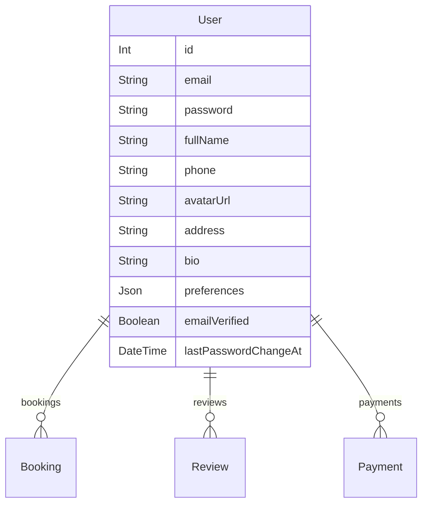
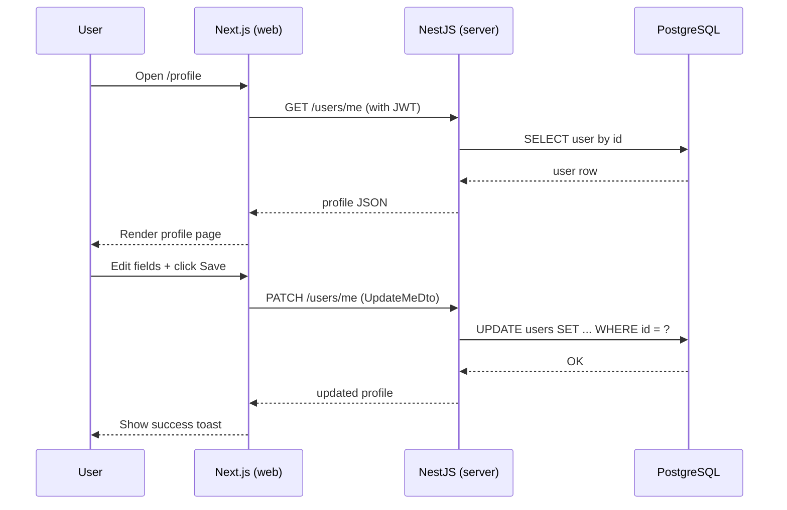
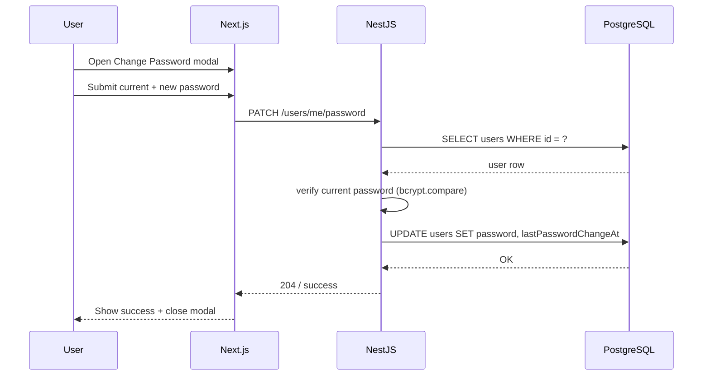
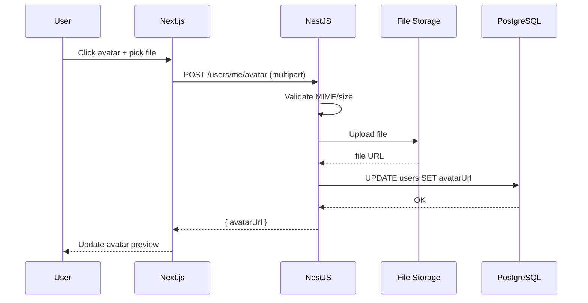

# Technical Design Document: User Profile Screen (`/profile`)

## 1. Overview

User profile management feature cho phép người dùng đã đăng nhập (ROLE: `USER`, `ADMIN`, `GUIDE`) xem và cập nhật thông tin cá nhân, ảnh đại diện, một số tuỳ chọn du lịch, và thay đổi các thiết lập bảo mật cơ bản (email verification, đổi mật khẩu) tại route `/profile`.

Mục tiêu:

- Tạo một **trung tâm tài khoản** rõ ràng, dễ dùng, bám sát thiết kế `user_profile_page/screen.png`.
- Tận dụng hạ tầng hiện có (NestJS + Prisma + Next.js) với thay đổi tối thiểu nhưng mở rộng được trong tương lai.

Scope (Phase này):

- UI + API cho **xem và cập nhật** thông tin cá nhân cơ bản.
- Upload avatar đơn giản (local disk hoặc S3 adapter – trừu tượng qua service).
- Hiển thị trạng thái email đã verify và trigger gửi email verify.
- Đổi mật khẩu (password-based auth hiện tại).
- Một số travel preferences cơ bản (boolean toggles).

Out of scope (có thể làm phase sau):

- Quản lý phương thức thanh toán (Payment Methods) chi tiết.
- Notification center phức tạp (multi-channel, digest, v.v.).
- Social login/link account.

---

## 2. Requirements

### 2.1. Functional Requirements

**FR-1 – Xem hồ sơ cá nhân**

- Người dùng đã đăng nhập có thể mở `/profile` và thấy:
  - Avatar, full name, vai trò (member type), ngày tham gia.
  - Thông tin cá nhân: First name, Last name, Email (readonly), Phone, Address, Bio.
  - Travel preferences: một số toggle (e.g. vegetarian meals, window seat).
  - Trạng thái email verification (Verified / Not verified).

**FR-2 – Cập nhật thông tin cá nhân**

- Từ form "Personal Information", user có thể chỉnh sửa các field cho phép sửa (firstName, lastName, phone, address, bio, preferences...).
- Khi user bấm "Save changes":
  - Frontend validate cơ bản (required, length, format email/phone).
  - Gửi `PATCH /users/me` với payload DTO chuẩn.
  - Backend cập nhật dữ liệu và trả về object profile mới.
  - Frontend hiển thị toast thành công hoặc lỗi.

**FR-3 – Upload / thay đổi avatar**

- User có thể click vào avatar để chọn ảnh mới.
- Hệ thống:
  - Mở file picker, validate định dạng (jpg/png/webp) và kích thước tối đa (VD: 5MB).
  - Upload qua `POST /users/me/avatar` (multipart/form-data).
  - Backend lưu file (local hoặc object storage), lưu URL vào user.
  - Trả về URL mới để frontend update preview.

**FR-4 – Hiển thị và trigger email verification**

- Nếu `emailVerified === false`, UI hiển thị badge/trạng thái "Email not verified" + nút "Verify".
- Khi user bấm verify:
  - Gọi `POST /auth/send-verification`.
  - Backend gửi email xác thực và trả về success.
  - UI hiển thị thông báo "Verification email sent".

**FR-5 – Đổi mật khẩu**

- Từ section "Sign-in Method", user có thể mở modal đổi mật khẩu.
- Form gồm: currentPassword, newPassword, confirmPassword.
- Gọi `PATCH /users/me/password`:
  - Backend kiểm tra current password.
  - Validate độ mạnh newPassword.
  - Hash & lưu mật khẩu mới.
  - Cập nhật `lastPasswordChangeAt` để hiển thị trong UI.

**FR-6 – Điều hướng sidebar**

- Sidebar profile (Personal Info, My Bookings, Payment Methods, Security, Notifications, Logout) phải hoạt động:
  - `My Bookings` link sang `/bookings`.
  - `Logout` gọi action logout (qua module `auth`).
  - Các tab khác có thể là placeholder (nhưng cấu trúc đã có sẵn cho Phase sau).

**User Stories (ví dụ)**

- _US-1_: "As a **traveler**, I want to update my personal info so that tour operators have correct contact details."
- _US-2_: "As a **user**, I want to upload a profile photo so that other people can recognize my account."
- _US-3_: "As a **user**, I want to verify my email so that my account is considered trusted and I can recover my password."
- _US-4_: "As a **user**, I want to change my password so that I can keep my account secure."

### 2.2. Non-Functional Requirements

- **NFR-1 – Security**
  - Tất cả endpoints `/users/me` phải yêu cầu JWT access token hợp lệ.
  - Chỉ được đọc/ghi hồ sơ của chính mình (không cho phép chỉ định userId).
  - Đổi mật khẩu phải check `currentPassword` + rate limit.
  - Upload avatar phải validate MIME + size, tránh upload arbitrary scripts.

- **NFR-2 – Performance**
  - `GET /users/me` response < 150ms trên data bình thường.
  - Cập nhật profile không dùng transaction phức tạp; 1 query update là đủ.

- **NFR-3 – Reliability & Consistency**
  - Thông tin user hiển thị trong toàn hệ thống (e.g. tên review, booking) dựa trên cùng nguồn (User table).
  - Đổi email (nếu phase sau) phải gắn với flow verify mới.

- **NFR-4 – UX / Accessibility**
  - Form có validation message rõ ràng.
  - Các action chính (Save, Change Password, Verify Email) đều có feedback.
  - Dùng semantic HTML + aria-label cho icon & button.

---

## 3. Technical Design

### 3.1. Database Schema Changes (Prisma)

Hiện tại `User` chỉ có `email`, `password`, `fullName`, `phone`, `role`, timestamps. Để support đầy đủ UI, đề xuất mở rộng `User` thay vì tạo bảng `UserProfile` riêng (scope nhỏ, tránh join thêm):

```prisma
model User {
  id        Int       @id @default(autoincrement())
  email     String    @unique
  password  String
  fullName  String?   @map("full_name")
  phone     String?
  role      Role      @default(USER)
  createdAt DateTime  @default(now()) @map("created_at")
  updatedAt DateTime  @updatedAt @map("updated_at")

  // NEW
  avatarUrl   String?  @map("avatar_url")
  address     String?
  bio         String?  @db.Text
  preferences Json?    @map("preferences") // travel preferences + notification settings
  emailVerified Boolean @default(false) @map("email_verified")
  lastPasswordChangeAt DateTime? @map("last_password_change_at")

  bookings  Booking[]
  reviews   Review[]
  payments  Payment[]

  @@map("users")
}
```

- **`avatarUrl`**: lưu link ảnh (S3/local). Có thể tái sử dụng ở phần review/avatar user.
- **`address`, `bio`**: map trực tiếp từ form.
- **`preferences`**: JSON lưu các boolean/toggle như `vegetarianMeals`, `windowSeat` để dễ mở rộng.
- **`emailVerified`**: đồng bộ với hệ thống auth/verification.
- **`lastPasswordChangeAt`**: hiển thị "last changed" trong UI và phục vụ audit.

> ERD (Mermaid – chỉ highlight User):



### 3.2. Backend Implementation (NestJS)

**Module liên quan:**

- `apps/server/src/modules/auth/*` – đã có logic JWT, send verification email (cần đọc thêm 02_api_contract nếu có).
- **New/Extended**: `apps/server/src/modules/users` (nếu chưa có) hoặc mở rộng module hiện có để expose `/users/me` endpoints.

**Endpoints** (theo README spec):

1. `GET /users/me`
   - **Guard**: `JwtAuthGuard`.
   - **Logic**:
     - Lấy `userId` từ JWT payload.
     - Query Prisma `user.findUnique` với select các field cần cho profile (không trả password).
   - **Response shape** (ví dụ):

     ```ts
     {
       id: number;
       email: string;
       fullName: string | null;
       firstName: string | null; // derive từ fullName nếu cần (hoặc thêm field riêng trong schema ở phase sau)
       phone?: string | null;
       address?: string | null;
       bio?: string | null;
       avatarUrl?: string | null;
       preferences?: UserPreferencesDto;
       emailVerified: boolean;
       role: Role;
       createdAt: string;
       lastPasswordChangeAt?: string | null;
     }
     ```

2. `PATCH /users/me`
   - **DTO**: `UpdateMeDto` với các field optional, whitelist:

     ```ts
     export class UpdateMeDto {
       @IsOptional() @IsString() fullName?: string;
       @IsOptional() @IsString() phone?: string;
       @IsOptional() @IsString() address?: string;
       @IsOptional() @IsString() @MaxLength(500) bio?: string;
       @IsOptional()
       @ValidateNested()
       @Type(() => PreferencesDto)
       preferences?: PreferencesDto;
     }

     export class PreferencesDto {
       @IsOptional() @IsBoolean() vegetarianMeals?: boolean;
       @IsOptional() @IsBoolean() windowSeat?: boolean;
       // dễ mở rộng thêm
     }
     ```

   - **Service**: `UsersService.updateMe(userId, dto)`
     - Map DTO -> Prisma `data`.
     - `user.update({ where: { id: userId }, data })`.

3. `POST /users/me/avatar`
   - Dùng `@UseInterceptors(FileInterceptor('file'))` + Multer config.
   - Validate file type & size.
   - Upload qua service trừu tượng `FileStorageService` (local/S3).
   - Lưu `avatarUrl` mới.
   - Trả về `{ avatarUrl }`.

4. `POST /auth/send-verification`
   - Có thể đã tồn tại trong `auth` module; nếu chưa thì implement:
     - Xác định user từ JWT.
     - Sinh token verify, gửi email.
   - Không thay đổi schema.

5. `PATCH /users/me/password`
   - **DTO**: `ChangePasswordDto` với `currentPassword`, `newPassword`.
   - Service:
     - Lấy user theo id, so sánh `currentPassword` (bcrypt.compare).
     - Validate độ mạnh password.
     - Hash và update `password`, set `lastPasswordChangeAt = new Date()`.
     - Option: revoke refresh tokens hiện tại.

**Controllers / Services skeleton (gợi ý)**

```ts
// users.controller.ts
@UseGuards(JwtAuthGuard)
@Controller("users/me")
export class UsersMeController {
  constructor(private readonly usersService: UsersService) {}

  @Get()
  getMe(@CurrentUser("id") userId: number) {
    return this.usersService.getMe(userId);
  }

  @Patch()
  updateMe(@CurrentUser("id") userId: number, @Body() dto: UpdateMeDto) {
    return this.usersService.updateMe(userId, dto);
  }

  @Post("avatar")
  @UseInterceptors(FileInterceptor("file"))
  uploadAvatar(
    @CurrentUser("id") userId: number,
    @UploadedFile() file: Express.Multer.File,
  ) {
    return this.usersService.updateAvatar(userId, file);
  }

  @Patch("password")
  changePassword(
    @CurrentUser("id") userId: number,
    @Body() dto: ChangePasswordDto,
  ) {
    return this.usersService.changePassword(userId, dto);
  }
}
```

### 3.3. Frontend Implementation (Next.js)

**Route:** `apps/web/app/profile/page.tsx`

- Sử dụng **Server Component** để fetch profile ban đầu (SSR) qua internal API hoặc server action.
- Bọc các phần interactive (form, avatar upload, password modal) trong **Client Components**.

**Cấu trúc gợi ý:**

```tsx
// app/profile/page.tsx
export default async function ProfilePage() {
  const profile = await getCurrentUserProfile(); // server-side fetch

  return (
    <ProfileLayout>
      <ProfileSidebar profile={profile} />
      <ProfileContent profile={profile} />
    </ProfileLayout>
  );
}
```

- `ProfileLayout`: chia 2 cột (sidebar + main content), sử dụng tailwind grid/flex.
- `ProfileSidebar` (client): handle navigation, logout.
- `ProfileContent` (client): chứa các section:
  - `ProfileHeader` (avatar + verified badge + joined date).
  - `PersonalInfoForm` (form chính, submit bằng fetch/axios hoặc server action).
  - `PreferencesSection` (toggles, reuse chung DTO preferences).
  - `SignInMethodSection` (hiển thị lastPasswordChangeAt + nút "Change Password").

**State management:**

- Form state local bằng React Hook Form hoặc useState.
- Sau khi save/update avatar/đổi password, nên cập nhật local state hoặc revalidate (SWR/React Query nếu dùng) để sync UI.

**Error/Loading:**

- Loading skeleton cho profile page.
- Toast cho success/error (có thể dùng shared component `@repo/ui`).

### 3.4. Logic Flow (Mermaid)

**Flow: Load & update profile**



**Flow: Change password**



**Flow: Upload avatar**



### 3.5. Security & Performance

- **Auth & RBAC**
  - Tất cả `/users/me` endpoints dùng `JwtAuthGuard`.
  - Không cho phép truyền `userId` trong body/query để tránh update user khác.

- **Validation**
  - DTO dùng `class-validator`: trim string, hạn chế độ dài (bio <= 500).
  - Password strength: tối thiểu 8 ký tự, có số + chữ.

- **Avatar Upload**
  - Giới hạn MIME: `image/jpeg`, `image/png`, `image/webp`.
  - Kích thước tối đa: VD 5MB.
  - Tên file chuẩn hóa, tránh path traversal.

- **Rate limiting**
  - `POST /auth/send-verification`: dùng `ThrottlerGuard` (VD: 3 req / 15 phút).

- **Performance**
  - `GET /users/me` chỉ select field cần thiết; không include bookings, reviews (load nơi khác).
  - Dùng index có sẵn trên `users` (id primary key) – không cần thêm.

---

## 4. Testing Plan

**Unit Tests (NestJS)**

- `UsersService.getMe`:
  - Trả về đúng field, không trả password.
- `UsersService.updateMe`:
  - Chỉ update field có trong DTO.
  - Validate độ dài bio.
- `UsersService.updateAvatar`:
  - Reject file không hợp lệ.
  - Gọi storage service đúng tham số, lưu đúng `avatarUrl`.
- `UsersService.changePassword`:
  - Sai currentPassword → throw error.
  - Password quá yếu → validation error.
  - Thành công: password được hash, `lastPasswordChangeAt` set.

**E2E Tests (NestJS)**

- `/users/me`:
  - Không auth → 401.
  - Auth → 200 + đúng payload.
- `PATCH /users/me`:
  - Update subset field → dữ liệu lưu đúng.
- `PATCH /users/me/password`:
  - End-to-end đổi mật khẩu + verify login với mật khẩu mới.
- `POST /users/me/avatar`:
  - Upload file hợp lệ → 200 + avatarUrl.

**Frontend Tests (tùy mức đầu tư)**

- Component test cho `PersonalInfoForm` (validation, hiển thị lỗi).
- Integration test bằng Playwright/Cypress: user login → mở `/profile` → đổi info → thấy toast.

---

## 5. Alternatives Considered

1. **Tạo bảng `UserProfile` riêng**
   - Ưu điểm:
     - Phân tách concern rõ: auth ở `User`, profile ở `UserProfile`.
     - Dễ mở rộng field profile rất nhiều mà không làm phình table `users`.
   - Nhược điểm:
     - Cần thêm join trong nhiều query.
     - Tăng độ phức tạp cho scope hiện tại.
   - **Quyết định**: KHÔNG dùng cho phase đầu; thay vào đó thêm một số field vào `User`.

2. **Lưu travel preferences thành bảng riêng**
   - Ưu điểm: query có thể index từng preference, hỗ trợ analytics.
   - Nhược: overkill cho vài toggle boolean.
   - **Quyết định**: Dùng JSON `preferences` trong `User` cho phase này.

3. **Frontend: dùng hoàn toàn server components + server actions**
   - Ưu: giảm JS client, đơn giản hoá fetch.
   - Nhược: form đổi mật khẩu/avatar khá interactive, dùng client component sẽ tự nhiên hơn.
   - **Quyết định**: Kết hợp SSR + client component cho form/phần tương tác.
